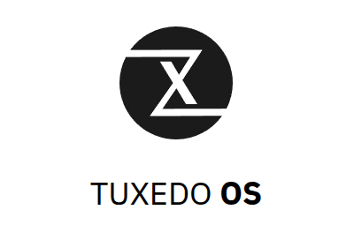

<!--more-->

<a href="https://tenor.com/view/yetopen-gif-27266616">Yetopen GIF</a>from <a href="https://tenor.com/search/yetopen-gifs">Yetopen GIFs</a>
 

## 為什麼要使用 Linux Desktop

我相信最多人用的 desktop 是 Windows  
我平常使用 Linux desktop 的原因是  
1. 工作使用 Linux server  
為了讓自己更加熟悉 Linux, 因此平常也使用 Linux desktop  
另外平常需要對 Linux server 進行操作/執行 Script 等, 有同樣的 Linux 環境較方便  

2. 資源較省  
對比 Windows, Linux 使用較少資源, 體感覺得 OS 執行速度快的多  
但 Linux 軟體生態較差(畢竟用的人少), 有些 Windows 上好用的 App 在 Linux 只有'🦽殘障版本'  
因此一些特定使用情境下, 效率可能反而較差  

3. Windows 11 大變革  
雖然我使用 Linux desktop  
但我個人並不討厭 Windows  
不過自從 Windows 11 有許多變化  
讓我認為變得更難用了...  
因此讓我更加努力使用 Linux desktop 做為日常使用  

## Linux Desktop 使用歷程

關於 Linux desktop 由於其開放性  
有各式各樣的 distro, 可以在 [distro watch](https://distrowatch.com) 看到清單  
因此選擇合適的 distro 就非常重要了  
剛接觸 Linux 一上來馬上就是選擇障礙, 因此這邊稍微講一下心路歷程  

最大的問題在於環境是否能以支撐日常使用, 以下是我認為重要的幾個點  
- 硬體相容性: 總不能連用都不能用對吧？  
- 軟體相容性: 勢必要有方案能夠支援日常, 比如說瀏覽器, 輸入法, 文書處理器...  
- 社群大小: 因為 Linux desktop 本身就冷門, 社群大小等同於有多少人踩雷/除錯/問題解答, 使用者越多等於越穩定  

以上幾點就是不斷地踩雷後找到心目中最理想 distro 的要求  

在繼續前要先說明 distro 的選擇會大概分兩個方向  
- [Source based](https://distrowatch.com/dwres.php?resource=glossary#sourcebased): 可理解為底層核心, 沒有圖形化介面  
- [Desktop environment](https://distrowatch.com/dwres.php?resource=glossary#desktop): 提供圖形化介面  
除了桌面環境外, 也提供了一些 app (檔案管理/記事本/終端機...等)  

<a href="https://tenor.com/view/scrolling-scroll-app-drawer-gadgets-one-malayalam-tech-tips-gif-12617216">Scrolling App Drawer GIF</a>from <a href="https://tenor.com/search/scrolling-gifs">Scrolling GIFs</a>
 

Source based 我選擇 Ubuntu  
我認為他提供了最佳的核心功能  
以上奠定了我選擇 distro 的方向  

<a href="https://tenor.com/view/crystal-the-cavern-spirit-gif-13960597190189876079">Crystal The Cavern Spirit GIF</a>from <a href="https://tenor.com/search/crystal+the+cavern+spirit-gifs">Crystal The Cavern Spirit GIFs</a>
 
---

我的 Linux desktop 使用歷程如下  
Source based 就以 Ubuntu 為主  
歷程都是在 Desktop environment 選擇過程  
由於 Ubuntu GNOME 環境實在不討我喜歡  
因此一開始從 [Ubuntu flavors](https://ubuntu.com/desktop/flavors) 來做選擇  
 
- [Xubuntu](https://xubuntu.org): 當時看上 [Xfce](https://www.xfce.org),以節省資源/高速為主  
然而實際用下來發覺功能並無法滿足我的需求, 有時會當機, 進而轉向其他 Desktop environment  

- [Kubuntu](https://kubuntu.org): [KDE](https://kde.org) 算一個挺主流的 Desktop environment, 實際用起來深得我心  
除了桌面系統穩定, 也有自己的龐大的 [KDE app](https://apps.kde.org) 生態, 裡面不少 App 幾乎是商業級別  
在日常使用非常加分  
然而 Kubuntu 有個挺惱人的問題, 就是 Ubuntu 的政策是以自己 patch 來維護套件, 而不是更新 source release  
而 Ubuntu LTS 的發布週期是兩年一版, 也就造成 feature 的引入要等兩年  
更何況新的 Ubuntu LTS 甚至也不會用最新版套件, 變成 feature 的引入可能要等四年  

此也有許多人抱怨 也有專門的文章分享如何升級 [Upgrade KDE Plasma](https://www.omgubuntu.co.uk/2025/10/how-to-upgrade-kde-plasma-6-5-kubuntu-25-10)  
但這樣不代表能用到最新版本, 加上穩定度堪憂, 因此又繼續尋找下個 distro  
Ubuntu 官方也做出部分調整 [Moves To Shipping Very Latest Upstream Kernel](https://www.phoronix.com/news/Ubuntu-Releases-Fresher-Kernels)  
然而究竟未來會如何, 我就以觀望角度看看如何發展, 此時此刻 我是等不了  

- [Linux Mint](https://linuxmint.com): 算是很多人推薦的系統  
但在淺嘗 Cinnamon 環境後, 仍覺得 KDE 才能符合我需求, 因此繼續找下個 distro  

- [KDE Neon](https://neon.kde.org): 由 KDE 官方製作的 distro, 就是標榜能用最新的 KDE release  
雖然有分 Unstable/stable 但是實際用起來 stable 穩定度沒很好  
更新速度有點過快了  

- [TUXEDO OS](https://www.tuxedocomputers.com/en/TUXEDO-OS_1.tuxedo): 綜觀我前面需求  
找到這篇文章 [Differences between TUXEDO OS, Kubuntu and KDE Neon](https://www.tuxedocomputers.com/en/Differences-between-TUXEDO-OS-Kubuntu-and-KDE-Neon.tuxedo)  
簡單來說呢 TUXEDO 等於是 KDE Neon 的企業版本, 幫忙把關了 KDE 的穩定度  
至今使用體感非常好, 真的是穩定的系統  

## 什麼是 Ubuntu

<a href="https://tenor.com/view/linux-ubuntu-software-gif-13909128">Linux Ubuntu Sticker</a>from <a href="https://tenor.com/search/linux-stickers">Linux Stickers</a>
 

在介紹 TUXEDO OS 之前  
來說說為什麼要選擇 based on Ubuntu 的 distro  

來自 [Reddit](https://www.reddit.com/r/linux4noobs/comments/1c9u8gd/comment/l0nu8xs/?utm_source=share&utm_medium=web3x&utm_name=web3xcss&utm_term=1&utm_content=share_button) 的討論  
- Ubuntu LTS 給予良好的穩定度
- Ubuntu 跟商業環境環境相容更好
- Ubuntu LTS 更新速度比 Debian Stable 快

然而也因為求穩定(feature 採用慢)+商業考量  
有些人是不喜歡 Ubuntu 的  
像是 Ubuntu 採用的 snap 就很多人詬病  
也因此一些 distro 就是拿 Ubuntu 的好, 去 Ubuntu 不好  
變成一個 distro  

## 什麼是 KDE

KDE Plasma 是 Linux 社群中最受歡迎的桌面環境之一，以其**極高的自由度**和**強大的功能**著稱。以下是其核心優勢：

**核心優點**

1. 極致的客製化能力 (High Customizability)
KDE 被譽為「桌面環境中的樂高」，幾乎每一個視覺元素都可以調整：
* **面板配置**：可自由移動工作列位置、調整大小、透明度，或建立多個自定義面板。
* **小工具 (Widgets)**：內建豐富工具，可在桌面直接顯示天氣、硬體監控、備忘錄或媒體控制。
* **外觀主題**：內建商店可一鍵下載全球社群創作的圖示、視窗裝飾與色彩方案。

2. 優異的效能表現 (Performance)
現代的 KDE Plasma（特別是 6.x 版本）在功能與效能之間取得了極佳平衡：
* **資源佔用低**：記憶體佔用通常比 GNOME 更少，甚至能流暢運行於老舊硬體。
* **反應迅速**：系統動畫流暢，且允許使用者關閉特效以追求極致速度。

3. 強大的軟體生態系 (KDE Gear)
KDE 擁有一系列功能極其強大的原生應用程式：
* **Dolphin**：被公認為 Linux 界最強大的檔案管理員，支援分頁、終端機嵌入與預覽。
* **KDE Connect**：殺手級應用。實現手機（Android/iOS）與電腦的深度同步，包含剪貼簿共享、檔案傳輸與遠端控制。
* **Konsole**：高度可自訂的終端機模擬器。

4. 適合各種工作流
* **低學習曲線**：預設佈局與 Windows 相似，讓新使用者能快速上手。
* **生產力工具**：內建 **KRunner**（強大的快速啟動與搜尋框）以及先進的視窗平鋪 (Window Tiling) 功能。

> **💡 提示：** 如果你是從 Windows 轉移過來的用戶，KDE Plasma 通常是首選，因為它的操作邏輯最接近傳統桌面。

## TUXEDO OS 簡介

官網 [https://www.tuxedocomputers.com/en/TUXEDO-OS_1.tuxedo](https://www.tuxedocomputers.com/en/TUXEDO-OS_1.tuxedo)

TUXEDO OS 是由德國硬體廠商 **TUXEDO Computers** 所開發的 Linux 發行版。雖然它是為了自家的筆電與桌機進行優化，但它也完全免費開放給所有硬體使用。

**核心特色：結合穩定與先進**

TUXEDO OS 採取了一個非常聰明的做法：**底層採用 Ubuntu LTS (長期支援版)** 以確保系統穩定性與商業軟體相容性，但**上層桌面環境 (KDE Plasma) 與核心 (Kernel)** 則採用類似「滾動更新」的機制，確保使用者能用到最新的功能。

以下是它主要的優勢：

1. **去 Snap 化 (Snap-free by default)**：Ubuntu 官方強推的 Snap 套件格式常被批評啟動慢、佔用空間。TUXEDO OS 特地移除了 Snap，改以 **Flatpak** 作為替代方案。甚至連 Firefox 也是提供原生的 `.deb` 版本，而不是 Ubuntu 預設的 Snap 版。

2. **KDE Plasma 之深度優化**：它不僅僅是裝上 KDE，TUXEDO 還對其進行了視覺上的修飾與穩定度測試。它不像 KDE Neon 那樣「過於前衛」導致崩潰，也不會像 Kubuntu 那樣「過於陳舊」。

3. **TUXEDO Control Center (TCC)**：這是系統的靈魂工具，可以讓你直接在桌面端調整風扇控制（靜音或效能模式）、限制 CPU 功耗 (TDP) 以及即時監控硬體狀態。

4. **TUXEDO Tomte & Chroot**：**Tomte** 是一個自動系統小助手，會自動檢查並修補驅動或系統配置問題；而內建的 **Chroot** 功能則讓你在系統更新出問題時，能透過 Live USB 快速修復引導。

5. **隱私與安全**：作為歐洲廠商，TUXEDO 不包含任何遙測或追蹤代碼，給予使用者完全的控制權。

> **總結：**
> 如果說 Ubuntu 是穩定的老牌企業，KDE Neon 是技術狂的實驗室，那麼 **TUXEDO OS 就是一家追求穩定但不失創新、且更懂使用者痛點的精品店。**

## Linux 至今難解難題

**1. 網路 ATM (晶片卡讀卡機)**
這對於台灣的使用者來說是極為現實的痛點。雖然現在行動支付與 App 轉帳很發達，但若需要用到實體讀卡機進行線上轉帳、報稅、或查詢餘額時，大多數銀行的 WebATM 元件依然只支援 Windows (及少部分 macOS)。雖然 Linux 底層可以透過 `pcscd` 驅動讀卡機，但因為銀行不提供對應的 Linux 元件，導致瀏覽器無法與硬體通訊。這意味著在 Linux 上，你幾乎無法使用實體晶片卡進行任何線上金融操作。

**2. 專業軟體與 Office 相容性**
這就是最常被提起的「相容性大山」。雖然 Linux 有很好的替代方案（如 LibreOffice,OnlyOffice），對於一般文書處理綽綽有餘，但一旦涉及複雜的 Excel 巨集 (VBA)、特殊的字體渲染、或是需要與他人協作高度精準的 Word 排版時，Linux 方案往往會出現「跑位」或功能缺失。雖然現在可以靠 Web 版 Office 365 解決部分問題，但在功能完整度與操作流暢感上，原生 Windows 版的 Office 依然是難以取代的標準。

