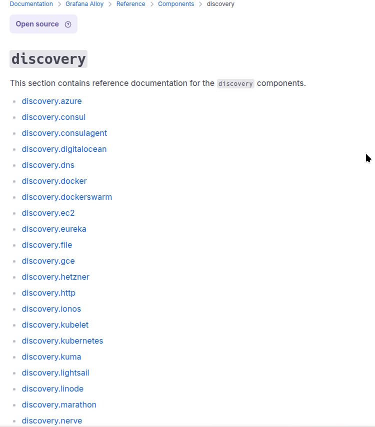
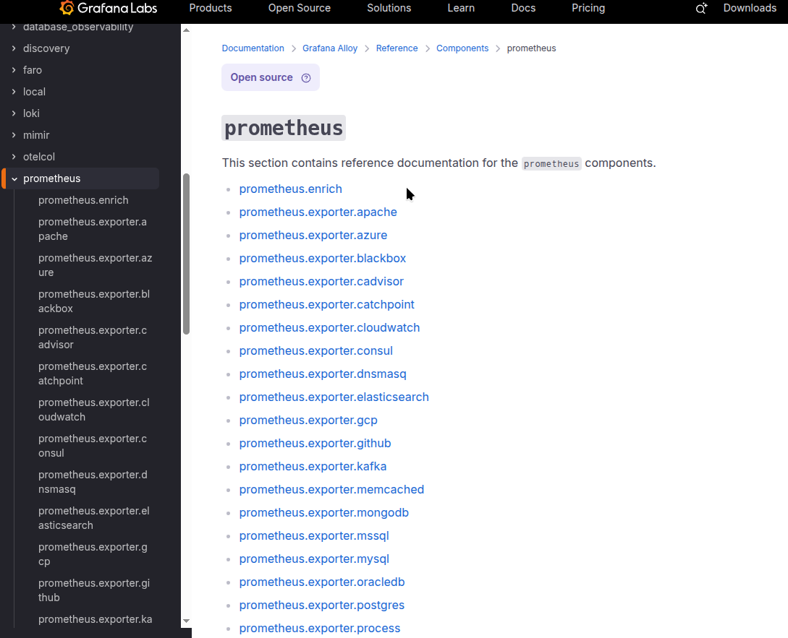

[Grafana Alloy](https://grafana.com/docs/alloy/latest/): 前身為 grafana agent  
由 grafana 推出的 all-in-one observability collector, 能夠同時蒐集 metric/log/trace  

為什要放棄 grafana agent 可見官方的 blog
- https://grafana.com/blog/2024/04/09/grafana-agent-to-grafana-alloy-opentelemetry-collector-faq/
- https://grafana.com/blog/2024/04/09/grafana-alloy-opentelemetry-collector-with-prometheus-pipelines/

alloy 優勢如下  
- discovery 自動發現 scrape target  
  

- 整合多個 metric exporter: 你不需要再各自安裝 exporter 簡化環境建置  
  
但要注意內建的 expoter 產生的 metric name/label 可能會與社群不同, 導致 dashboard 可能需要修改  

alloy 弱勢如下  
- log 部份僅支援 loki  


## 實戰 
使用 helm chart https://artifacthub.io/packages/helm/grafana/alloy 進行測試  

### scrape metrics in k8s  

簡易的 helm values 如下  
```yaml
controller:
  volumes:
    extra: 
    - hostPath:
        path: /proc
        type: ""
      name: proc
    - hostPath:
        path: /sys
        type: ""
      name: sys
    - hostPath:
        path: /
        type: ""
      name: root

alloy:
  mounts:
    extra: 
    - mountPath: /host/proc
      name: proc
      readOnly: true
    - mountPath: /host/sys
      name: sys
      readOnly: true
    - mountPath: /host/root
      mountPropagation: HostToContainer
      name: root
      readOnly: true

  configMap:
    content: |-
      // metrics
      prometheus.remote_write "default" {
        endpoint {
          url = "http://gf-stack-mimir-distributor.monitor.svc:8080/api/v1/push"
          headers = {
            "X-Scope-OrgID" = "alloy",
          }
        }
      }

      prometheus.exporter.unix "node" { }

      // Configure a prometheus.scrape component to collect unix metrics.
      prometheus.scrape "node" {
        targets    = prometheus.exporter.unix.node.targets
        forward_to = [prometheus.remote_write.default.receiver]
      }

      prometheus.scrape "pod" {
        targets    = discovery.kubernetes.pod.targets
        forward_to = [prometheus.remote_write.default.receiver]
      }

```


1. grafana alloy 會藉由 `discovery.kubernetes` 會去取得 pod 的 ip:port  
新增至 scrape targets  
`prometheus.scrape` 會使用 endpoint `/metrics` 嘗試取得 metrics  

2. grafana alloy 會利用內建的 node-exporter 產生 scrape tragets
`prometheus.scrape` 取得 metrics  

3. 利用 `prometheus.remote_write` 將 metrics 送至 promethues  


同一時間我們看看 resource usage 
```
$ kubectl top pod 
NAME                                                    CPU(cores)   MEMORY(bytes)   
alloy-7kwd9                                             39m          461Mi           
victoria-metrics-agent-d6cff6696-lg964                  2m           102Mi           
victoria-metrics-agent-prometheus-node-exporter-6l5jm   4m           10Mi     
```

坦白說 這 resource usage 另我難以接受  
看來採用 victoria-metrics-agent 依舊是較佳選擇  


### scrape logs in k8s  
簡易的 helm values 如下  


```yaml
alloy:
  mounts:
    varlog: true

  configMap:
    content: |-
      
      // local.file_match discovers files on the local filesystem using glob patterns and the doublestar library. It returns an array of file paths.
      local.file_match "node_logs" {
        path_targets = [{
            // Monitor syslog to scrape node-logs
            __path__  = "/var/log/syslog",
            job       = "node/syslog",
            node_name = sys.env("HOSTNAME"),
            cluster   = "local",
        }]
      }

      // loki.source.file reads log entries from files and forwards them to other loki.* components.
      // You can specify multiple loki.source.file components by giving them different labels.
      loki.source.file "node_logs" {
        targets    = local.file_match.node_logs.targets
        forward_to = [loki.write.default.receiver]
      }


      // discovery.kubernetes allows you to find scrape targets from Kubernetes resources.
      // It watches cluster state and ensures targets are continually synced with what is currently running in your cluster.
      discovery.kubernetes "pod" {
        role = "pod"
        // Restrict to pods on the node to reduce cpu & memory usage
        selectors {
          role = "pod"
          field = "spec.nodeName=" + coalesce(sys.env("HOSTNAME"), constants.hostname)
        }
      }

      // discovery.relabel rewrites the label set of the input targets by applying one or more relabeling rules.
      // If no rules are defined, then the input targets are exported as-is.
      discovery.relabel "pod_logs" {
        targets = discovery.kubernetes.pod.targets

        // Label creation - "namespace" field from "__meta_kubernetes_namespace"
        rule {
          source_labels = ["__meta_kubernetes_namespace"]
          action = "replace"
          target_label = "namespace"
        }

        // Label creation - "pod" field from "__meta_kubernetes_pod_name"
        rule {
          source_labels = ["__meta_kubernetes_pod_name"]
          action = "replace"
          target_label = "pod"
        }

        // Label creation - "container" field from "__meta_kubernetes_pod_container_name"
        rule {
          source_labels = ["__meta_kubernetes_pod_container_name"]
          action = "replace"
          target_label = "container"
        }

        // Label creation -  "app" field from "__meta_kubernetes_pod_label_app_kubernetes_io_name"
        rule {
          source_labels = ["__meta_kubernetes_pod_label_app_kubernetes_io_name"]
          action = "replace"
          target_label = "app"
        }

      }

      // loki.source.kubernetes tails logs from Kubernetes containers using the Kubernetes API.
      loki.source.kubernetes "pod_logs" {
        targets    = discovery.relabel.pod_logs.output
        forward_to = [loki.process.pod_logs.receiver]
      }

      // loki.process receives log entries from other Loki components, applies one or more processing stages,
      // and forwards the results to the list of receivers in the component's arguments.
      loki.process "pod_logs" {
        stage.static_labels {
            values = {
              cluster = "laterstack",
              job = "alloy",
            }
        }
        forward_to = [loki.write.default.receiver]
      }
    
      loki.write "default" {
        endpoint {
          url = "http://loki-write.monitor.svc:3100/loki/api/v1/push"
          tenant_id = "alloy"
        }
      }
```


1. grafana alloy 會藉由 `discovery.kubernetes` 會去取得 pod 的 label
新增至 scrape targets  
`loki.source.kubernetes` 取得 logs  

2. 利用 `loki.source.file` 取的 host log 

3. 利用 `loki.write` 將 log 送至 loki  


同一時間我們看看 resource usage 
```
$ kubectl top pod
NAME                                                    CPU(cores)   MEMORY(bytes)   
alloy-85jxg                                             8m           74Mi            
promtail-9hpgh                                          30m          126Mi     
```

作為對比 alloy 比 promtail 好上不少  
看起來是能夠放心轉換 promtail 至 alloy  

