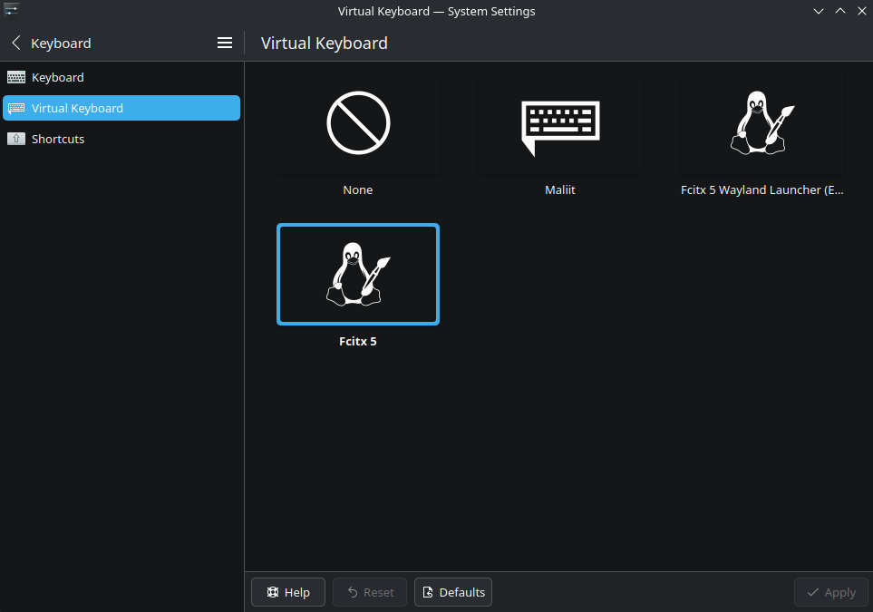

本篇說明解決 chrome 在 v140 之後無法使用 fcitx5 輸入法問題  


只要補上 config 即可解決  
## 解決方法一 - 手動編輯 config  
```bash {filename="~/.config/kwinrc"}  
[Wayland]
InputMethod[$e]=/usr/share/applications/org.fcitx.Fcitx5.desktop
```

## 解決方法二 - 透過 system settings 自動新增 config  
打開 system settings - Keyboard - Virtual Keyboard  
選擇 Fcitx5 (預設是 None) > Apply  



---
選擇其中一種方法  
重新登入後即可解決  

