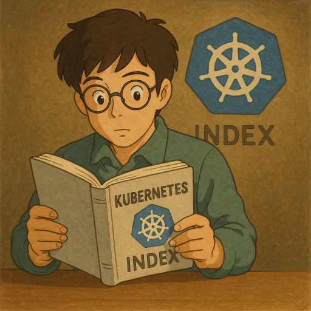

<!--more-->

## 前言：為什麼要讀官方文件？

Kubernetes (K8s) 已是現代雲原生應用程式的作業系統，也是所有後端工程師的必修課。然而，K8s 功能強大、體系龐雜，加上官方文件的編排方式有時不夠親民，使得許多初學者望而卻步。

本系列文章的誕生，旨在解決這個痛點。我們將會：
1.  **重新編排學習路徑**：打破官方文件的章節限制，按照由淺入深的認知順序，重新組織學習主題。
2.  **提煉核心概念**：將晦澀的原文，用更易於理解的語言和比喻重新詮釋，幫助您快速掌握核心思想。
3.  **補充實務經驗**：結合業界的最佳實踐，補充官方文件中沒有提及、但在實務上卻至關重要的「眉角」。

我們的目標是讓這個系列成為您學習 K8s 的最佳夥伴，無論您是初學者還是有經驗的工程師，都能從中獲益。

---

## 學習 K8s 之前：先學會 docker 

在深入 K8s 之前，有一個重要的先備條件：**您必須對容器 (Container) 和 Docker 有基本的了解。**

-   **Docker 就像自排小客車**：您只需要學會打檔、踩油門和煞車，就能輕鬆上路。它適合在單一主機或小型環境中運行容器。
-   **K8s 則像手排大客車**：您不僅需要具備開小客車的基本技能，還得學習手動排檔、車輛保養、判斷轉彎半徑等進階知識。它專為管理大規模、跨多主機的容器化應用而設計。

如果您還不熟悉 Docker，強烈建議您先花時間學習容器的基本概念。這會讓您的 K8s 學習之路事半功倍。

## 為什麼選擇 Kubernetes？

當您開的小客車 (Docker) 已經無法滿足搭載數十位乘客（大規模應用）的需求時，您自然會需要一輛大客車 (K8s)。K8s 解決了 Docker 在大規模環境中遇到的種種挑戰：

-   **自動化 (Automation)**：自動處理服務發現、負載平衡、自我修復和擴展等繁瑣工作。
-   **宣告式 (Declarative)**：您只需要「宣告」您想要的最終狀態，K8s 會自動地、持續地將系統調整至該狀態。
-   **可擴展性 (Extensibility)**：憑藉其開放的架構和豐富的生態系，您可以輕易地擴展 K8s 的功能，以滿足各種複雜的需求。

然而，強大的功能也意味著更高的學習曲線。請務必在評估導入 K8s 前，確認您當前的環境確實遇到了 Docker 無法解決的痛點，切勿為了技術而技術。

## 本系列學習路徑 (Index)

我們將官方文件重新梳理，規劃成以下四個學習階段。建議您按照順序閱讀，以建立穩固的知識體系。

### 階段一：核心概念與工作負載 (Core Concepts & Workloads)
*目標：理解 K8s 的基本組成、如何在 K8s 中運行您的第一個應用程式。*
-   [Concepts - Overview](/docs/k8s-doc-reading/20250616_k8s-doc-reading-concepts-overview/)
-   [Concepts - Cluster Architecture (架構總覽)](/docs/k8s-doc-reading/20250616_k8s-doc-reading-concepts-cluster-architecture/)
-   [Concepts - Cluster Architecture: Node (節點詳解)](/docs/k8s-doc-reading/20250617_k8s-doc-reading-concepts-cluster-architecture-node/)
-   [Concepts - Workloads (工作負載介紹)](/docs/k8s-doc-reading/20250617_k8s-doc-reading-concepts-workloads/)
-   [Getting started (開始使用 kubectl)](/docs/k8s-doc-reading/20250618_k8s-doc-reading-getting-started/)
-   [Getting started - Helm (套件管理)](/docs/k8s-doc-reading/20250627_k8s-doc-reading-getting-started-helm/)
-   [Workload - Deployments (無狀態應用)](/docs/k8s-doc-reading/20250620_k8s-doc-reading-workload-management-deployments/)
-   [Workload - StatefulSets (有狀態應用)](/docs/k8s-doc-reading/20250623_k8s-doc-reading-workload-management-statefulsets/)
-   [Workload - DaemonSet (節點常駐應用)](/docs/k8s-doc-reading/20250624_k8s-doc-reading-workload-management-demonset/)
-   [Workload - Jobs (一次性任務)](/docs/k8s-doc-reading/20250625_k8s-doc-reading-workload-management-jobs/)
-   [Workload - CronJob (定時任務)](/docs/k8s-doc-reading/20250625_k8s-doc-reading-workload-management-cronjob/)

### 階段二：網路、儲存與設定 (Networking, Storage & Configuration)
*目標：掌握如何將服務對外暴露、如何讓資料持久化，以及如何管理應用程式的設定。*
-   [Networking - Service, loadbalancing, networking](/docs/k8s-doc-reading/20250626_k8s-doc-reading-services-loadbalancing-networking/)
-   [Networking - Service (服務發現)](/docs/k8s-doc-reading/20250626_k8s-doc-reading-services/)
-   [Networking - Ingress (七層負載平衡)](/docs/k8s-doc-reading/20250627_k8s-doc-reading-ingress/)
-   [Networking - Gateway API (下一代路由 API)](/docs/k8s-doc-reading/20250627_k8s-doc-reading-gateway/)
-   [Networking - Network Policies (網路防火牆)](/docs/k8s-doc-reading/20250627_k8s-doc-reading-network-policy/)
-   [Networking - DNS](/docs/k8s-doc-reading/20250627_k8s-doc-reading-dns/)
-   [Storage - Volumes (儲存卷)](/docs/k8s-doc-reading/20250702_k8s-doc-reading-storage-volume/)
-   [Storage - Persistent Volumes (持久化儲存)](/docs/k8s-doc-reading/20250703_k8s-doc-reading-storage-volume-storage/)
-   [Configuration - ConfigMaps (設定檔管理)](/docs/k8s-doc-reading/20250703_k8s-doc-reading-configuration-configmaps/)
-   [Configuration - Secrets (密鑰管理)](/docs/k8s-doc-reading/20250703_k8s-doc-reading-configuration-secrets/)

### 階段三：調度、維運與自動擴展 (Scheduling, Operations & Autoscaling)
*目標：學習更精細的資源與調度管理，以及如何讓叢集自動化維運。*
-   [Configuration - Probes (健康檢查)](/docs/k8s-doc-reading/20250703_k8s-doc-reading-configuration-probes/)
-   [Configuration - Resource Management (資源管理與 QoS)](/docs/k8s-doc-reading/20250704_k8s-doc-reading-configuration-resource_management_for_pods_and_containers/)
-   [Scheduling - Assigning Pods to Nodes (節點親和性)](/docs/k8s-doc-reading/20250704_k8s-doc-reading-assign_pod_to_node/)
-   [Scheduling - Taints and Tolerations (污點與容忍)](/docs/k8s-doc-reading/20250704_k8s-doc-reading-taint-and-toleration/)
-   [Operations - Node Shutdowns (節點維護)](/docs/k8s-doc-reading/20250708_k8s-doc-reading-cluster-administration_node-shutdown/)
-   [Operations - Autoscaling Workloads (自動擴展)](/docs/k8s-doc-reading/20250625_k8s-doc-reading-workload-autoscaling-workloads/)

### 階段四：安全與生態系 (Security & Ecosystem)
*目標：探索 K8s 的權限管理、安全性原則，以及其強大的擴展能力。*
-   [Security - Authentication Part 1 (認證與授權 - 基礎)](/docs/k8s-doc-reading/20250810_k8s-authentication-part1/)
-   [Security - Authentication Part 2 (認證與授權 - 使用者帳號)](/docs/k8s-doc-reading/20250810_k8s-authentication-part2/)
-   [Ecosystem - Objects In Kubernetes (物件管理)](/docs/k8s-doc-reading/20250712_k8s-doc-reading-objects-in-kubernetes/)
-   [Ecosystem - UI Tools (儀表板工具)](/docs/k8s-doc-reading/20250810_k8s-UI-tools/)

---

準備好了嗎？讓我們一起踏上這趟 Kubernetes 的學習之旅吧！

