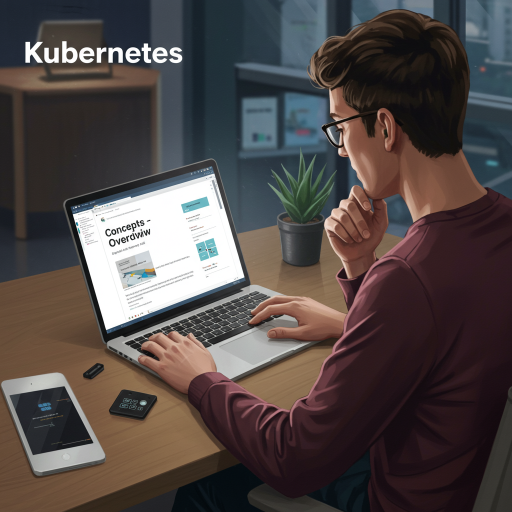

  

<!--more-->
[doc link](https://kubernetes.io/docs/concepts/overview/)

## 為什麼需要 Kubernetes？

許多人會問：「既然有了 Docker，為什麼還需要 Kubernetes (K8s)？」

簡單來說，Docker 在單一或小型環境中運行良好，但當擴展到中大型規模的生產環境時，就會面臨許多管理上的挑戰，例如：服務的自動修復 (auto-healing)、資源監控 (monitoring)、以及容器之間的網路連線等問題。

Kubernetes 的誕生正是為了解決這些問題。根據官方文件，K8s 的核心特性包含：

- **宣告式組態 (Declarative Configuration)**：開發者透過 YAML 設定檔來定義應用程式的「期望狀態 (desired state)」。K8s 會自動調整並維護系統，使其符合這個狀態。這種方式不僅易於管理、理解和版本控制，也大幅降低了人為操作失誤的風險。
- **自動化 (Automation)**：在需要管理成千上萬個容器的環境中，自動化是不可或缺的。K8s 自動處理了許多繁瑣的工作，包括擴展 (scaling) 和故障轉移 (failover)，讓維運人員不再需要手動介入。
- **可擴展性 (Extensibility)**：K8s 具有強大的第三方擴充能力，其功能不受限於官方開發的項目。這使得社群可以圍繞 K8s 建立豐富的生態系，帶來無限的潛力。

## Kubernetes 提供了什麼？

### 服務發現與負載平衡 (Service Discovery and Load Balancing)

在 Docker 環境中，容器間的通訊是一大挑戰。您不僅需要知道如何找到目標容器的 IP 位址，當服務擁有多個副本 (Replica) 時，還必須處理負載平衡 (Load Balancing) 的問題，這通常需要借助外部的負載平衡器 (Load Balancer) 來實現。

K8s 內建了解決方案。它透過 DNS 名稱的方式，讓容器可以輕易地找到彼此的端點 (Endpoint)。此外，K8s 也提供了原生的負載平衡功能，當服務有多個副本時，能夠自動分配流量，無需人為介入。

### 儲存編排 (Storage Orchestration)

K8s 支援多種儲存解決方案，包括本地儲存、NFS、iSCSI 等。您可以根據不同的需求，為容器配置不同類型和效能的儲存空間（例如 SSD 或 HDD），從而提升應用的彈性。

### 自動化部署與回滾 (Automated Rollouts and Rollbacks)

K8s 能夠自動化您的應用程式部署流程。您可以執行「滾動升級 (Rolling Upgrade)」來逐一更新容器，而無需中斷服務。如果更新後出現問題，也可以快速地「回滾 (Rollback)」到先前的穩定版本。

若搭配健康檢查 (Health Check)，更可以實現「金絲雀部署 (Canary Deployment)」，逐步將流量導向新版本，讓每次的發布都更加穩定、優雅 (graceful)。

### 自動化裝箱 (Automatic Bin Packing)

K8s 會根據您為容器設定的資源需求（如 CPU 和記憶體），自動將其調度到合適的節點 (Node) 上執行。如果沒有節點擁有足夠的資源，容器將不會被執行。這可以有效地避免將容器部署到已經非常忙碌的節點上，防止「忙上加忙」的窘境。

### 自我修復 (Self-healing)

K8s 會持續監控容器的健康狀態。當它偵測到異常的容器時，會自動將其隔離、替換或重啟，並確保外部流量不會再導向這些有問題的容器。

### Secret 與組態管理 (Secret and Configuration Management)

K8s 提供了專門的機制來管理設定檔 (ConfigMap) 和機密資訊 (Secret)，如密碼、API 金鑰等。這讓您可以將敏感資訊與容器映像檔 (Image) 分離，提升安全性。

### 批次執行 (Batch Execution)

除了長時間運行的服務，K8s 也可以用來管理批次處理和 CI (持續整合) 工作。搭配其自動擴展的特性，在有高負載需求時能發揮極佳的效益。

### 水平擴展 (Horizontal Scaling)

K8s 提供強大的水平擴展功能，可以根據 CPU 或記憶體使用率自動增加或減少服務的副本數量。若搭配 [KEDA](https://keda.sh/) 這類擴充工具，更能支援多樣化的觸發來源，例如：根據訊息隊列 (Message Queue) 的長度來進行擴展。

### IPv4/IPv6 雙協議棧 (IPv4/IPv6 Dual-stack)

K8s 能夠在同一個叢集中同時支援 IPv4 和 IPv6 網路。

### 為可擴展性而設計 (Designed for Extensibility)

這是 K8s 最重要的功能之一。它允許社群開發人員擴充其核心功能，而不需要修改核心原始碼或等待官方發布新版本。

前面提到的 KEDA 就是一個很好的例子。原生的 K8s 在自動擴展方面主要依賴 CPU/Memory 指標，但在實際應用中，我們可能需要根據更複雜的條件（如佇列長度）來擴展。透過 K8s 的擴展機制，社群可以開發出像 KEDA 這樣的工具來滿足這些需求，而不會讓 K8s 本身變得臃腫。

## Kubernetes 不是什麼？

在學習 K8s 時，有一句重要的話必須理解：

> Kubernetes is not monolithic, and these default solutions are optional and pluggable. Kubernetes provides the building blocks for building developer platforms, but preserves user choice and flexibility where it is important.

這句話揭示了 K8s 的核心設計哲學：**模組化**與**靈活性**。

K8s 就像一個樂高積木平台，它提供了許多基礎構件，但您可以自由選擇和替換這些構件。例如，如果您不喜歡預設的網路代理 `kube-proxy`，可以將其更換為其他的解決方案。

另一個重點是，K8s 有些功能只定義了標準介面，但並**沒有提供預設的實作 (Implementation)**，例如 Ingress。這就像政府蓋好了一條高速公路，任何人都可以開車上路，但您必須自備車輛。Ingress 定義了流量進入叢集的規則，但您需要自行安裝一個 Ingress Controller (如 NGINX Ingress Controller) 來實現它。

這個特點有時會讓初學者感到困惑，但它正是 K8s 強大和靈活的來源。

---

以下同樣節錄原文，並附上中文解釋。

### K8s 不限制應用程式的類型

> Does not limit the types of applications supported.

K8s 不會限制您可以在上面運行的應用程式類型，無論是無狀態 (Stateless)、有狀態 (Stateful) 的應用，或是任何程式語言。基本上，只要您的應用程式可以被容器化並遵循 [OCI (Open Container Initiative)](https://opencontainers.org/) 標準，就可以在 K8s 上運行。

### K8s 不部署原始碼，也不建置您的應用程式

> Does not deploy source code and does not build your application.

與某些 PaaS (平台即服務) 不同，K8s 的職責是「部署和運行容器」，它不包含從原始碼建置 (build) 容器映像檔的功能。不過，您可以透過整合 CI/CD 工具（如 Jenkins, GitLab CI）來自動化這個流程。

### K8s 不提供應用程式級別的服務

> Does not provide application-level services.

K8s 負責的是容器的生命週期管理，它不直接提供應用程式執行所需的依賴項，例如中介軟體 (middleware)、資料庫 (database) 或快取 (cache) 服務。您需要自行將這些服務容器化，並部署到 K8s 叢集中。

### K8s 不強制指定日誌、監控或警報解決方案

> Does not dictate logging, monitoring, or alerting solutions.

K8s 本身不包含完整的日誌、監控和警報系統，但它提供了整合這些系統的機制。您可以根據團隊的需求，自由選擇和整合各種開源或商業解決方案，如 Prometheus、Grafana、ELK Stack 等。

### K8s 不提供或強制使用特定的組態語言/系統

> Does not provide nor mandate a configuration language/system (for example, Jsonnet). It provides a declarative API that may be targeted by arbitrary forms of declarative specifications.

K8s 提供的是一個宣告式的 API。雖然 YAML 是最常見的設定檔格式，但您也可以使用其他工具或語言來生成符合 K8s API 規格的設定。

### K8s 不提供全面的機器配置、維護或自我修復系統

> Does not provide nor adopt any comprehensive machine configuration, maintenance, management, or self-healing systems.

K8s 專注於管理容器，而非底層的主機 (Node)。它不會處理作業系統的更新、安全修補或硬體維護。這就是為什麼在各大公有雲上，您會看到像 GKE、EKS、AKS 這樣託管式的 Kubernetes 服務，它們幫助您管理底層基礎設施。

### K8s 不僅僅是一個編排系統

> Additionally, Kubernetes is not a mere orchestration system. In fact, it eliminates the need for orchestration. The technical definition of orchestration is execution of a defined workflow: first do A, then B, then C. In contrast, Kubernetes comprises a set of independent, composable control processes that continuously drive the current state towards the provided desired state. It shouldn't matter how you get from A to C. Centralized control is also not required. This results in a system that is easier to use and more powerful, robust, resilient, and extensible.

傳統的「編排 (Orchestration)」是指按照一個預先定義好的工作流程來執行任務：先做 A，再做 B，然後做 C。

而 K8s 的運作方式完全不同。它採用的是一種「協調 (Choreography)」模式。您只需要向 K8s 宣告「最終我想要達到的狀態」，K8s 內部一系列獨立的控制器 (Controller) 就會協同工作，不斷地將系統的「當前狀態」調整為您所宣告的「期望狀態」。它不關心從 A 到 C 的過程，也不需要一個中央集權的控制器。

舉例來說，假設我們要部署一個需要資料庫的應用程式 `App A`。在傳統的編排系統中，流程會是「先啟動 DB」->「再啟動 App A」。但在 K8s 中，您可以同時宣告 DB 和 App A 的期望狀態，K8s 會並行地啟動它們，並透過內建的機制（如 Readiness Probes）確保 App A 在 DB 準備就緒後才開始接收流量。

這種設計使得 K8s 系統更易於使用、更強大、更穩健、更有彈性和可擴展性。

---

以上就是 Kubernetes 的概念總覽。在對 K8s 有了整體的認識後，相信您能更容易地理解後續章節中各個功能的用途和設計理念。