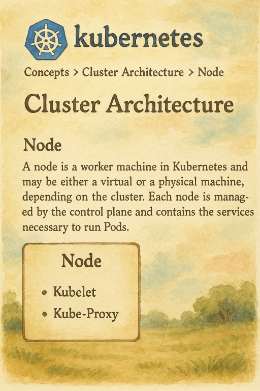

  

<!--more-->
[doc link](https://kubernetes.io/docs/concepts/architecture/nodes/)

## 什麼是節點 (Node)？

在 Kubernetes (K8s) 中，**節點 (Node)** 是指一個工作機器 (Worker Machine)，它可以是實體機 (Bare Metal) 或虛擬機 (VM)。每個節點都由控制平面 (Control Plane) 管理，並負責運行您的應用程式容器 (Workload)。

您可以透過設定，來決定容器要如何分佈在各個節點上，以及要分配多少運算資源 (Computing Resource) 給它們。

## 如何將節點加入叢集？

將節點加入 K8s 叢集的方式，會因您使用的 K8s 發行版 (Distribution) 而異。

- **雲端供應商託管的 K8s**：如果您使用 GKE、EKS 或 AKS 等服務，通常只需要在管理主控台中點擊幾下即可新增節點。
- **本地環境 (On-Premise)**：在本地環境中，主要有兩種方式：
    - **自動註冊 (Self-registration)**：`kubelet` 服務在節點上啟動時，會自動向控制平面註冊。
    - **手動新增 (Manually Add)**：您可以使用 `kubectl` 指令手動將節點加入叢集。

> **注意**：每個節點的名稱在叢集中必須是唯一的，預設情況下會使用主機名稱 (hostname)。

> `kubectl` 是操作 K8s 叢集的命令列工具，後續章節會有更詳細的介紹。

## 節點狀態詳解 (Node Status)

您可以使用 `kubectl describe node` 指令來查看特定節點的詳細資訊。

```bash
# 檢查節點狀態
kubectl describe node <node-name>
```

這個指令會回傳大量資訊，對於初學者來說可能有點不知所措。以下我們將重點解釋幾個關鍵部分：

### 範例輸出 (節錄)

```bash
$ kubectl describe node node-1
# ... (省略部分資訊)

# Conditions: 顯示節點的健康狀況
# Ready 狀態為 True 表示節點已準備好接收 Pod
Conditions:
  Type              Status  LastHeartbeatTime                 LastTransitionTime                Reason                       Message
  ----              ------  -----------------                 ------------------                ------                       -------
  MemoryPressure    False   Tue, 17 Jun 2025 07:07:56 +0000   Sat, 14 Jun 2025 08:36:06 +0000   KubeletHasSufficientMemory   kubelet has sufficient memory available
  DiskPressure      False   Tue, 17 Jun 2025 07:07:56 +0000   Sat, 14 Jun 2025 08:36:06 +0000   KubeletHasNoDiskPressure     kubelet has no disk pressure
  PIDPressure       False   Tue, 17 Jun 2025 07:07:56 +0000   Sat, 14 Jun 2025 08:36:06 +0000   KubeletHasSufficientPID      kubelet has sufficient PID available
  Ready             True    Tue, 17 Jun 2025 07:07:56 +0000   Sat, 14 Jun 2025 08:45:56 +0000   KubeletReady                 kubelet is posting ready status

# Capacity: 顯示節點擁有的總資源量
Capacity:
  cpu:                2
  ephemeral-storage:  61608748Ki
  memory:             4010048Ki
  pods:               110

# Allocatable: 顯示節點「可供 Pod 使用」的資源量
Allocatable:
  cpu:                2
  ephemeral-storage:  59932990008
  memory:             4010048Ki
  pods:               110

# Non-terminated Pods: 列出目前正在此節點上運行的 Pod
Non-terminated Pods:          (26 in total)
  Namespace                   Name                                     CPU Requests  CPU Limits  Memory Requests  Memory Limits  Age
  ---------                   ----                                     ------------  ----------  ---------------  -------------  ---
  kube-system                 coredns-697968c856-9dm6b                 100m (5%)     0 (0%)      70Mi (1%)        170Mi (4%)     2d22h
  # ...

# Events: 記錄與此節點相關的近期事件
Events:
  Type     Reason                          Age   From             Message
  ----     ------                          ----  ----             -------
  Normal   Starting                        27s   kubelet          Starting kubelet.
  Warning  Rebooted                        26s   kubelet          Node node1 has been rebooted...
  Normal   RegisteredNode                  14s   node-controller  Node node1 event: Registered Node node1 in Controller
```

總之，當您需要排查節點問題時，`describe` 是您的好朋友。

## 節點心跳 (Node Heartbeats)

K8s 的控制平面會定期檢查每個節點的健康狀態，這就是所謂的「心跳 (Heartbeats)」，預設每 5 秒一次。如果某個節點在指定時間內沒有回報心跳，控制平面會將其標記為 `NotReady`。

此時，排程器 (Scheduler) 會避免將新的 Pod 調度到這個有問題的節點上，並且會開始**驅逐 (Evict)** 該節點上現有的 Pod，將它們重新安排到其他健康的節點上。

## 維護節點 (Maintaining a Node)

當您需要對節點進行維護（例如：硬體升級、核心更新）時，可以透過以下指令來安全地將其從叢集中隔離。

### `cordon`: 暫停調度

`cordon` 指令會將節點標記為 `unschedulable` (不可調度)。

這就像在餐廳門口掛上「暫停入場」的牌子。K8s 的排程器不會再將**新的 Pod** 分配到這個節點上，但**已經在上面運行的 Pod 不會受到影響**，會繼續正常服務。

```bash
kubectl cordon <node-name>
```

執行後，您可以使用 `kubectl get node` 查看到該節點的狀態變為 `Ready,SchedulingDisabled`。

```bash
$ kubectl get node
NAME    STATUS                     ROLES    AGE     VERSION
node-4  Ready,SchedulingDisabled   <none>   2d22h   v1.32.5+k3s1
```

### `drain`: 驅逐 Pod

`drain` 指令比 `cordon` 更進一步。它不僅會將節點設為不可調度，還會安全地**驅逐 (Evict)** 該節點上所有由使用者部署的 Pod。

這就像餐廳不僅掛上「暫停入場」的牌子，還會禮貌地請店內所有客人離開，以便進行內部整修。K8s 會確保在驅逐 Pod 的同時，不會有新的 Pod 被調度進來。

```bash
# --ignore-daemonsets 參數是用來忽略不受 drain 影響的 DaemonSet Pod
# 我們會在後續章節介紹 DaemonSet
kubectl drain <node-name> --ignore-daemonsets
```

### 如何恢復節點？

當節點維護完成後，您可以使用 `uncordon` 指令來讓節點重新回到可調度 (`schedulable`) 的狀態，再次開始接收新的 Pod。

```bash
kubectl uncordon <node-name>
```

### 如何移除節點？

如果您確定要永久地從叢集中移除一個節點，可以使用 `delete` 指令。

```bash
kubectl delete node <node-name>
```

---

以上是關於 K8s 節點的基本管理知識，這些操作是日常維運中非常重要的一環。