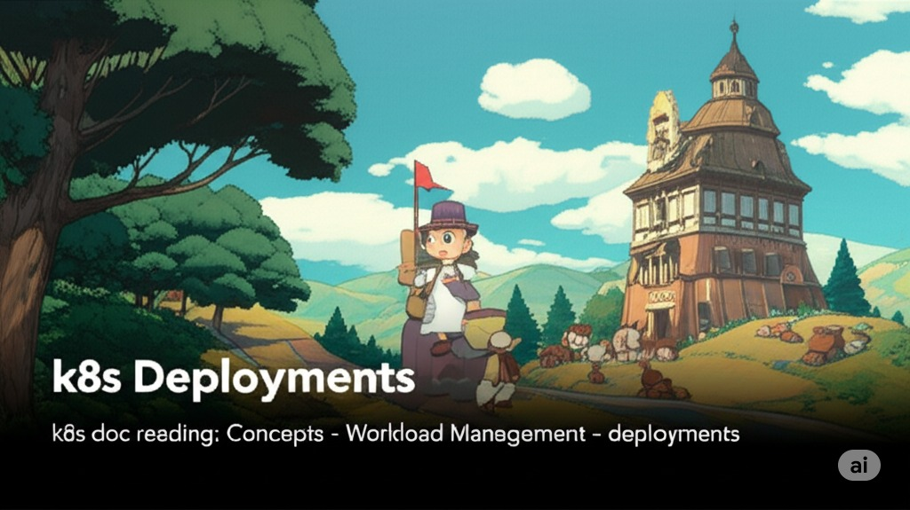
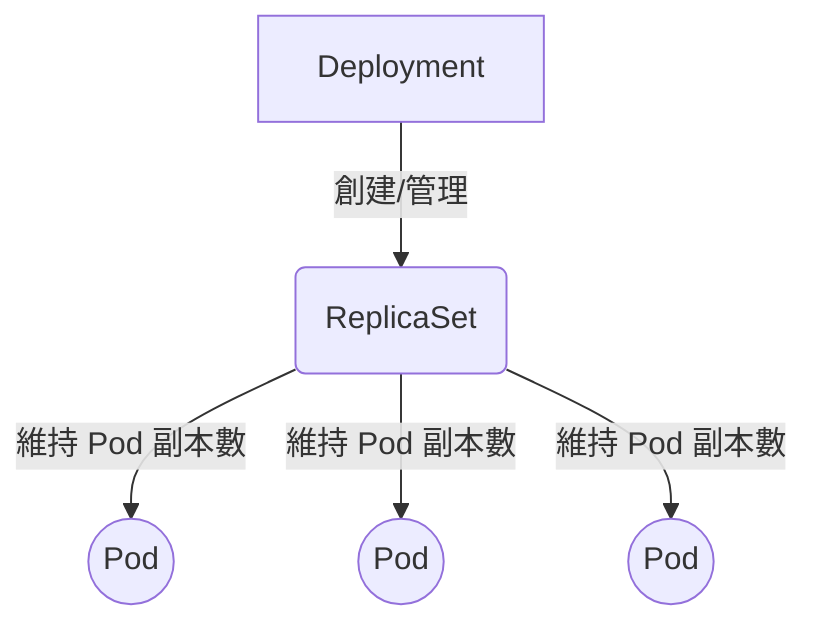

  

<!--more-->
[doc link](https://kubernetes.io/docs/concepts/workloads/controllers/deployment/)

## 為什麼需要 Deployment？

在 Kubernetes (K8s) 中，雖然 Pod 是最小的部署單位，但我們幾乎從不直接建立 Pod。為什麼？因為單獨的 Pod 是「脆弱」的。如果它所在的節點故障，或者 Pod 本身因錯誤而退出，它就會永遠消失。

這就是 **Deployment** 的價值所在。Deployment 是 K8s 中用來管理**無狀態 (Stateless)** 應用程式最常用的物件。它的核心職責是：

1.  **狀態維護**：確保在任何時候，都有指定數量的、健康的 Pod 副本在運行。
2.  **生命週期管理**：提供一套聲明式的方法來進行應用程式的更新、回滾和擴展。

您可以將 Deployment 想像成一位盡責的管家。您只需要告訴他您的「期望狀態」（例如：我需要 3 個 nginx 服務），Deployment Controller 就會持續地監控並調整系統，確保現實世界永遠符合您的期望。

## Deployment 的結構與運作

Deployment 的背後，其實是由 **ReplicaSet** 來完成實際的 Pod 管理工作。它們之間的關係如下：


-   **Deployment**：定義了應用的期望狀態，例如副本數、容器映像檔、更新策略等。
-   **ReplicaSet**：確保在任何時候都有指定數量的 Pod 副本在運行。我們通常不直接操作它，而是交由 Deployment 來管理。
-   **Pod**：真正運行您應用程式的單位。

### YAML 範例解析

讓我們來解析一個典型的 Deployment YAML 檔：
```yaml
apiVersion: apps/v1
kind: Deployment
metadata:
  name: nginx-deployment
  labels:
    app: nginx # 1. Deployment 自身的標籤
spec:
  replicas: 3
  selector:
    matchLabels:
      app: nginx # 2. Selector，用來尋找要管理的 Pod
  template: # Pod 的模板
    metadata:
      labels:
        app: nginx # 3. Pod 模板的標籤，必須與 Selector 匹配
    spec:
      containers:
      - name: nginx
        image: nginx:1.14.2
        ports:
        - containerPort: 80
```

### `Labels` 與 `Selector`：串起一切的關鍵
`Labels` 是 K8s 中用來組織和選擇物件的關鍵。在 Deployment 中，有三個地方的 `labels` 和 `selector` 需要特別注意：

| 位置 | 作用 |
| :--- | :--- |
| `1. metadata.labels` | Deployment 物件本身的標籤，方便我們透過 `kubectl get deploy -l app=nginx` 來篩選和管理 Deployment。 |
| `2. spec.selector` | **最關鍵的設定**。Deployment 透過這個 `selector` 來識別哪些 Pod 是歸它管理的。 |
| `3. spec.template.metadata.labels` | Pod 模板的標籤。這裡設定的標籤**必須**與 `spec.selector` 相匹配，Deployment 才能正確地找到它所建立的 Pod。 |


## 更新策略 (Update Strategy)

Deployment 最強大的功能之一，就是提供了優雅的應用程式更新機制。

### 滾動更新 (Rolling Update) - 預設策略
這是 K8s 預設的更新策略，它能確保在更新過程中服務不中斷。其行為可以透過以下兩個參數來微調：

-   `maxSurge`：在更新過程中，允許比期望副本數**多出**的 Pod 數量。例如，`replicas: 10`, `maxSurge: 25%`，則更新時最多可以有 `10 + 3 = 13` 個 Pod。
-   `maxUnavailable`：在更新過程中，允許**無法提供服務**的 Pod 最大數量。例如，`replicas: 10`, `maxUnavailable: 25%`，則更新時至少要有 `10 - 2 = 8` 個 Pod 處於可用狀態。

```mermaid
graph TD
    subgraph "更新前 (v1)"
        direction LR
        P1_1[Pod] --- P1_2[Pod] --- P1_3[Pod] --- P1_4[Pod]
    end

    subgraph "更新中 (maxSurge=1, maxUnavailable=1)"
        direction LR
        P1_1_down[Pod v1 <br> (Terminating)]
        P1_2_run[Pod v1]
        P1_3_run[Pod v1]
        P1_4_run[Pod v1]
        P2_1_new[Pod v2 <br> (Creating)]
    end
    
    subgraph "更新後 (v2)"
        direction LR
        P2_1[Pod] --- P2_2[Pod] --- P2_3[Pod] --- P2_4[Pod]
    end
    
    A[Start Update] --> B(Step 1: Scale down old, Scale up new) --> C(Step 2: Repeat) --> D[Finish]
    B --> 更新中
    更新前 --> A
    D --> 更新後
```
透過這兩個參數的組合，K8s 會逐步地用新版本的 Pod 替換舊版本的 Pod，實現平滑的零停機更新。

### 重建 (Recreate)
這個策略比較暴力。它會先將所有舊版本的 Pod **全部終止**，然後再建立所有新版本的 Pod。這會導致服務在更新過程中出現短暫的中斷，適用於能容忍停機的應用程式。

## Deployment 的日常操作

> **注意**：在正式的生產環境中，強烈建議使用 GitOps (如 ArgoCD) 或 CI/CD Pipeline 來管理 Deployment 的變更，而不是手動執行 `kubectl` 指令。

### 更新應用程式版本
```bash
# 將 nginx 容器的映像檔更新為 1.16.1
kubectl set image deployment/nginx-deployment nginx=nginx:1.16.1
```

### 查看更新歷史與回滾
K8s 會保存 Deployment 的變更歷史 (`revision`)。
```bash
# 查看更新歷史
kubectl rollout history deployment/nginx-deployment

# 查看某個特定版本的詳細資訊
kubectl rollout history deployment/nginx-deployment --revision=2

# 回滾到上一個版本
kubectl rollout undo deployment/nginx-deployment

# 回滾到指定的版本
kubectl rollout undo deployment/nginx-deployment --to-revision=2
```

### 擴展與縮減副本數
```bash
# 將副本數擴展到 10
kubectl scale deployment/nginx-deployment --replicas=10

# 將副本數縮減為 0，常用於臨時下線服務
kubectl scale deployment/nginx-deployment --replicas=0
```

---
Deployment 是您在 K8s 中最常打交道的物件之一。理解其宣告式的運作模型和強大的生命週期管理能力，是掌握 K8s 應用部署的關鍵第一步。