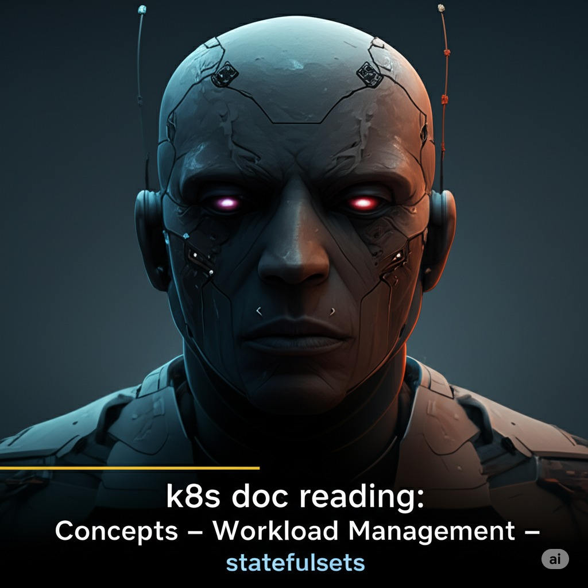
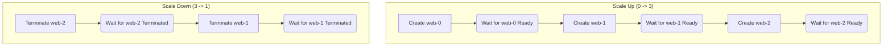

  

<!--more-->
[doc link](https://kubernetes.io/docs/concepts/workloads/controllers/statefulset/)

在雲原生的世界裡，有一個經典的比喻：「**我們應該像對待牲畜 (Cattle) 一樣對待伺服器，而不是像對待寵物 (Pets) 一樣。**」

-   **Deployment** 管理的就是「**牲畜**」。所有的 Pod 都是一模一樣、沒有差別的。如果一個 Pod 死了，Deployment Controller 會毫不在意地用一個全新的 Pod 替換它。
-   **StatefulSet** 管理的則是「**寵物**」。每一個 Pod 都是獨一無二的，有自己固定的名字和身份。如果一個 Pod (例如 `db-0`) 出了問題，我們希望它能原地恢復，而不是被一個全新的 `db-0` 所取代。

StatefulSet 正是為那些需要「身份」的有狀態應用（如資料庫、訊息佇列）而設計的。

## Deployment vs. StatefulSet

| 特性 | Deployment (牲畜) | StatefulSet (寵物) |
| :--- | :--- | :--- |
| **Pod 標識** | Pod 名稱是隨機的 (`-<random-hash>`) | Pod 名稱是**穩定且有序**的 (`-<ordinal-index>`)，例如 `web-0`, `web-1`。 |
| **網路標識** | Pod 的 IP 不固定，依賴 Service 進行服務發現。 | 每個 Pod 擁有**穩定**的 DNS 名稱 (`<pod-name>.<service-name>...`)。 |
| **儲存** | 所有 Pod 通常共享同一個 PVC。 | 每個 Pod **各自擁有**一個獨立的、穩定的 PVC。 |
| **部署/擴展** | 並行、無序。 | **有序**。擴展時 `0..N-1`，縮減時 `N-1..0`。 |
| **更新策略** | 預設為 `RollingUpdate`，可並行更新。 | 預設為 `RollingUpdate`，但會**依序**更新 (partitioned)。 |

## StatefulSet 的核心特性

### 1. 穩定且唯一的網路標識
StatefulSet 透過一個**無頭服務 (Headless Service)**，為其管理的每個 Pod 提供一個穩定且唯一的 DNS A 記錄。
-   **Headless Service**：是一個 `ClusterIP` 設為 `None` 的特殊 Service。K8s 不會為它分配虛擬 IP，而是會為其後端的每個 Pod 產生一個 DNS 記錄。
-   **DNS 格式**：`<pod-name>.<headless-service-name>.<namespace>.svc.cluster.local`
-   **範例**：`web-0.nginx.default.svc.cluster.local`

這使得叢集中的其他應用程式（例如資料庫的主從節點之間）可以透過一個固定的、可預測的 DNS 名稱來互相發現和通訊。

### 2. 穩定且持久的儲存
這是 StatefulSet 的精髓。透過 `.spec.volumeClaimTemplates` 欄位，StatefulSet Controller 會為每一個 Pod 自動建立一個對應的 PersistentVolumeClaim (PVC)。

-   **命名規則**：PVC 的名稱會是 `<volume-name>-<pod-name>`，例如 `www-web-0`。
-   **生命週期**：當 Pod 被刪除或重建時，與它關聯的 PVC **不會**被刪除。新的 `web-0` Pod 會被重新掛載到舊的 `www-web-0` PVC 上，從而確保資料的持久性。

```yaml
spec:
  # ...
  volumeClaimTemplates:
  - metadata:
      name: www # Volume 的名稱
    spec:
      accessModes: [ "ReadWriteOnce" ]
      storageClassName: "my-storage-class"
      resources:
        requests:
          storage: 1Gi
```

### 3. 有序的部署、擴展與更新
StatefulSet 的所有操作都遵循嚴格的順序，以確保應用程式的穩定性。



-   **部署/擴展**：從 `0` 到 `N-1`，一次一個，必須等前一個 Pod 進入 `Running and Ready` 狀態後，才會開始下一個。
-   **縮減**：從 `N-1` 到 `0`，一次一個，必須等前一個 Pod 完全終止後，才會開始下一個。
-   **更新**：也是從 `N-1` 到 `0` 反向依序更新。

這種可預測的行為對於需要進行節點間同步或有主從關係的有狀態應用至關重要。

## YAML 範例
```yaml
apiVersion: v1
kind: Service # 必須先建立 Headless Service
metadata:
  name: nginx # Service 名稱必須與 StatefulSet 的 serviceName 匹配
  labels:
    app: nginx
spec:
  ports:
  - port: 80
    name: web
  clusterIP: None # 設為 None
  selector:
    app: nginx
---
apiVersion: apps/v1
kind: StatefulSet
metadata:
  name: web
spec:
  serviceName: "nginx" # 指向上面建立的 Headless Service
  replicas: 3
  selector:
    matchLabels:
      app: nginx
  template:
    metadata:
      labels:
        app: nginx
    spec:
      terminationGracePeriodSeconds: 10
      containers:
      - name: nginx
        image: registry.k8s.io/nginx-slim:0.24
        ports:
        - containerPort: 80
          name: web
        volumeMounts:
        - name: www # 必須與 volumeClaimTemplates 的 name 匹配
          mountPath: /usr/share/nginx/html
  volumeClaimTemplates:
  - metadata:
      name: www
    spec:
      accessModes: [ "ReadWriteOnce" ]
      storageClassName: "my-storage-class"
      resources:
        requests:
          storage: 1Gi
```

---
總結來說，當您的應用程式需要穩定的網路標識、持久化的獨立儲存，以及可預測的部署順序時，StatefulSet 就是您的不二之選。它是 K8s 能夠成功運行複雜有狀態服務（如 MySQL, etcd, Kafka）的關鍵所在。