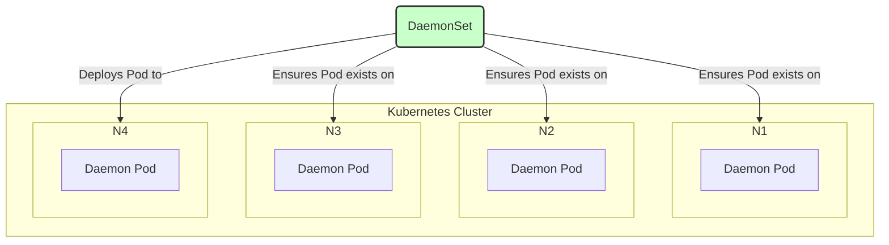

  

<!--more-->
[doc link](https://kubernetes.io/docs/concepts/workloads/controllers/daemonset/)

## 什麼是 DaemonSet？

**DaemonSet** 是 Kubernetes (K8s) 中一種特殊的工作負載，它的核心任務是**確保在叢集中的每一個（或指定的）節點上，都運行且僅運行一個 Pod 的副本**。

您可以將 DaemonSet 想像成每個節點上的「**守護精靈**」或「**常駐管家**」。當有新的節點加入叢集時，DaemonSet 會自動在該節點上部署一個 Pod；當節點被移除時，對應的 Pod 也會被自動回收。



這種「每個節點都有一個」的特性，使得 DaemonSet 非常適合用來部署叢集級別的基礎設施服務。

## DaemonSet 的典型應用場景

1.  **日誌收集 (Log Collection)**：在每個節點上運行一個日誌收集代理（如 Fluentd, Logstash, Promtail），負責收集該節點上所有容器的日誌，並將其轉發到中央日誌系統。
2.  **節點監控 (Node Monitoring)**：在每個節點上運行一個監控代理（如 Prometheus Node Exporter, Datadog Agent），負責收集該節點的效能指標（CPU, Memory, Disk I/O 等）。
3.  **叢集儲存 (Cluster Storage)**：在每個節點上運行儲存常駐程式（如 Ceph, GlusterFS），將所有節點的本地儲存聚合成一個分佈式的儲存池。
4.  **網路插件 (CNI)**：許多 CNI 網路解決方案（如 Calico, Cilium）就是透過 DaemonSet 來在每個節點上部署其網路代理的。

## 如何控制 DaemonSet 的部署範圍？

預設情況下，DaemonSet 會在叢集中的**所有**節點上部署 Pod。但有時我們需要更精細的控制。

### 1. 精準部署：`nodeSelector` / `nodeAffinity`
如果您希望 DaemonSet 只在**符合特定條件**的節點上運行，可以使用 `nodeSelector` 或 `nodeAffinity`。

**範例：只在裝有 SSD 的節點上運行日誌收集器**
```yaml
# ... spec.template.spec ...
      nodeSelector:
        disktype: ssd
```

### 2. 突破限制：`tolerations`
在標準的 K8s 叢集中，控制平面節點 (Control Plane) 預設會被加上「**污點 (Taint)**」，以防止普通的使用者應用程式被調度上去。

但我們的日誌收集器或監控代理，通常也需要運行在控制平面節點上，才能收集到完整的叢集資訊。這時，就需要為 DaemonSet 的 Pod 加上「**容忍 (Toleration)**」，讓它可以被部署到這些帶有污點的特殊節點上。

```yaml
# ... spec.template.spec ...
      tolerations:
      # 容忍控制平面節點的 Taint
      - key: "node-role.kubernetes.io/control-plane"
        operator: "Exists"
        effect: "NoSchedule"
      - key: "node-role.kubernetes.io/master"
        operator: "Exists"
        effect: "NoSchedule"
```
> 關於 Taints 和 Tolerations 的詳細介紹，請參考 [Taints and Tolerations](/docs/k8s-doc-reading/20250704_k8s-doc-reading-taint-and-toleration/) 一文。

## DaemonSet 的更新策略

DaemonSet 也支援兩種更新策略 (`.spec.updateStrategy.type`)：
-   **`RollingUpdate` (預設)**：與 Deployment 類似，會逐一地更新每個節點上的 Pod，確保服務的可用性。
-   **`OnDelete`**：只有當您手動刪除舊版本的 Pod 後，DaemonSet Controller 才會建立新版本的 Pod。這種策略通常用於需要手動控制更新節奏的關鍵基礎設施。

## YAML 範例
以下是一個部署 Fluentd 日誌收集器的 DaemonSet 範例：
```yaml
apiVersion: apps/v1
kind: DaemonSet
metadata:
  name: fluentd-elasticsearch
  namespace: kube-system
  labels:
    k8s-app: fluentd-logging
spec:
  selector:
    matchLabels:
      name: fluentd-elasticsearch
  template:
    metadata:
      labels:
        name: fluentd-elasticsearch
    spec:
      tolerations: # 容忍控制平面節點的 Taint
      - key: node-role.kubernetes.io/control-plane
        operator: Exists
        effect: NoSchedule
      containers:
      - name: fluentd-elasticsearch
        image: quay.io/fluentd_elasticsearch/fluentd:v2.5.2
        resources:
          limits:
            memory: 200Mi
          requests:
            cpu: 100m
            memory: 200Mi
        volumeMounts: # 掛載節點上的日誌目錄
        - name: varlog
          mountPath: /var/log
      volumes:
      - name: varlog
        hostPath: # 使用 hostPath 來存取節點的檔案系統
          path: /var/log
```

---
總結來說，DaemonSet 是管理叢集基礎設施層服務的關鍵工具。透過它，我們可以確保叢集的每個角落都受到監控、日誌都被收集，從而構建一個更健壯、更易於觀測的生產環境。
