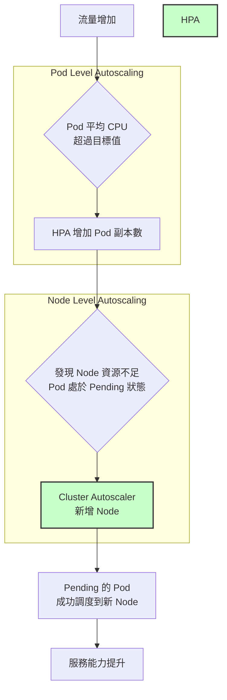

  

<!--more-->
[doc link](https://kubernetes.io/docs/concepts/workloads/autoscaling/)

自動擴展 (Autoscaling) 是 Kubernetes (K8s) 最強大、也最核心的功能之一。它不僅能在流量高峰時自動增加資源以應對壓力，也能在離峰時自動縮減資源以節省成本，是實現雲原生應用彈性的關鍵。

在 K8s 中，自動擴展有兩個主要維度：**Pod 的擴展** 和 **Node 的擴展**。這兩者相輔相成，共同構建了一個完整的擴展閉環。



## Pod 的擴展 (Workload Autoscaling)

Pod 的擴展分為「水平」和「垂直」兩種方式。

-   **水平擴展 (Horizontal Scaling)**：增加或減少 Pod 的**數量** (Replica)。這是最常見、也最推薦的擴展方式，由 **HorizontalPodAutoscaler (HPA)** 物件管理。
-   **垂直擴展 (Vertical Scaling)**：增加或減少單一 Pod 的**資源** (CPU/Memory)。通常用於有狀態服務 (StatefulSet) 或特殊場景，由 **VerticalPodAutoscaler (VPA)** 物件管理。

### 前提：安裝 Metrics Server

HPA 和 VPA 都需要依賴 Pod 的資源使用率指標 (Metrics) 來做決策。然而，一個乾淨的 K8s 叢集預設並**不包含**收集這些指標的組件。

您必須先在叢集中安裝 [**Metrics Server**](https://github.com/kubernetes-sigs/metrics-server)。它會從每個 Node 的 `kubelet` 收集資源使用數據，並透過 K8s 的 Metrics API 將其暴露出來，供 HPA 等組件使用。

```bash
# 安裝最新版本的 Metrics Server
kubectl apply -f https://github.com/kubernetes-sigs/metrics-server/releases/latest/download/components.yaml
```
> 許多 K8s 發行版（如 k3s）或公有雲託管的 K8s 服務會預設安裝好 Metrics Server。

### Pod 水平擴展 (HPA)

HPA 會定期檢查指標，並根據以下公式來計算期望的副本數：
`期望副本數 = ceil[ 目前副本數 * ( 目前指標值 / 期望指標值 ) ]`

**範例：**
假設您設定 HPA 的目標是讓 Pod 的平均 CPU 使用率維持在 50%。
-   **目前狀態**：有 3 個副本，平均 CPU 使用率為 80%。
-   **HPA 計算**：`ceil[3 * (80% / 50%)] = ceil[3 * 1.6] = ceil[4.8] = 5`
-   **結果**：HPA 會將 Deployment 的副本數從 3 調整為 5。

HPA 的設定非常簡單，您可以指定最小/最大副本數，以及觸發擴展的指標（如 CPU 或 Memory 平均使用率）。

### Pod 垂直擴展 (VPA)

VPA 會分析 Pod 的歷史資源使用情況，並自動調整其 `requests` 和 `limits`。

雖然聽起來很美好，但在實務上，**VPA 較少被用於自動調整**，原因是在 K8s 1.32 版本之前，調整資源需要重啟 Pod，這會導致服務中斷。

VPA 更常見的用途是作為一個**資源推薦工具**。您可以將 VPA 設定在 `Recommender` 模式下，它會持續觀察您的應用程式，並「建議」一個最合適的 `requests` 和 `limits` 值，幫助您優化資源配置。

## Node 的擴展 (Cluster Autoscaler)

當 HPA 建立了新的 Pod，但叢集中所有 Node 的資源都已滿載，導致新 Pod 因資源不足而處於 `Pending` 狀態時，就需要 **Cluster Autoscaler (CA)** 登場了。

-   **擴展 (Scale-out)**：CA 會偵測到因資源不足而 `Pending` 的 Pod，並自動向雲端供應商（如 AWS, GCP, Azure）申請新的 Node 加入叢集。
-   **縮減 (Scale-in)**：CA 也會持續檢查使用率過低的 Node。如果一個 Node 長時間處於低負載，並且其上運行的 Pod 都可以被安全地重新調度到其他 Node，CA 就會將該 Node 從叢集中移除，以節省成本。

> Cluster Autoscaler 是雲端環境專屬的功能，在本地 (On-Premise) 環境中無法使用。

## 超越 CPU/Memory：事件驅動的 KEDA

HPA 和 VPA 主要依賴 CPU/Memory 指標，但在許多現代應用中，擴展的需求可能來自更複雜的業務指標，例如：
-   訊息佇列 (RabbitMQ, Kafka) 的隊列長度
-   資料庫的查詢延遲
-   自訂的 Prometheus 指標

這就是 [**KEDA (Kubernetes Event-driven Autoscaling)**](https://keda.sh/) 的用武之地。KEDA 是 CNCF 的一個畢業專案，它極大地擴展了 K8s 的自動擴展能力。

KEDA 可以作為 HPA 的一個「增強器」，它提供超過 60 種內建的 Scaler，可以連接到各種事件源，並根據這些外部指標來驅動 HPA 進行擴展，甚至可以將 Pod 副本數縮減到 **零**，實現真正的 Serverless 化。

對於任何有複雜擴展需求的場景，**強烈推薦使用 KEDA**。

---

總結來說，一個成熟的 K8s 自動擴展策略，通常是 **HPA + Cluster Autoscaler + KEDA** 的組合，讓您的應用程式能夠從容應對各種負載變化，兼具彈性與成本效益。