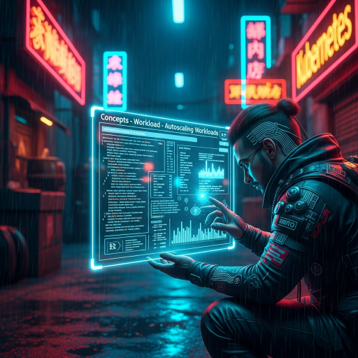

  

<!--more-->
[doc link](https://kubernetes.io/docs/concepts/workloads/autoscaling/)   

auto scale 是我認為最重點的功能  
auto scale 不僅可以節省 resource  
也在高壓力時增加 resource   
藉由自動 scale 機制的實現  就算人工 scale 也會因部份功能已經自動化  
而大幅降低人工操作 loading 及時間  

k8s 是一個 cluster  
有多少 computing resource 取決於有多少 work node  
有多少 work node 才可以執行多少 workload  
因此 auto scale 分成兩部份  

1. node auto scale   
2. pod auto scale   


## node auto scale
如果是 on-primes (地端) 架設 k8s cluster  
那就沒有 auto scale node 的功能了 (畢竟要先有硬體)  

可是如果你是使用 EKS(amazon),GKE(google),AKS(azure)  
因為是公有雲環境, 要多少 computing resource 就是 api 要馬上有  
因此能提供 cluster auto scale  
根據不同的 distro  
有不同得做法  
不過基本上 [kubernetes/autoscaler](https://github.com/kubernetes/autoscaler) 都支援   

基本概念就是觀察 scheduler 如果發生無法 schedule pod 時  
會看原因是什麼, 找到無法滿足原因後, scale 對應的 hardware resource 的 node group   

至於實際使用 因不同 distro 會稍微不同, 因此就大家各自嘗試了  

## workload auto scale 

workload auto scale a.k.a. pod auto scale  
因為真正在消耗 computing resource 的是 pod  

k8s 內建有兩種 scale  

**Horizontal scaling**: 就是增加 pod 的 replica  
**Vertical scaling**: 提高 CPU and memory resources (request or limit)  

通常來說 應用的 kind 就是  
**Horizontal scaling**: deployment  
**Vertical scaling**: statefulset  

在 k8s 進行 Horizontal scaling 稱為 HorizontalPodAutoscaler (HPA)  
在 k8s 進行 Vertical scaling 稱為 VerticalPodAutoscaler (VPA)  

HPA 是 k8s 直接支援  
VPA 則是需要另外安裝  
兩個都是依靠 pod cpu/mem 的 metric 作為判斷條件  
而 k8s defaule 沒有提供 pod cpu/mem 的 metric(what...?)  

也就是說 default 情況下 HPA/VPA 其實是無法運作的  
k8s 支援但沒有 implement feature, 這種情況在 k8s 中很常發生  
因此在使用功能之前, 務必做好了解

那關於 pod cpu/mem 的 metric  
需要安裝 [metrics-server](https://github.com/kubernetes-sigs/metrics-server)  才能支援  
k3s 預設已經安裝 metrics-server  

for 其他 distro 可能須自行安裝    
```bash
kubectl apply -f https://github.com/kubernetes-sigs/metrics-server/releases/latest/download/components.yaml
```

關於 pod auto scale 其實 k8s 內建的 Autoscaler 功能有限  
也並沒那麼好用  
k8s 官方推薦使用 [KEDA](https://keda.sh)  
我個人也非常推薦使用 KEDA  
因此 HPA/VPA 大家稍微了解即可  


### HorizontalPodAutoscaler (HPA)  
[doc](https://kubernetes.io/docs/tasks/run-application/horizontal-pod-autoscale/)

他的運作原理很簡單  
我們給予目標 desire loading  
allowed max pod count  
allowed min pod count  

HPA 會依據 monitor 到的 pod metric average value 做一個計算  
得出預期要調整的 replica count 最終會滿足 desire loading  

比如說 desire cpu loading: 100m  
current cpu metric average value: 200m   
current replica pod count: 1   

那 HPA 就會計算出 replica pod count 改為: 2  
會滿足 desire cpu loading: 100m  
除了 scale-out 外  

反過來也會 scale-in  


然後最終 pod replica count 結果不會高於 max pod count  
不低於 min pod count  

### VerticalPodAutoscaler (VPA) 

關於 VPA 可以可以參考 [doc](https://github.com/kubernetes/autoscaler/blob/master/vertical-pod-autoscaler/docs/quickstart.md)   
要注意的是  
k8s 1.32 以前不支援對既有的 pod 調整 resource  
因此 VPA 必須要重起過 pod 才行  

但是在 k8s 1.33 開始支援 dynamic 調整了
https://kubernetes.io/docs/tasks/configure-pod-container/resize-container-resources/

詳細可以參考 [InPlaceOrRecreate](https://github.com/kubernetes/autoscaler/blob/master/vertical-pod-autoscaler/docs/installation.md)  

至於實際使用就不說明了, 我個人覺得實務上不太會用到 VPA  


---  

最後關於 KEDA  
之後再找個篇幅說明  

如果是在公有雲的環境下  
pod 一 scale, node 有需要也會 scale  
因此 auto 功能做起來後也能夠幫助 manual scale 變輕鬆  
因此我認為是日常維運相當重要的功能  