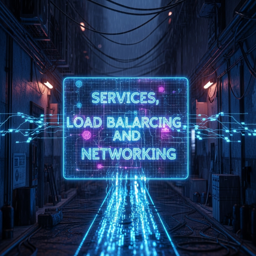
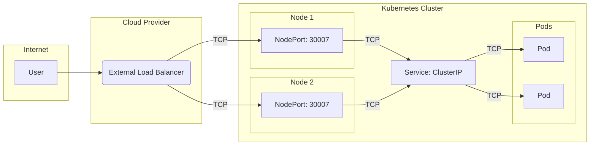

  

<!--more-->
[doc link](https://kubernetes.io/docs/concepts/services-networking/)

## K8s 網路概覽：一座城市的交通系統

要理解 Kubernetes (K8s) 複雜的網路世界，我們可以將其比喻為一座精心規劃的城市交通系統。

| K8s 元件 | 城市交通比喻 | 角色 |
| :--- | :--- | :--- |
| **Pod IP** | 每家每戶的**門牌號碼** | Pod 的實際位址，短暫而不穩定。 |
| **Service (ClusterIP)** | 城市裡的**圓環/交叉路口** | 為一組 Pod 提供一個穩定的內部入口，負責在街區內引導車流。 |
| **Ingress / Gateway** | 城市的主要**高速公路交流道** | 管理所有進城的車流 (HTTP/S)，並根據路標（主機名、路徑）將它們導向不同的目的地。 |
| **NetworkPolicy** | **交通管制/通行證** | 設定防火牆規則，規定哪些車輛（Pods）可以進入哪些特定區域（其他 Pods）。 |
| **CNI 插件** | **道路工程隊** | 負責鋪設城市所有的道路，確保每家每戶（Pods）之間都能互相連通。 |

本篇文章將帶您遊覽這座城市，了解各個交通樞紐是如何協同工作的。

## K8s 網路模型基礎：IP-per-Pod
K8s 的網路模型有一個核心原則：**每個 Pod 都擁有自己獨立且可路由的 IP 位址**。

這意味著：
-   所有 Pod 都在同一個巨大的網路平面上。
-   任何一個 Pod 都可以直接透過 IP 位址與另一個 Pod 通訊，無需 NAT。
-   同一個 Pod 內的多個容器共享同一個網路命名空間，可以使用 `localhost` 互相通訊。

這個基礎網路是由 **CNI (Container Network Interface)** 插件來實現的。K8s 本身不負責鋪路，而是將這個任務交給了像 Calico, Flannel, Cilium 這樣的專業「工程隊」。

## 對內交通：Service
Pod 的生命是短暫的，其 IP 位址會隨生老病死而改變。**Service** 的誕生，就是為了解決這個「門牌號碼天天換」的問題。

Service 為一組功能相同的 Pod 提供了一個**穩定不變的存取入口**。它有自己的虛擬 IP (`ClusterIP`) 和 DNS 名稱，當流量到達 Service 時，它會自動地、智慧地將流量負載平衡到後端健康的 Pod 上。

### Service 的類型：從巷口到高速公路

-   **`ClusterIP` (預設)**：**僅限叢集內部存取**。它就像一個社區內部的交叉路口，只負責引導社區內的車流。這是最常見的 Service 類型，用於服務之間的內部通訊。
-   **`NodePort`**：在 `ClusterIP` 的基礎上，會在**每個 Node** 上開啟一個固定的埠號。就像在社區的每個角落都開一個小側門，您可以透過 `[任何節點的 IP]:[NodePort]` 從外部訪問服務。主要用於開發和測試。
-   **`LoadBalancer`**：在 `NodePort` 的基礎上，會向雲端供應商**申請一個外部負載平衡器**。這是將服務標準化地暴露到網際網路上的最佳方式，就像為城市建立一個正式的高速公路交流道。

## 對外交通：Ingress & Gateway
雖然 `LoadBalancer` 類型的 Service 可以將服務暴露到外部，但它通常只處理四層 (TCP/UDP) 流量，且每暴露一個服務就需要一個昂貴的 LB IP。

當我們需要更複雜的七層 (HTTP/S) 路由規則時，就需要 **Ingress** 或其下一代 **Gateway API**。

-   **Ingress**：定義了基於**主機名稱** (e.g., `a.com`, `b.com`) 或 **URL 路徑** (e.g., `/api`, `/images`) 的路由規則。它需要一個 **Ingress Controller** (例如 NGINX Ingress Controller) 來實現這些規則。
-   **Gateway API**：提供了更強大、更靈活、角色分離的路由管理能力，是 K8s 網路路由的未來方向。

## 網路安全：NetworkPolicy
預設情況下，叢集內的所有 Pod 之間可以自由通訊（"zero-trust" or "default-allow"）。**NetworkPolicy** 提供了**網路防火牆**的功能，讓您可以基於標籤 (Labels) 來定義精細的存取控制規則。

例如，您可以定義一條策略：「只允許 `frontend` 標籤的 Pod 存取 `backend` 標籤的 Pod 的 `6379` 埠號」。

> **重要**：NetworkPolicy 的實現同樣依賴於 CNI 插件。並非所有 CNI 都支援此功能。

## K8s 實作了什麼？

| 功能 | K8s 是否內建？ | 備註 |
| :--- | :--- | :--- |
| **Pod 網路** | ❌ 否 | 完全依賴 **CNI 插件** (如 Calico, Flannel)。 |
| **Service (ClusterIP, NodePort)** | ✅ 是 | K8s 的核心功能，由 `kube-proxy` 實現。 |
| **Service (LoadBalancer)**| ⚠️ 半內建 | 需要**雲端控制器**或特定插件 (如 MetalLB, Klipper) 的整合。 |
| **Ingress** | ⚠️ 僅 API | 只提供 API 物件，需要額外安裝 **Ingress Controller**。 |
| **Gateway API**| ⚠️ 僅 API | 同 Ingress，需要安裝對應的 Gateway Controller。 |
| **NetworkPolicy**| ⚠️ 僅 API | 需要支援此功能的 **CNI 插件**。 |

---
對於 k3s 使用者來說，好消息是它已經為您「內建電池」，預先配置好了 Flannel (CNI)、Klipper (Service LB) 和 Traefik (Ingress Controller)，讓您可以開箱即用地體驗完整的 K8s 網路功能。
