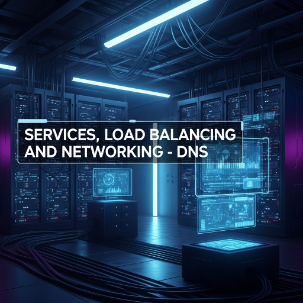

  

<!--more-->
[doc link](https://kubernetes.io/docs/concepts/services-networking/dns-pod-service/)   

pod/service 每一次新增刪除都會 assigin new ip  
因此 connection 要去使用 ip 連線是不現實的  

在 cloud 的世界, 不管是公有雲還是 k8s 都是同樣的狀況  
因此會提供 DNS server 來讓 access pod/service 能夠輕易達成  

## service DNS rule  
**service DNS rule**: `<service name>.<namespace>.svc.<cluster domain>` or `<service name >.<namespace>`  
example: service1.default.svc.cluster.local or service1.default  

> cluster domain 預設為 `cluster.local`  

for normal (not headless) Services, 是回 service ecluster IP  

for headless Services, 是回這個 service selected 的所有 pod IP  

## pod DNS rule
**pod DNS rule**: `<pod-ipv4-address>.<namespace>.pod.<cluster domain>`  
example: 172-17-0-3.default.pod.cluster.local  

> cluster domain 預設為 `cluster.local`  

## Pod's DNS nameeserver Policy
既然 service/pod 會有自己的 DNS record  
那誰來維護呢？  
k8s 內建會有 DNS serever, 基本上是使用 coreDNS  

預設情況下 pod 都優先使用 cluster DNS server  

如果不希望使用 cluster DNS server  
可以在 pod 新增設定 `dnsPolicy` 來改變設定  

`ClusterFirst`: default 設定, 使用 cluster DNS server  
`Default`: 使用該 node DNS 設定  
> 此 default 不是指 default 設定, 超誤導人的啦  

`ClusterFirstWithHostNet`: 如果使用 hostNetwork, dnsPolicy 無法使用 ClusterFirst, 會 fallback 至 Default  
必須設定 ClusterFirstWithHostNet 解決這問題  
`None`: 允許 pod 設定 `dnsConfig` 自行設定 DNS serever  

---

不管是 k8s 還是公有雲 DNS 都很重要, 因為 IP 不會是固定的  
也因此在設定 pod access service 時, 請務必使用 DNS 來設定  
