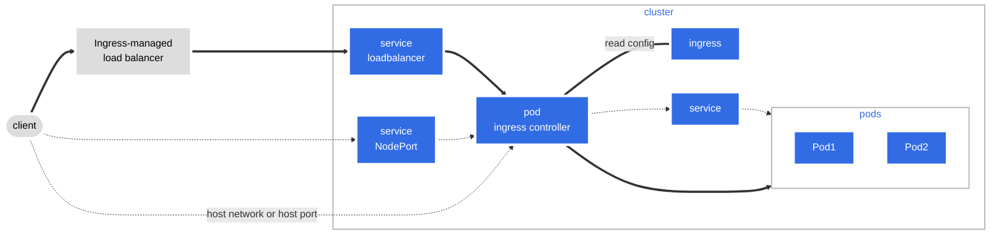

  

<!--more-->
[doc link](https://kubernetes.io/docs/concepts/services-networking/ingress/)

## 什麼是 Ingress？

簡單來說，**Ingress** 是 Kubernetes (K8s) 中管理外部流量進入叢集的 API 物件，其作用類似於一個「智慧型反向代理 (Reverse Proxy)」。它主要負責處理 HTTP 和 HTTPS 流量，並提供以下關鍵功能：

- **SSL/TLS 終止 (Termination)**：集中管理憑證，卸載後端服務的加密負擔。
- **基於主機名和路徑的路由 (Host and Path-based Routing)**：根據請求的網域名稱 (e.g., `foo.com`, `bar.com`) 或 URL 路徑 (e.g., `/api`, `/images`) 將流量轉發到不同的後端服務。

Ingress 是目前將 K8s 服務暴露給外部最推薦、也最常見的方式。

### Ingress 與 Gateway API

您可能聽過一個更新的 API 叫做 [Gateway API](https://gateway-api.sigs.k8s.io/)。它旨在提供比 Ingress 更強大、更具表達力的路由功能，並原生支援 TCP/UDP 等非 HTTP 流量。

根據官方說明，Gateway API 未來會成為 K8s 路由功能的演進方向，但 **Ingress 並沒有被棄用 (deprecate) 的打算**。考量到 Ingress 的成熟度和廣泛應用，在現階段學習它依然非常重要且實用。

## Ingress 如何運作？

要理解 Ingress，最重要的一點是：**Ingress 本身只是一個設定檔 (Configuration)，它不處理任何流量。**

真正負責讀取 Ingress 設定並處理流量的是 **Ingress Controller**。

以下是流量處理的簡化流程圖：



運作流程解析：
1.  **安裝 Ingress Controller**：由於 K8s 本身不提供 Ingress 的實作，您必須先在叢集中安裝一個 Ingress Controller。它會以 Pod 的形式運行。
2.  **建立 Ingress 物件**：您需要建立一個 Ingress 的 YAML 設定檔，定義路由規則，例如：「當請求 `foo.bar.com/bar` 時，將流量轉發到 `service1`」。
3.  **Controller 讀取設定**：Ingress Controller 會持續監聽叢集中的 Ingress 物件。當它發現您建立的 Ingress 物件後，就會讀取其中的規則，並更新自身的代理設定。
4.  **流量進入**：外部客戶端的請求首先會到達一個負載平衡器 (Load Balancer)，這個負載平衡器將流量導向叢集中的 Ingress Controller Pod。
5.  **轉發至後端**：Ingress Controller 根據讀取到的規則，將請求轉發到對應的後端 Service，最終到達目標 Pod。

**重點提醒**：所有外部流量都由 Ingress Controller Pod 處理。如果您的網站流量很大，請務必監控 Ingress Controller 的負載，並在必要時對其進行水平擴展 (scale-out)。

## 如何開始使用 Ingress？

### 1. 安裝 Ingress Controller

K8s 官方維護了一個可用 [Ingress Controller 的列表](https://kubernetes.io/docs/concepts/services-networking/ingress-controllers/)。對於初學者，推薦使用由 K8s 社群維護的 [ingress-nginx](https://github.com/kubernetes/ingress-nginx)。

> **注意**：市面上有兩個著名的 NGINX Ingress Controller：一個是 K8s 社群維護的 `ingress-nginx`，另一個是由 F5/NGINX 官方維護的 `nginx-ingress-controller`。兩者在功能和使用上有所差異，安裝時請特別注意。

每個 Ingress Controller 的安裝方式都不同，請務必參考其官方文件。如果您使用的是像 **k3s** 這樣的輕量級發行版，它通常會預設安裝好 [Traefik](https://traefik.io/traefik/) 作為 Ingress Controller，讓您可以直接開始使用。

### 2. 建立 Ingress 物件

以下是一個基本的 Ingress 設定範例：

```yaml
apiVersion: networking.k8s.io/v1
kind: Ingress
metadata:
  name: ingress-foo-bar
spec:
  # ingressClassName: traefik  # 指定要使用的 Ingress Controller
  rules:
  - host: "foo.bar.com"
    http:
      paths:
      - pathType: Prefix
        path: "/bar"
        backend:
          service:
            name: service1
            port:
              number: 80
```

-   `.spec.rules[0].host`: 定義主機名稱。只有當請求的 `Host` 標頭為 `foo.bar.com` 時，此規則才會生效。
-   `.spec.rules[0].http.paths[0]`: 定義路徑規則。這裡表示所有以 `/bar` 為前綴的請求，都會被轉發到後端名為 `service1` 的 Service。

### 3. 實作：透過 Ingress 暴露服務

讓我們用 [Helm](https://helm.sh/) 來安裝一個 `httpbin` 服務，並透過 Ingress 將其暴露出來。

```bash
# 加入 Helm Chart 倉庫
helm repo add owan-charts https://owan-io1992.github.io/helm-charts/
helm repo update

# 使用 Helm 安裝 httpbin，並啟用 ingress
# 假設我們使用的是 k3s 預設的 traefik ingress controller
helm upgrade --install my-httpbin owan-charts/httpbin --version 0.1.6 \
  --set ingress.enabled=true \
  --set ingress.className=traefik \
  --set ingress.hosts[0].host=chart-example.local
```

安裝完成後，可以查看 Ingress 物件的狀態：
```bash
$ kubectl get ingress
NAME         CLASS     HOSTS                 ADDRESS          PORTS   AGE
my-httpbin   traefik   chart-example.local   192.168.56.101   80      4m49s
```

現在，您可以透過 `curl` 來測試服務是否成功暴露：
```bash
# 將 <your-k8s-node-ip> 替換為您任何一個 K8s 節點的 IP
node_ip=<your-k8s-node-ip>

# 使用 --resolve 參數來模擬 DNS 解析
curl http://chart-example.local/get --resolve chart-example.local:80:${node_ip}
```
如果一切順利，您應該會看到 `httpbin` 服務回傳的 JSON 結果。

---

以上就是 Ingress 的基本介紹和快速入門。事實上，Ingress 的功能遠不止於此，它還支援更複雜的路由、重寫、身份驗證等高級功能，是 K8s 中不可或缺的重要組件。