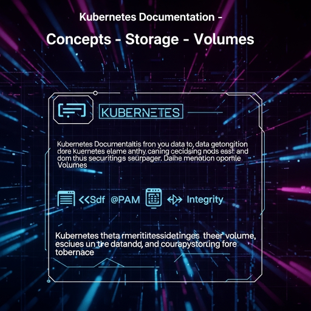

  

<!--more-->
[doc link](https://kubernetes.io/docs/concepts/storage/volumes/)   

volume 讓 container 可以 mount config / storage space / host file  
相信這用途對於學過 docker 的人並不陌生  
不過 k8s 統一將 [docker config](https://docs.docker.com/reference/compose-file/configs/) 功能統一放在 volume 下設定  

Volumes 可以滿足以下幾種需求  
- mount ConfigMap or Secret as file
- 暫時性可讀寫儲存空間
- 持續性可讀寫儲存空間
- 唯讀空間
- 共用 filesystem 在 pod / container 之間 (允許跨 node)
- pass k8s 部份資訊給 container (比如說 namespace)

> ConfigMap 與 Secret 還沒提到  
> 他是 k8s 提供一個空間讓你存放 config 資訊於 etcd 中  
> 其中 ConfigMap 未編碼, Secret 已編碼  
> 詳細差異會在之後提到  

以下介紹常用的 volume type  

## ConfigMap / Secret
能將 k8s 中的 ConfigMap / Secret 以 file 方式 mount 到 container 中  
兩者皆會以唯獨方式 mount  
允許跨 node / multiple pod / multiple container 同時 mount  

sample config  
```bash
apiVersion: v1
kind: Pod
metadata:
  name: configmap-pod
spec:
  containers:
    - name: test
      image: busybox:1.28
      command: ['sh', '-c', 'echo "The app is running!" && tail -f /dev/null']
      volumeMounts:
        - name: config-vol
          mountPath: /etc/config
  volumes:
    - name: config-vol
      configMap:
        name: log-config
        items:
          - key: log_level
            path: log_level.conf

```

在 `.spec.volumes` 聲明一個 volume name: config-vol  
要從 configMap(resource) 的 log-config(object) 的 log_level 當作 log_level.conf 這個 file  

在 `.spec.containers[0].volumeMounts` 把他放在目錄 /etc/config 下  

container 在執行時就可以 access /etc/config/log_level.conf 讀到我們給予的設定  

## hostPath
將執行該 pod 的 node 的 folder or path mount 給 pod  
最常用在 monitor(read host log send to log server)  


## storage 

storage 可以提供 pod 一個共用專用的空間做讀寫使用  
可以支援多種來源, 比如說 NFS, iSCSI, local...  
並能夠根據不同來源設定 iops/throughput/size/accessModes ... etc  
具有相當高的彈性  
但由於這裡 k8s 實做方式較為複雜  
因此下篇再繼續說明  
