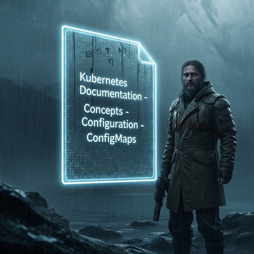

  

<!--more-->
[doc link](https://kubernetes.io/docs/concepts/configuration/configmap/)   
[doc link](https://kubernetes.io/docs/tasks/configure-pod-container/configure-pod-configmap/)   


configmap(cm) 是 k8s 提供存放非敏感訊息的地方  
他實際存放於 k8s 的 etcd 中, 每個 cm 最大 size 為 1MB  
因此超過此 size 的請考慮使用 volume  

configmap 能夠設定到 container 的 environments / command-line arguments / file   


## comfigmap sample 
configmap 使用 key-value 來設定
key 允許使用 [a-z-_.]  
value 一律為 string, 支援 multi-line  
範例  
```bash
apiVersion: v1
kind: ConfigMap
metadata:
  name: game-demo
data:
  # property-like keys; each key maps to a simple value
  sleep_time: "9527"
  ui_properties_file_name: "user-interface.properties"

  # file-like keys
  game.properties: |
    enemy.types=aliens,monsters
    player.maximum-lives=5    
  user-interface.properties: |
    color.good=purple
    color.bad=yellow
    allow.textmode=true    
```


pod

```bash
apiVersion: v1
kind: Pod
metadata:
  name: configmap-demo-pod
spec:
  containers:
    - name: demo
      image: alpine
      command: ["sleep", "$(SLEEP_TIME)"]
      env:
        # Define the environment variable
        - name: SLEEP_TIME
          valueFrom:
            configMapKeyRef:
              name: game-demo           # The ConfigMap this value comes from.
              key: sleep_time
        - name: UI_PROPERTIES_FILE_NAME
          valueFrom:
            configMapKeyRef:
              name: game-demo
              key: ui_properties_file_name
      volumeMounts:
      - name: config
        mountPath: "/config"
        readOnly: true
  volumes:
  # You set volumes at the Pod level, then mount them into containers inside that Pod
  - name: config
    configMap:
      # Provide the name of the ConfigMap you want to mount.
      name: game-demo
      # An array of keys from the ConfigMap to create as files
      items:
      - key: "game.properties"
        path: "game.properties"
      - key: "user-interface.properties"
        path: "user-interface.properties"
        
```


`.spec.volumes` 將 configmap 中的 `game.properties`,`user-interface.properties` 以 file 方式變成一個可掛載的 volume  
contianer 再去 mount 這個 volume  
要注意 volume 是唯讀  

`spec.containers[0].env` 將 configmap 以 environment 提供給 pod  
在 command 的地方就可以使用 env 當作參數   
要注意 k8s manifest 要使用 env 是使用 `$()` 非 `${}`  


在上面的例子 volume 跟 env 都是拿部份 configmap  
也可以直接拿全部 configmap 內容  

```bash
apiVersion: v1
kind: Pod
metadata:
  name: dapi-test-pod
spec:
  containers:
    - name: test-container
      image: registry.k8s.io/busybox:1.27.2
      command: [ "/bin/sh", "-c", "ls /etc/config/" ]
      volumeMounts:
      - name: config-volume
        mountPath: /etc/config
      envFrom:
      - configMapRef:
          name: game-demo

  volumes:
    - name: config-volume
      configMap:
        name: game-demo
```

## 注意事項
**ConfigMaps auto update**  
如果是用 volume, 更新 configmap, pod 會直接更新內容  
但如果是用 env 的話, pod 一定要重起才會更新  

**access range**  
pod 要使用 configmap 務必要在同個 namespace 之下  

--- 

以上就是 k8s 的 configmap  
因為設定直接存在 k8s 中, 並可以直接 mount 給 pod  
不必考慮 node 在何處 因此非常實用  
