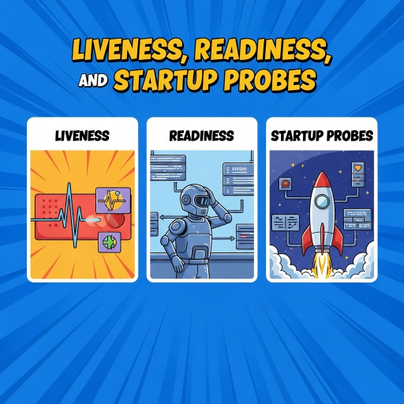
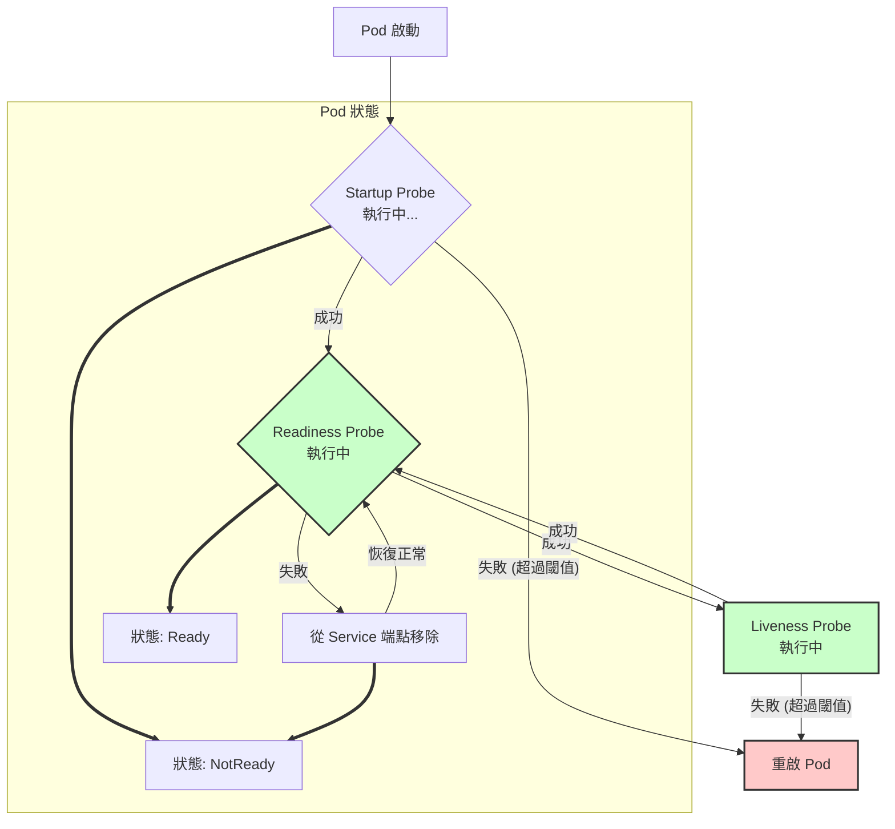

  

<!--more-->
[doc link](https://kubernetes.io/docs/concepts/workloads/pods/pod-lifecycle/#container-probes)
[doc link](https://kubernetes.io/docs/tasks/configure-pod-container/configure-liveness-readiness-startup-probes/)

## 為什麼需要健康檢查 (Probes)？

在 Kubernetes (K8s) 中，**探針 (Probes)** 是由 `kubelet` 對容器執行的定期診斷，是確保應用程式穩定運行的核心機制。

想像一下您正在經營一家餐廳：
-   您不希望在廚房還沒準備好時就讓客人進來點餐。
-   如果廚房因為太忙而暫時無法出餐，您希望能先暫停接單，而不是讓客人一直枯等。
-   萬一廚房發生了無法恢復的故障（例如火災），您必須立刻疏散客人並關門重整。

K8s 中的三種探針就分別扮演了這些角色，幫助您的應用程式實現自癒 (self-healing) 和優雅地處理服務生命週期。

## 認識三種探針 (Probes)

K8s 提供了三種探針，它們在 Pod 的生命週期中協同工作：



| 探針 (Probe) | 餐廳比喻 | 目的 | 失敗時的行為 | 是否持續執行 |
| :--- | :--- | :--- | :--- | :--- |
| **Startup** | 廚房預熱 | 判斷容器內的應用程式是否已**啟動完成**。 | **重啟**容器 | 否 (成功後即停止) |
| **Readiness**| 開門迎客 | 判斷容器是否已**準備好**接收流量。 | 從 Service 的端點 (Endpoint) 中**移除** | 是 |
| **Liveness** | 廚房運作 | 判斷容器是否**仍在運行**且健康。 | **重啟**容器 | 是 |

### 1. Startup Probe (啟動探針)

-   **用途**：專門用於那些啟動時間較長的應用程式（例如：需要載入大量資料或模型的 Java 應用）。
-   **機制**：如果設定了 Startup Probe，K8s 會在它成功之前，暫停執行 Readiness 和 Liveness Probe。這可以防止因啟動緩慢而被後兩者誤判為失敗，導致 Pod 陷入無限重啟的迴圈。
-   **生命週期**：一旦 Startup Probe 成功，它就不會再執行。

### 2. Readiness Probe (就緒探針)

-   **用途**：告訴 K8s 您的應用程式何時可以開始處理流量。
-   **機制**：只有當 Readiness Probe 成功時，`kubelet` 才會將該 Pod 加入到對應 Service 的 Endpoints 列表中。如果探針失敗，Pod 會被從 Endpoints 中移除，流量就不會再被轉發到這個 Pod。
-   **常見場景**：應用程式啟動後需要預熱快取、或在負載過高時暫時不想接收新請求。

### 3. Liveness Probe (存活探針)

-   **用途**：偵測應用程式是否陷入死鎖 (deadlock) 或無法回應的狀態。
-   **機制**：如果 Liveness Probe 失敗，`kubelet` 會終止並**重啟**該容器，嘗試讓應用程式恢復正常。
-   **常見場景**：應用程式因記憶體洩漏或執行緒卡死而無法服務。

## 如何設定探針？

三種探針的設定方式完全相同，都包含「執行動作 (Action)」和「探針配置 (Config)」兩個部分。

### 執行動作 (Action)

K8s 提供了四種檢查容器健康狀況的方式：

| 動作 | 描述 |
| :--- | :--- |
| `httpGet` | 向容器的指定路徑和埠號發送 HTTP GET 請求。如果回傳的狀態碼在 `200-399` 之間，則視為成功。 |
| `tcpSocket` | 嘗試與容器的指定埠號建立 TCP 連線。如果連線成功建立，則視為成功。 |
| `exec` | 在容器內執行一條命令。如果命令的回傳碼 (exit code) 為 `0`，則視為成功。 |
| `grpc` | 向容器的指定埠號發送 gRPC 請求。如果回傳的狀態為 `SERVING`，則視為成功。 |

### 探針配置 (Config)

您可以透過以下參數來微調探針的行為：

| 參數 | 描述 | 預設值 |
| :--- | :--- | :--- |
| `initialDelaySeconds` | 容器啟動後，延遲多少秒才開始第一次探測。 | `0` |
| `periodSeconds` | 執行探測的頻率（間隔多少秒）。 | `10` |
| `timeoutSeconds` | 探測超時的秒數。 | `1` |
| `failureThreshold` | 探測失敗多少次後，才將容器標記為不健康。 | `3` |
| `successThreshold` | 在探測失敗後，需要連續成功多少次，才將容器重新標記為健康。 | `1` |
| `terminationGracePeriodSeconds` | (僅 Liveness/Startup) 探針失敗後，給予 Pod 優雅終止的寬限期。 | Pod 的全域設定 |

### 設定範例

```yaml
apiVersion: v1
kind: Pod
metadata:
  name: probe-demo
spec:
  containers:
  - name: my-app
    image: my-app:1.0
    ports:
    - containerPort: 8080
    
    # 應用啟動慢，先用 Startup Probe 擋住
    startupProbe:
      httpGet:
        path: /healthz
        port: 8080
      failureThreshold: 30 # 總共等待 30 * 10 = 300 秒
      periodSeconds: 10

    # 應用準備好接收流量了嗎？
    readinessProbe:
      httpGet:
        path: /readyz
        port: 8080
      periodSeconds: 5
      failureThreshold: 3
    
    # 應用還活著嗎？
    livenessProbe:
      tcpSocket:
        port: 8080
      initialDelaySeconds: 15
      periodSeconds: 20
```

## 實踐建議

-   **務必設定**：盡量為所有長期運行的服務都設定 Liveness 和 Readiness Probe。
-   **保持輕量**：探針的檢查端點（如 `/healthz`）應盡可能輕量，避免消耗過多資源或依賴外部服務。
-   **區分 Liveness 和 Readiness**：Liveness 應該檢查核心功能是否死鎖，而 Readiness 則可以包含更全面的依賴檢查（如資料庫連線）。
-   **給予恢復時間**：Liveness Probe 的 `failureThreshold` 和 `periodSeconds` 應設定得比 Readiness Probe 更寬鬆，給予應用程式在被重啟前自我修復的機會。
-   **善用 Startup Probe**：對於任何啟動時間可能超過 `failureThreshold * periodSeconds` 的應用，請務必使用 Startup Probe。

---

正確地設定探針是確保 K8s 應用程式高可用性的關鍵。它能有效地防止將流量發送到未就緒的 Pod，並自動從無法恢復的故障中恢復，是維運工作的重要一環。