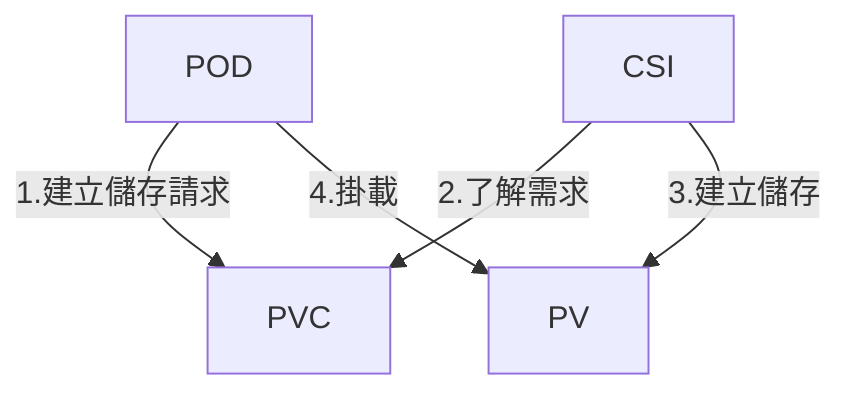

  

<!--more-->
[doc link - csi](https://kubernetes.io/docs/concepts/storage/volumes/#csi)   
[doc link - Storage Classes](https://kubernetes.io/docs/concepts/storage/storage-classes/)   
[doc link - Dynamic Volume Provisioning](https://kubernetes.io/docs/concepts/storage/dynamic-provisioning/)   
[doc link - Persistent Volumes](https://kubernetes.io/docs/concepts/storage/persistent-volumes/)   

由於再接下來的功能官方分成好幾個文件  
為了連貫性 我一併在這裡說明  

在 k8s 中 我們要提供一個儲存空間 會需要對應的 driver  
稱之為 Container Storage Interface (CSI)  
不同的 CSI 會對應不同儲存空間, 比如說 iSCSI, NFS, local ...  
一個 cluster 內可以存在多個 CSI 來滿足不同 pod 的需求  

有了 CSI 之後  
會使用 PersistentVolumeClaim(PVC) 來建立 volume  
簡單來說就是跟 CSI 要一個 volume 空間  
CSI 建立空間後就會提供 Persistent Volumes(PV) object, 來讓 pod mount volume  

簡易關係如下  




## CSI  
Container Storage Interface (CSI)  

CSI 簡單來說就是儲存空間的 driver  
不同的儲存空間會有不同的特性/功能  
比如說是否支援 clone/snapshot/backup  
能否設定 iops/throughput/size  

較常見的有 [longhorn](https://github.com/longhorn/longhorn), [rook](https://github.com/rook/rook),[local](https://kubernetes.io/docs/concepts/storage/storage-classes/#local)  

### storage class  
storage class 跟 ingress class 概念差不多  
一個 CSI 可以建立多個 storage class  
storage class 用來 PVC 指定使用那 CSI 及設定

以下範例
```bash
apiVersion: storage.k8s.io/v1
kind: StorageClass
metadata:
  name: ebs-sc
provisioner: ebs.csi.aws.com
volumeBindingMode: WaitForFirstConsumer
parameters:
  csi.storage.k8s.io/fstype: xfs
  type: io1
  iopsPerGB: "50"
  encrypted: "true"
  tagSpecification_1: "key1=value1"
  tagSpecification_2: "key2=value2"
allowedTopologies:
- matchLabelExpressions:
  - key: topology.ebs.csi.aws.com/zone
    values:
    - us-east-2c
```

這個 storage class 指定使用 CSI provisioner  
要建立 aws ebs type 為 io1  
及性能參數 iopsPerGB 還有其他設定  
實際須看 CSI 的 doc 才知道能做哪些設定  

所以應用之一是可以建立 low,medium,high 等多種 storage class 來對應 pod 的 volume performance 需求  


## PVC
PersistentVolumeClaim(PVC)  

PVC 是讓 pod 發出一個建立 volume 的請求  
其中可以再包含部份設定

設定範例  
```
apiVersion: v1
kind: PersistentVolumeClaim
metadata:
  name: claim1
spec:
  accessModes:
    - ReadWriteOnce
  storageClassName: fast
  resources:
    requests:
      storage: 30Gi
```


這 config 跟 storage class "fast" 要一個 30Gi 空間  
在這之後 CSI 就會建立一個 volume  

accessModes 可以用來設定是否允許多個 pod / host 同時使用這個 volume  

accessModes 支援以下種類, **不過實際必須看 CSI 是否支援**  
- ReadWriteOnce: 允許單一 node 使用, 但該 node 上允許多個 pod 同時進行讀取/寫入  
- ReadOnlyMany: 允許多個 node/pod 同時讀取  
- ReadWriteMany: 允許多個 node/pod 同時讀取/寫入  
- ReadWriteOncePod: 允許單一 pod 讀取/寫入  

參考文件 [access-modes](https://kubernetes.io/docs/concepts/storage/persistent-volumes/#access-modes)


## persistent volume 
persistent volume(PV)  

PV 就是 CSI 讀取 PVC 後建立的空間, POD 就可以 mount 此 PV 來使用  


config sample  
```
apiVersion: v1
kind: Pod
metadata:
  name: mypod
spec:
  containers:
    - name: myfrontend
      image: nginx
      volumeMounts:
      - mountPath: "/var/www/html"
        name: mypd
  volumes:
    - name: mypd
      persistentVolumeClaim:
        claimName: myclaim
```

以上範例是使用 PVC `myclaim` 建立的 PV  
mount 在 /var/www/html  


---

以上是 storage 快速介紹  
事實上 storage 幾乎可以說是另一門科學  
如果是 public cloud 環境可以不用考慮太多  直接使用即可  
但如果是 on-premises 務必要做好功課  
要是設定不好  
輕則效率不佳  
重則資料喪失  
會是很沈重的代價  
