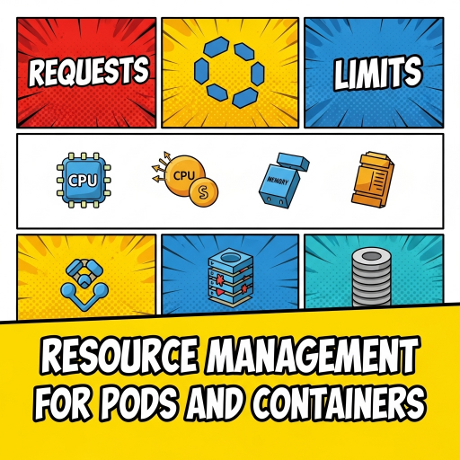

  

<!--more-->
[doc link](https://kubernetes.io/docs/concepts/configuration/manage-resources-containers/)   


Resource Management 是一個很重要的設定  
在 k8s 中 scheduler 會負責指定 pod 要執行在哪個 node 上  
萬一某個 node 非常 busy, scheduler 又持續將 pod place 在該 node 上   
就會導致效率不佳, 或者 pod 根本起不來, 甚至搞垮整 node   

因此 resources 設定非常重要, 一定要設定  

resources 分為 request/limit  
兩者底下都可以設定 cpu/memory  

- **request:**  
保留 resource 給 pod  
一個 node 有多少 cpu/memory 會紀錄該 node 有多少 capacity  
當 scheduler place pod 時 會根據設定的 request 做安排  
當 pod place 到 node 時 該 node capacity 就會減去 pod request 藉此得知 node resource 剩餘狀況  
作為下次 scheudler place pod 的考慮條件   
因此可以避免 node resource 耗盡時, scheduler 依舊 place pod 到該 node  
**但要強調 request 並非強制保留 resource 給該 pod**  
其他 pod 是允許使用這些 resource 的  

- **limit:**
限制 pod 可用 resource  
與 request 不同, limit 是 enforce 限制  
pod 會無法使用超出 limit 的 resource  


> 如果設定 request 但沒有設定 limit  
> 那 limit 為空, pod 允許使用無上限的 resource  

> 如果設定 limit 但沒有設定 request  
> 那 request 會等於 limit  

> 如果 limit/request 都有設定  
> 那 limit 必須 >= request  


## cpu 
cpu 的設定單位是 core  

1 就是 1 core  
0.5 500m 就是 0.5 core  
> m = one hundred millicpu
> 1m 是最小單位


## memory
memory 的設定單位是 byte  
可以使用十進制單位 E, P, T, G, M, k
或是 2 進制單位 Ei, Pi, Ti, Gi, Mi, Ki

> 莫名前妙的點  
> k8s 有辦法設定小於 1 byte 的設定 支援的單位 [eEinumkKMGTP]  
> 可以參考 [metric prefix](https://en.wikipedia.org/wiki/Metric_prefix)  
> 如果設定 400m 等於 0.4 bytes, 到底誰用的到啦🤦🏻!!  
> 因此大小寫有差別 千萬別設錯了  


## How Kubernetes applies resource requests and limits

基本重點  

- cpu limit 頂到上限就是只能用這麼多, container 跑不快  
- memory limit 頂到上限就是觸發 container OOM-killed  
- cpu request 越大 container 會有較高的優先權執行  
- memory limit 基本只影響 Pod scheduling   


## sample config
```bash
---
apiVersion: v1
kind: Pod
metadata:
  name: frontend
spec:
  containers:
  - name: app1
    image: images.my-company.example/app:v4
    resources:
      requests:
        memory: "64Mi"
        cpu: "500m"
      limits:
        memory: "128Mi"
        cpu: "1"
  - name: app2
    image: images.my-company.example/app:v4
    resources:
      requests:
        memory: "64Mi"
        cpu: "1"
      limits:
        memory: "128Mi"
        cpu: "2"
```

由於 pod 內的 container 必須要在同一 node 上  
因此 scheduler 會找 node capacity 足夠放入所有 container 的 mode  

另外前面強調過 request 沒有強制保留  
因此如果 node 只有 2 core  

是可以執行該 pod (total request 1.5 core)  
但是如果 container app2 需要消耗 2 core  
那他是可以用超過 1.5 core 的 (node 2 core - container app1 0.5 core )
假設 app1 只消耗 0.1 core  
app request 剩下 0.4 core
app2 如果需要消耗 1.9 core , app2 是可以使用的  


---

以上是 resource 設定說明  
由於會影響到 node 是否會超過負荷  
因此用 k8s 的人務必要設定此參數  