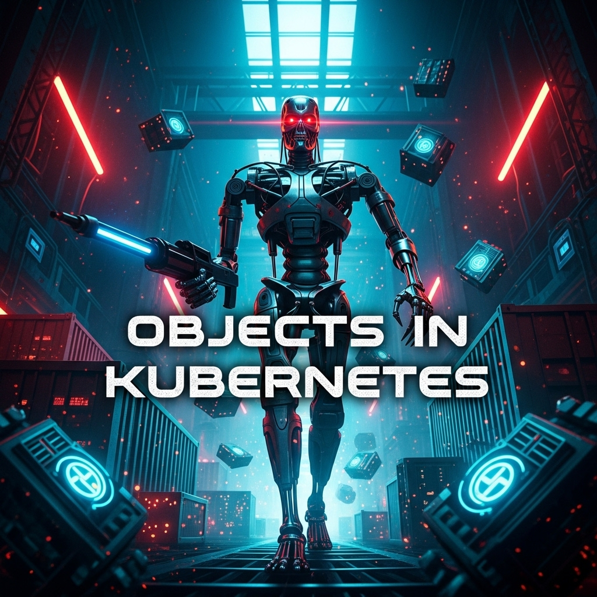

  

<!--more-->
[doc link](https://kubernetes.io/docs/concepts/overview/working-with-objects/)

## K8s 的核心：萬物皆物件

在 Kubernetes (K8s) 的世界裡，**一切皆為物件 (Object)**。無論是您部署的應用程式 (Pod)、暴露服務的端點 (Service)，還是設定檔 (ConfigMap)，它們在 K8s 的視角中，都是一個個的 API 物件。

我們透過向 K8s API Server 提交一個 YAML 或 JSON 格式的**設定檔 (Manifest)** 來操作這些物件。這個過程就像是向 K8s 提交一份「**願望清單**」。

-   **`spec` (Specification)**：您在這份清單的 `spec` 欄位中，詳細描述您的「**期望狀態 (Desired State)**」。例如：「我想要一個名為 `nginx` 的 Deployment，它需要有 3 個副本，使用 `nginx:1.21` 的映像檔」。
-   **`status`**：K8s 的各種控制器 (Controller) 會不斷地工作，努力將「**當前狀態 (Current State)**」調整為您所期望的狀態，並將結果回寫到該物件的 `status` 欄位中。

理解 `spec` (您想要的) 和 `status` (實際上的) 之間的差異，是掌握 K8s 宣告式 API 的關鍵。

## 物件的四大必填欄位

每一個 K8s 物件的 Manifest，都必須包含以下四個頂層欄位：

| 欄位 | 作用 | 範例 |
| :--- | :--- | :--- |
| `apiVersion` | 指定了建立此物件所使用的 K8s API 版本。 | `apps/v1` |
| `kind` | 指定了您想要建立的物件種類。 | `Deployment`, `Service`, `ConfigMap` |
| `metadata` | 包含了物件的元數據，用於唯一識別此物件。 | `name`, `namespace`, `labels`, `annotations` |
| `spec` | 定義了此物件的「期望狀態」。 | `replicas`, `selector`, `template` |

**範例：一個簡化的 Deployment 物件**
```yaml
apiVersion: apps/v1
kind: Deployment
metadata:
  name: nginx-deployment
  namespace: default
spec:
  replicas: 3
  selector:
    matchLabels:
      app: nginx
  template:
    metadata:
      labels:
        app: nginx
    spec:
      containers:
      - name: nginx
        image: nginx:1.21.0
```

## 物件的身份證：`metadata` 詳解

`metadata` 欄位就像是每個物件的身份證，其中包含了幾個非常重要的子欄位。

### `name` 和 `uid`
-   `name`：在同一個 `namespace` 和 `kind` 下，`name` 必須是唯一的。
-   `uid`：由 K8s 自動產生的、在整個叢集中真正獨一無二的 ID。

### `namespace`：虛擬的叢集隔間
Namespace 是 K8s 用來在同一個實體叢集中，劃分出多個「**虛擬叢集**」的機制。它就像是辦公室裡的隔間，讓不同的團隊或專案可以各自管理自己的資源，而不會互相干擾。

-   **用途**：
    -   **隔離**：避免不同專案間的命名衝突。
    -   **授權**：可以基於 Namespace 來設定 RBAC 權限。
    -   **資源配額**：可以為每個 Namespace 設定資源使用上限 (Resource Quota)。
-   **預設 Namespaces**：
    -   `default`：您建立物件時若不指定，預設會被放在這裡。
    -   `kube-system`：K8s 系統組件（如 `etcd`, `kube-scheduler`）的家。
    -   `kube-public`：通常用於存放一些所有使用者（無論是否認證）都能讀取的公開資料。
-   **查詢**：
    -   `kubectl get pods`：只會顯示當前 Namespace 的 Pods。
    -   `kubectl get pods -n <namespace>`：顯示指定 Namespace 的 Pods。
    -   `kubectl get pods -A` 或 `--all-namespaces`：顯示所有 Namespace 的 Pods。

### `labels` vs. `annotations`：給誰看的標籤？
這兩者都是附加在物件上的 key-value 資料，但用途截然不同。

| 特性 | Labels (標籤) | Annotations (註解) |
| :--- | :--- | :--- |
| **用途** | **用於識別和篩選物件** | **用於記錄非識別性的元數據** |
| **給誰看** | 主要給 **K8s 系統**看 | 主要給**人類**或其他**外部工具**看 |
| **語法** | key 和 value 的格式有嚴格限制 | key 和 value 可以是任意字串 |
| **範例** | `app: nginx`, `env: production` | `description: "This is my web server"` |

-   **何時使用 `labels`**：當您需要用 `selector` 來**選取**一組物件時。例如，Service 就是透過 `selector` 來找到它應該代理的 Pod。
-   **何時使用 `annotations`**：當您想為物件附加一些額外的、不會被 K8s 核心組件直接使用的資訊時。許多第三方工具（如 Ingress Controller, Prometheus Operator）會利用 Annotations 來擴充其功能，從而實現比原生 API 更豐富的設定。

## 如何管理 Manifest？

隨著應用變的複雜，手動管理大量的 YAML 檔案變得不切實際。社群為此發展出了兩種主流的管理工具：

-   **Helm**：K8s 的套件管理器。它將一組相關的 YAML 打包成一個可重複使用、可配置的「Chart」，極大地簡化了複雜應用的分發和部署。
-   **Kustomize**：一個無模板的 YAML 設定管理工具。它透過對基礎 YAML 進行「疊加 (Overlay)」和「打補丁 (Patch)」的方式來產生不同環境的設定，更貼近原生 YAML 的體驗。

對於剛入門的初學者，建議先從 **Helm** 開始，因為它擁有最豐富的社群資源，能讓您快速地部署各種現成的應用程式。
