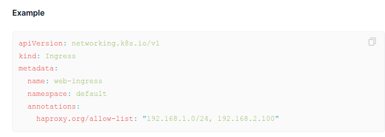

  

<!--more-->
[doc link](https://kubernetes.io/docs/concepts/overview/working-with-objects/)   


前面用過 manifest 後, 這邊來細部說明  

object 就是我們設定進去 k8s 的內容, 舉凡 ingress/deployment...etc  
而 object 我們都會用 yaml 檔紀錄, 稱為 manifest  
當我們建立 object 後, k8s 會不斷工作來滿足 object 預期狀態   
也就是說, k8s 的運作方式是讓他自動操作達到我們預期目標  


每個 object 都必須擁有以下設定  

- kind: 要建立的 kind 類型, 比如 deployment/statefulset..
- apiVersion: 要使用 kind 的 API 版本, 除了影響功能, k8s 升即時也要注意使用中的 kind api version 是否有變, 否則功能失效就很麻煩了    
- metadata: 幫助建立唯一識別, 或是其他輔助資訊. 比如 name,annotation,label,namespace
- spec: 希望 k8s 要幫我們完成的內容,必須根據 kind 來設定

範例
``` {filename=deployment.yaml}
apiVersion: apps/v1
kind: Deployment
metadata:
  annotations:
    deployment.kubernetes.io/revision: "10"
    meta.helm.sh/release-name: httpbin
    meta.helm.sh/release-namespace: default
  creationTimestamp: "2025-07-07T08:19:58Z"
  generation: 10
  labels:
    app.kubernetes.io/instance: httpbin
    app.kubernetes.io/managed-by: Helm
    app.kubernetes.io/name: httpbin
    app.kubernetes.io/version: latest
    helm.sh/chart: httpbin-0.1.7
  name: httpbin
  namespace: default
  resourceVersion: "108611"
  uid: db429dbe-aaa1-4304-a8d3-da1532f9839e
spec:
  progressDeadlineSeconds: 600
  replicas: 9
  revisionHistoryLimit: 10
  selector:
    matchLabels:
      app.kubernetes.io/instance: httpbin
      app.kubernetes.io/name: httpbin
  strategy:
    rollingUpdate:
      maxSurge: 25%
      maxUnavailable: 25%
    type: RollingUpdate
  template:
    metadata:
      annotations:
        kubectl.kubernetes.io/restartedAt: "2025-07-07T16:24:41+08:00"
      creationTimestamp: null
      labels:
        app.kubernetes.io/instance: httpbin
        app.kubernetes.io/managed-by: Helm
        app.kubernetes.io/name: httpbin
        app.kubernetes.io/version: latest
        date: "1751878666"
        helm.sh/chart: httpbin-0.1.7
    spec:
      containers:
      - image: mccutchen/go-httpbin:latest
        imagePullPolicy: IfNotPresent
        livenessProbe:
          failureThreshold: 3
          httpGet:
            path: /anything/livenessProbe
            port: http
            scheme: HTTP
          periodSeconds: 10
          successThreshold: 1
          timeoutSeconds: 1
        name: httpbin
        ports:
        - containerPort: 8080
          name: http
          protocol: TCP
        readinessProbe:
          failureThreshold: 3
          httpGet:
            path: /anything/readinessProbe
            port: http
            scheme: HTTP
          periodSeconds: 10
          successThreshold: 1
          timeoutSeconds: 1
        resources: {}
        securityContext: {}
        startupProbe:
          failureThreshold: 3
          httpGet:
            path: /anything/startupProbe
            port: http
            scheme: HTTP
          periodSeconds: 10
          successThreshold: 1
          timeoutSeconds: 1
        terminationMessagePath: /dev/termination-log
        terminationMessagePolicy: File
      dnsPolicy: ClusterFirst
      restartPolicy: Always
      schedulerName: default-scheduler
      securityContext: {}
      serviceAccount: httpbin
      serviceAccountName: httpbin
      terminationGracePeriodSeconds: 30
      tolerations:
      - operator: Exists

```


接著再針對某些設定提供更詳細用途

## Namespaces
[doc link](https://kubernetes.io/docs/concepts/overview/working-with-objects/namespaces/)   

namespace 是 k8s 用來將 resource 分不同 group  
大部分 kind 都會分 namespace, 只有極少部份不分 namespace  

可以參考 `NAMESPACED` 看看該 kind 是否分 namespace  
```bash
$ kubectl api-resources 
NAME                                SHORTNAMES                          APIVERSION                        NAMESPACED   KIND
bindings                                                                v1                                true         Binding
componentstatuses                   cs                                  v1                                false        ComponentStatus
configmaps                          cm                                  v1                                true         ConfigMap
endpoints                           ep                                  v1                                true         Endpoints
...
```


k8s default 核心相關 pod 就會放在 kube-system 這個 namespace  
一般 user workload 可以放 default or 自己建立 namespace  


關於用途部份  
他可以用來分散不同的 multiple teams, or projects 使用同一個 k8s cluster  
另外也能對 hardware resource 做控制 [resource-quotas](https://kubernetes.io/docs/concepts/policy/resource-quotas/)  

至於平常在使用 kubectl 時要特別注意 namespace 有沒有用對  
預設情況只會使用設定的 namespace (default)  
差異如下  

```bash
$ k get pod
NAME                       READY   STATUS    RESTARTS        AGE
httpbin-74f894968d-696cz   1/1     Running   2 (3h21m ago)   5d1h
httpbin-74f894968d-bbwfw   1/1     Running   2 (3h21m ago)   5d1h
httpbin-74f894968d-cvhcd   1/1     Running   2 (3h21m ago)   5d1h
httpbin-74f894968d-gsmqz   1/1     Running   2 (3h21m ago)   5d1h
httpbin-74f894968d-pddf5   1/1     Running   2 (3h21m ago)   5d1h
httpbin-74f894968d-q7mb4   1/1     Running   2 (3h21m ago)   5d1h
httpbin-74f894968d-qpwsj   1/1     Running   2 (3h21m ago)   5d1h
httpbin-74f894968d-vp26r   1/1     Running   2 (3h21m ago)   5d1h
httpbin-74f894968d-zv8xv   1/1     Running   2 (3h21m ago)   5d1h
$ k get pod -A 
NAMESPACE            NAME                                                READY   STATUS    RESTARTS         AGE
default              httpbin-74f894968d-696cz                            1/1     Running   2 (3h21m ago)    5d1h
default              httpbin-74f894968d-bbwfw                            1/1     Running   2 (3h21m ago)    5d1h
default              httpbin-74f894968d-cvhcd                            1/1     Running   2 (3h21m ago)    5d1h
default              httpbin-74f894968d-gsmqz                            1/1     Running   2 (3h21m ago)    5d1h
default              httpbin-74f894968d-pddf5                            1/1     Running   2 (3h21m ago)    5d1h
default              httpbin-74f894968d-q7mb4                            1/1     Running   2 (3h21m ago)    5d1h
default              httpbin-74f894968d-qpwsj                            1/1     Running   2 (3h21m ago)    5d1h
default              httpbin-74f894968d-vp26r                            1/1     Running   2 (3h21m ago)    5d1h
default              httpbin-74f894968d-zv8xv                            1/1     Running   2 (3h21m ago)    5d1h
haproxy-controller   haproxy-kubernetes-ingress-67b459d7f8-l89fs         1/1     Running   1 (3h21m ago)    4d4h
haproxy-controller   haproxy-kubernetes-ingress-67b459d7f8-llxwj         1/1     Running   2 (3h21m ago)    5d2h
...
```


## Annotations 

annotation(註解) 用於上加非辨識用 data  
簡單的理解是 label 是給 k8s 用  
如果我們想加上一些非給 k8s 用的資訊, 可以使用 annotation  
這樣可以避免 control-plan 在使用 label 時會有很多不相干的 data  

某些工具也會使用 annotation 來做 api 的擴充  
舉例來說 k8s ingress API 因設定有限  
大部分 ingress class 會透過 annotation 來接受更多設定  


因此有趣的是 annotation 更多時候不只是 annotation  
可以看成最簡易的 api 的擴充方式  

## manage manifest  
我們在使用 k8s 時會建立許多 object 比如 ingress,deployment,service...etc  
要管理這麼多的 object 借助工具會好的多  

k8s 官方提供了 kustomize 這個 tool 幫忙管理眾多的 manifest    
類似的 tool 還有 helm  
那以經驗來說 helm 功能強大不少  
且基本上已成為標準, 大家都會優先支援 helm  
因此建議直接學習 helm 來管理 manifest   

> [!TIP]
> 有另一個 [nelm](https://github.com/werf/nelm) project 要取代 helm  
> 但目前 argoCD 尚未支援, 不過以長期來看 nelm 具有一定潛力  
