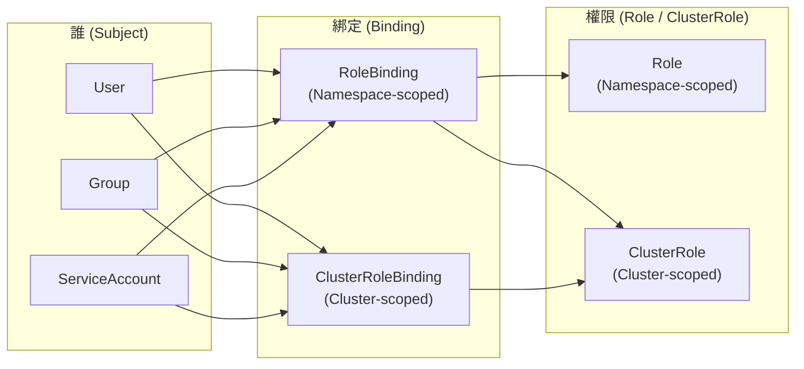

  

<!--more-->

[doc link](https://kubernetes.io/docs/reference/access-authn-authz/authentication/)

## K8s 權限管理三部曲

當一個請求到達 Kubernetes (K8s) API Server 時，它會經過三個階段的檢查，才能被放行：

1.  **認證 (Authentication) - 你是誰？**
    驗證請求者的身份。就像在電影院門口**驗票**，確認你持有有效的電影票。
2.  **授權 (Authorization) - 你能做什麼？**
    在確認身份後，檢查該身份是否擁有執行此操作的權限。就像檢查你的票是普通廳還是 VIP 廳，決定你能進入哪個影廳。
3.  **准入控制 (Admission Control) - 這個操作合規嗎？**
    這是最後一道防線。即使請求者有權限，准入控制器仍然可以基於叢集的安全策略或最佳實踐，來修改或拒絕這個請求。就像電影院規定「禁止攜帶外食」，即使你有 VIP 票，也不能帶漢堡進去。

本篇和下一篇文章將聚焦於前兩個階段：**認證**與**授權**。

## 你是誰？認識兩種帳號

在 K8s 的世界裡，有兩種截然不同的「身份」：

| 帳號類型 | 管理方式 | 主要用途 |
| :--- | :--- | :--- |
| **ServiceAccount** | **由 K8s 管理**，是 K8s 的原生 API 物件。 | **專為應用程式設計**。主要被掛載到 Pod 中，讓 Pod 內的程式有權限與 API Server 溝通。 |
| **Normal User** | **不由 K8s 管理**。沒有對應的 API 物件。 | **專為人類使用者設計**（如開發者、維運人員）。通常需要整合外部身份系統（如 LDAP, OIDC）或手動分發憑證。 |

## 你能做什麼？RBAC 詳解

K8s 主要使用 **RBAC (Role-Based Access Control)** 模型來進行授權。RBAC 的核心思想是將「**誰 (Subject)**」可以對「**什麼 (Resource)**」做「**什麼事 (Verb)**」這個問題，拆解成幾個可組合的物件來管理。



### 步驟 1：定義權限 (Role / ClusterRole)
首先，我們需要定義一組權限。
-   **Role**：定義在**特定 Namespace** 內的權限。
-   **ClusterRole**：定義**整個叢集範圍**的權限，它不受 Namespace 限制。

**範例：建立一個只能讀取 `default` namespace 下 Pod 的 `Role`**
```yaml
apiVersion: rbac.authorization.k8s.io/v1
kind: Role
metadata:
  namespace: default
  name: pod-reader
rules:
- apiGroups: [""] # "" 表示核心 API 群組
  resources: ["pods"]
  verbs: ["get", "watch", "list"]
```

### 步驟 2：綁定權限 (RoleBinding / ClusterRoleBinding)
接著，我們需要將定義好的權限「綁定」到一個或多個主體 (Subject) 上。
-   **RoleBinding**：在**特定 Namespace** 內進行綁定。
-   **ClusterRoleBinding**：在**整個叢集範圍**內進行綁定。

**範例：將 `pod-reader` Role 綁定給 `default` namespace 的 `default` ServiceAccount**
```yaml
apiVersion: rbac.authorization.k8s.io/v1
kind: RoleBinding
metadata:
  name: read-pods-sa
  namespace: default
subjects:
- kind: ServiceAccount
  name: default # ServiceAccount 的名稱
  namespace: default
roleRef:
  kind: Role
  name: pod-reader # 上一步建立的 Role 名稱
  apiGroup: rbac.authorization.k8s.io
```

> **重點**：`RoleBinding` 也可以綁定一個 `ClusterRole`。這種組合非常實用，它意味著「將一個叢集級別的通用權限，授予給某個特定 Namespace 內的主體」。例如，您可以定義一個 `admin` ClusterRole，然後透過 RoleBinding 將其授予給不同 Namespace 的開發團隊。

## 專為應用程式設計的帳號：ServiceAccount

ServiceAccount (SA) 是 K8s 中一等公民，主要用於**授權給 Pod**。

-   每個 Namespace 在建立時，都會自動產生一個名為 `default` 的 ServiceAccount。
-   當您建立一個 Pod 卻沒有指定 SA 時，它會自動使用所在 Namespace 的 `default` SA。
-   SA 的認證資訊 (Token) 會被自動掛載到 Pod 的 `/var/run/secrets/kubernetes.io/serviceaccount/` 目錄下，供 Pod 內的應用程式使用。

### 為外部程式產生 SA 的 Kubeconfig
雖然 SA 主要用於 Pod 內部，但有時我們也需要讓外部的 CI/CD 工具或自動化腳本，使用 SA 的身份來存取叢集。這時，我們可以為 SA 產生一個基於 Token 的 `kubeconfig`。

```bash
# --- 基本設定 ---
SERVICE_ACCOUNT_NAME=default
NAMESPACE=default
KUBECONFIG_FILE="kubeconfig-sa.yaml"

# 1. 取得叢集資訊
CLUSTER_NAME=$(kubectl config view --minify -o jsonpath='{.clusters[0].name}')
SERVER=$(kubectl config view --minify -o jsonpath='{.clusters[0].cluster.server}')
CA_DATA=$(kubectl config view --raw --minify -o jsonpath='{.clusters[0].cluster.certificate-authority-data}')

# 2. 為 ServiceAccount 產生一個永不過期的 Token
# 在新版 K8s 中，需要手動建立 Secret 來存放 Token
cat <<EOF | kubectl apply -f -
apiVersion: v1
kind: Secret
metadata:
  name: ${SERVICE_ACCOUNT_NAME}-token-secret
  annotations:
    kubernetes.io/service-account.name: ${SERVICE_ACCOUNT_NAME}
type: kubernetes.io/service-account-token
EOF

# 3. 從 Secret 中取得 Token
TOKEN=$(kubectl get secret ${SERVICE_ACCOUNT_NAME}-token-secret -o jsonpath='{.data.token}' | base64 --decode)

# 4. 產生 kubeconfig 檔案
cat <<EOF > ${KUBECONFIG_FILE}
apiVersion: v1
kind: Config
clusters:
- name: ${CLUSTER_NAME}
  cluster:
    certificate-authority-data: ${CA_DATA}
    server: ${SERVER}
users:
- name: ${SERVICE_ACCOUNT_NAME}
  user:
    token: ${TOKEN}
contexts:
- name: sa-context
  context:
    cluster: ${CLUSTER_NAME}
    user: ${SERVICE_ACCOUNT_NAME}
    namespace: ${NAMESPACE}
current-context: sa-context
EOF

echo "✅ Kubeconfig for ServiceAccount '${SERVICE_ACCOUNT_NAME}' created successfully."
```

---

我們已經了解了 K8s 的授權模型 (RBAC) 以及專為應用程式設計的 ServiceAccount。在 [Part 2](@/docs/k8s-doc-reading/20250810_k8s-authentication-part2/index.md) 中，我們將深入探討如何為「人類」使用者設定認證，實現更靈活的權限管理。