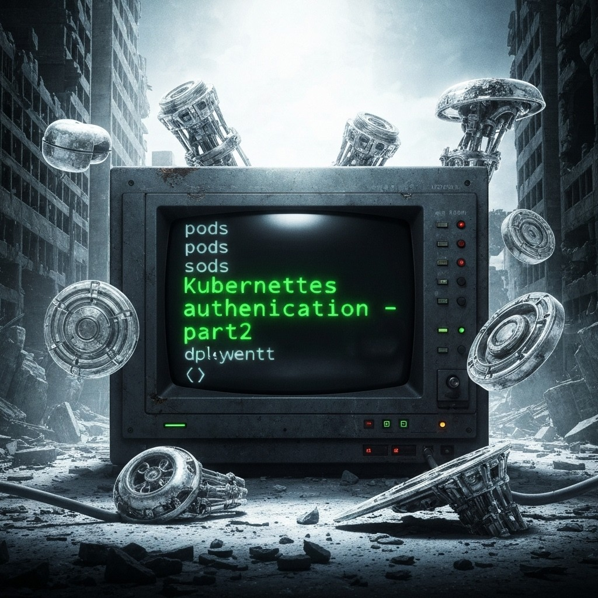
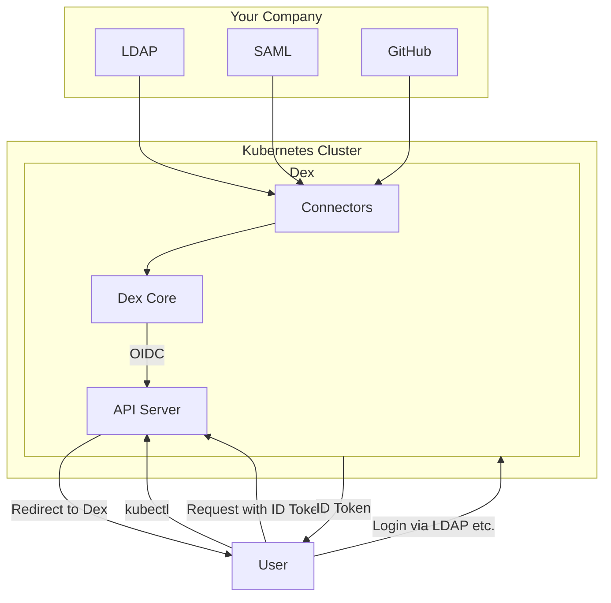

  

<!--more-->

[doc link](https://kubernetes.io/docs/reference/access-authn-authz/authentication/)

在 [Part 1](@/docs/k8s-doc-reading/20250810_k8s-authentication-part1/index.md) 中，我們介紹了 Kubernetes (K8s) 的兩種帳號類型，並深入探討了主要用於 Pod 內部流程自動化的 **ServiceAccount**。

這篇文章將聚焦於另一種帳號類型：**Normal User Account**，也就是專門為「人類」使用者（如開發者、維運人員）設計的帳號。

## 為什麼需要 Normal User Account？

雖然 ServiceAccount 也可以透過 `kubeconfig` 給人類使用者使用，但它並非為此設計。在企業環境中，我們通常希望能夠：
-   整合現有的身份驗證系統（如 LDAP, Active Directory, Google Workspace）。
-   實現單一登入 (Single Sign-On, SSO)。
-   集中管理使用者身份和權限，而非在 K8s 中手動建立和分發憑證。

K8s 本身不直接管理 Normal User，而是透過整合外部身份提供者 (Identity Provider, IdP) 來實現認證。本篇將介紹兩種最常見的 Normal User 認證方式。

## 方法一：X.509 客戶端憑證 (Client Certificates)

這是 K8s 最基礎的認證方式，也是您透過 `kubeadm` 或 `k3s` 建立叢集時，預設產生的 `kubeconfig` 所使用的方式。

它的原理是為每一位使用者產生一對獨一無二的 TLS 私鑰和憑證，並由 K8s 叢集的 CA (憑證授權中心) 簽署。API Server 會驗證客戶端提交的憑證是否由受信任的 CA 簽發，並從憑證的 `Subject` 欄位中提取使用者名稱 (`CN`) 和所屬群組 (`O`)。

雖然這種方式安全可靠，但管理起來非常繁瑣，因為您需要為每一位使用者手動產生、簽署、分發和撤銷憑證。

### 操作流程：為使用者 `jane` 建立 `kubeconfig`

以下是為一位名叫 `jane`、隸屬於 `developers` 群組的使用者，手動建立一個僅能讀取 `default` namespace 下 Pod 權限的 `kubeconfig` 的完整流程。

#### 步驟 1：產生私鑰和憑證簽署請求 (CSR)
```bash
# 為 jane 產生一個 2048 位元的 RSA 私鑰
openssl genrsa -out jane.key 2048

# 建立一個 CSR (Certificate Signing Request)
# CN=jane 代表使用者名稱是 "jane"
# O=developers 代表她屬於 "developers" 群組
openssl req -new -key jane.key -out jane.csr -subj "/CN=jane/O=developers"
```

#### 步驟 2：透過 K8s 簽署憑證
```bash
# 將 CSR 檔案內容進行 Base64 編碼
CSR_BASE64=$(cat jane.csr | base64 -w 0)

# 建立一個 CertificateSigningRequest 物件的 YAML 檔
cat <<EOF > csr.yaml
apiVersion: certificates.k8s.io/v1
kind: CertificateSigningRequest
metadata:
  name: jane-csr
spec:
  request: ${CSR_BASE64}
  signerName: kubernetes.io/kube-apiserver-client
  usages:
  - client auth
EOF

# 將 CSR 提交給 K8s
kubectl apply -f csr.yaml

# 由叢集管理員批准這個 CSR
kubectl certificate approve jane-csr

# 下載簽署好的憑證
kubectl get csr jane-csr -o jsonpath='{.status.certificate}' | base64 --decode > jane.crt
```

#### 步驟 3：建立 RBAC 授權
```bash
# 建立一個 RoleBinding，將使用者 'jane' 和預先定義好的 'pod-reader' Role 綁定
cat <<EOF > jane-rolebinding.yaml
apiVersion: rbac.authorization.k8s.io/v1
kind: RoleBinding
metadata:
  name: read-pods-jane
  namespace: default
subjects:
- kind: User
  name: jane  # 這就是 CSR 中 CN 的值
  apiGroup: rbac.authorization.k8s.io
roleRef:
  kind: Role
  name: pod-reader # 假設這個 Role 已經存在
  apiGroup: rbac.authorization.k8s.io
EOF

kubectl apply -f jane-rolebinding.yaml
```

#### 步驟 4：產生專屬的 Kubeconfig
```bash
# 這個腳本會讀取當前的叢集資訊，並結合 jane 的憑證，產生一個新的 kubeconfig 檔案
KUBECONFIG_FILE="kubeconfig-jane.yaml"
CLUSTER_NAME=$(kubectl config view --minify -o jsonpath='{.clusters[0].name}')
SERVER=$(kubectl config view --minify -o jsonpath='{.clusters[0].cluster.server}')
CA_DATA=$(kubectl config view --raw --minify -o jsonpath='{.clusters[0].cluster.certificate-authority-data}')

# 設定叢集資訊
kubectl config set-cluster ${CLUSTER_NAME} \
  --server=${SERVER} \
  --certificate-authority-data=${CA_DATA} \
  --embed-certs=true \
  --kubeconfig=${KUBECONFIG_FILE}

# 設定使用者憑證
kubectl config set-credentials jane \
  --client-key=jane.key \
  --client-certificate=jane.crt \
  --embed-certs=true \
  --kubeconfig=${KUBECONFIG_FILE}

# 設定 Context
kubectl config set-context jane-context \
  --cluster=${CLUSTER_NAME} \
  --user=jane \
  --namespace=default \
  --kubeconfig=${KUBECONFIG_FILE}

# 設定預設 Context
kubectl config use-context jane-context --kubeconfig=${KUBECONFIG_FILE}

echo "✅ Kubeconfig file '${KUBECONFIG_FILE}' created successfully."

# --- 測試新的 kubeconfig ---
echo "Testing the new kubeconfig..."
kubectl --kubeconfig=${KUBECONFIG_FILE} get pods # 應該成功
kubectl --kubeconfig=${KUBECONFIG_FILE} get nodes # 應該失敗 (權限不足)
```

## 方法二：OpenID Connect (OIDC) - 推薦

手動管理憑證顯然不適合大型團隊。在企業環境中，**OpenID Connect (OIDC)** 是整合外部身份驗證的**推薦**方式。

OIDC 是一個基於 OAuth 2.0 的身份驗證協定。K8s API Server 可以配置為信任一個外部的 OIDC IdP (Identity Provider)，例如 Google, Okta, Keycloak, 或 GitLab。

### 運作流程
1.  使用者試圖用 `kubectl` 存取叢集。
2.  `kubectl` 將使用者導向到 OIDC IdP (例如 Google 登入頁面) 進行登入。
3.  登入成功後，IdP 會回傳一個 `ID Token` 給使用者。
4.  `kubectl` 將這個 `ID Token` 包含在請求中，發送給 K8s API Server。
5.  API Server 會向 IdP 驗證此 `ID Token` 的有效性。
6.  驗證通過後，API Server 從 `ID Token` 中提取使用者資訊（如 Email 和群組），並根據 RBAC 規則進行授權。

### 使用 Dex 進行整合

K8s API Server 只支援 OIDC 協定。如果您的公司使用的是 LDAP、SAML 或其他非 OIDC 的認證系統，該怎麼辦？

這時就需要一個中間人，而 [**Dex**](https://dexidp.io/) 就是最受歡迎的選擇。Dex 是一個開源的身份服務，它可以作為一個橋樑，連接各種後端使用者系統 (稱為 `Connectors`)，並將它們統一以 OIDC 的形式暴露給 K8s。



### 實作
參考文章 https://geek-cookbook.funkypenguin.co.nz/kubernetes/oidc-authentication/k3s-keycloak/  

我這邊設定 github oauth + dex  

參考 https://docs.k3s.io/installation/configuration#configuration-file  
設定 api server 存取 OIDC  
```bash
vi /etc/rancher/k3s/config.yaml
kube-apiserver-arg:
- "oidc-issuer-url=<oidc-issuer-url>"
- "oidc-client-id=<oidc-client-id>"
- "oidc-username-claim=email"
- "oidc-groups-claim=groups"
```

then restart k3s server
```bash
restart k3s server 
sudo systemctl restart k3s
```

安裝驗證工具
```bash
mise use -g krew kubelogin
export PATH="${KREW_ROOT:-$HOME/.krew}/bin:$PATH"
```

執行 OIDC 驗證  
```bash
kubectl oidc-login setup \
  --oidc-issuer-url=<oidc-issuer-url> \
  --oidc-client-id=<oidc-client-id> \
  --oidc-extra-scope=email,openid,groups,profile,offline_access \
  --oidc-client-secret=<oidc-client-secret>
Authentication in progress...
error: could not open the browser: exec: "xdg-open,x-www-browser,www-browser": executable file not found in $PATH

Please visit the following URL in your browser manually: http://localhost:8000/
```

當驗證成功後  
會看到 OIDC 提供的資訊, 以及 command for setup kubeconfig
```
## Authenticated with the OpenID Connect Provider

You got the token with the following claims:


{
  "iss": "https://xxx",
  "sub": "xxx",
  "aud": "k3s-oidc-owanio1992-cloudns-nz",
  "exp": 1759057994,
  "iat": 1758971594,
  "nonce": "dpm-wofsd-BPGNwqv7ZE-UKgbaeab2mEEMCBK5GwLKg",
  "at_hash": "cNF083gbIONxp2Lkuca0cQ",
  "c_hash": "AJcIrCuV6hKMDY4rlIQ7-A",
  "email": "owan.io1992@gmail.com",
  "email_verified": true,
  "groups": [
    "owan-io1992:test"
  ],
  "name": "owan",
  "preferred_username": "owanio1992"
}


## Set up the kubeconfig

You can run the following command to set up the kubeconfig:


kubectl config set-credentials oidc \
  --exec-api-version=client.authentication.k8s.io/v1 \
  --exec-interactive-mode=Never \
  --exec-command=kubectl \
  --exec-arg=oidc-login \
  --exec-arg=get-token \
  --exec-arg="--oidc-issuer-url=https://xxx" \
  --exec-arg="--oidc-client-id=xxx" \
  --exec-arg="--oidc-client-secret=xxx" \
  --exec-arg="--oidc-extra-scope=email" \
  --exec-arg="--oidc-extra-scope=openid" \
  --exec-arg="--oidc-extra-scope=groups" \
  --exec-arg="--oidc-extra-scope=profile" \
  --exec-arg="--oidc-extra-scope=offline_access"

```

測試存取,因為還沒有給 RBAC, 失敗會是正常的, 但是能看到 user 為 "owan.io1992@gmail.com"    
```bash
$ kubectl --user=oidc cluster-info

To further debug and diagnose cluster problems, use 'kubectl cluster-info dump'.
Error from server (Forbidden): services is forbidden: User "owan.io1992@gmail.com" cannot list resource "services" in API group "" in the namespace "kube-system"

$ kubectl whoami --user=oidc
owan.io1992@gmail.com
```

設定 RBAC  
```{filename="clusterrolebinding-oidc-group-admin-kube-apiserver.yaml"}
kind: ClusterRoleBinding
apiVersion: rbac.authorization.k8s.io/v1
metadata:
  name: oidc-group-admin-kube-apiserver
roleRef:
  apiGroup: rbac.authorization.k8s.io
  kind: ClusterRole
  name: cluster-admin 
subjects:
- kind: Group
  name: oidc:admin-kube-apiserver
```

apply 後
就可能存取 cluster 了

最後設定 config default user 為 oidc
```bash
kubectl config set-context --current --user=oidc
```

## 總結

| 特性 | X.509 憑證 | OpenID Connect (OIDC) |
| :--- | :--- | :--- |
| **管理方式** | 手動，分散式 | 集中式，自動化 |
| **適用場景** | 小型團隊、測試環境、自動化腳本 | 中大型企業、需要 SSO 的場景 |
| **優點** | 概念簡單、無需額外服務 | SSO、集中管理、易於擴展、支援多種 IdP |
| **缺點** | 管理複雜、難以擴展、憑證撤銷困難 | 需要額外部署和維護 IdP (如 Dex) |

對於任何正式的生產環境或多人協作的場景，強烈建議投入時間設定 **OIDC** 整合。