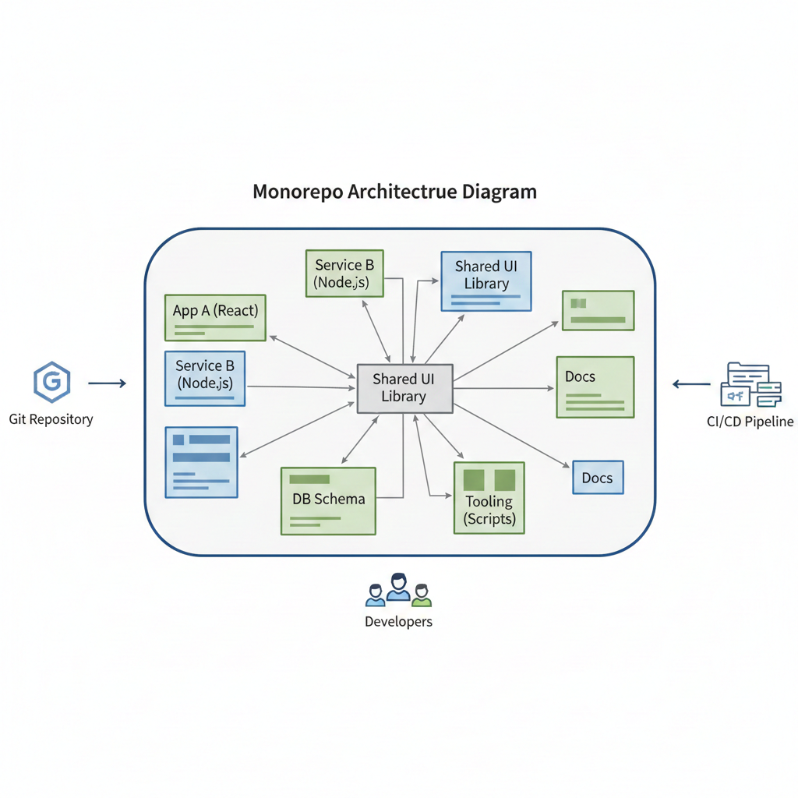
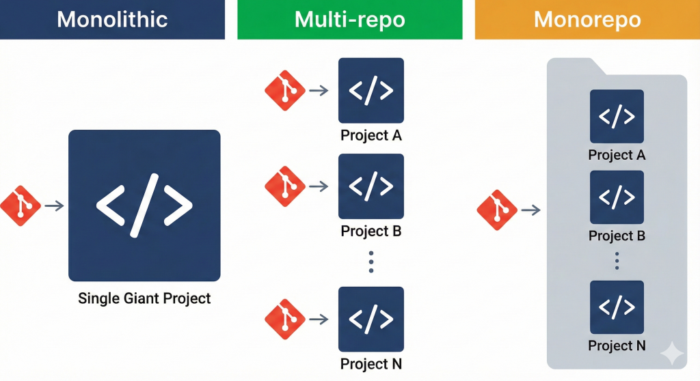

  

<!--more-->

## Introduction
monorepo 的由來是在大型 project 中 source code 的存放方式的改進  

專案的開始都由小到大  
因此發生了這樣的演化 Monolithic > Polyrepo > Monorepo

**Monolithic:**  
將所有功能加到一個 project 並使用一個 git repo 管理 就叫 Monolithic  
當 feature 越來越多時,就會導致開發與部屬越來越困難  
因為太"大"了  
舉例來說 A feature 可能經常使用, B feature 反之  
feature A/B 各自需要 1GB memory  
feature A 需要 10 core 算力  
feature B 需要 1 core 算力  
在部屬中只能部屬所有 feature 導致以下問題  
- 資源的浪費: 因無法單獨部屬 feature A, 滿足需求的情況 需要 11 core, 花費 11 GB memory   
- scale 困難: project 啟動會需要時間, 更大的 project 意味著更久的啟動時間, 也因 resource 消耗巨大 更難找到硬體執行

**Polyrepo(Multi-repo):**  
因為 Monolithic 的問題  
就將 feature 拆成小 project/library 並存在各自的 repo 中  
可是這樣很快就面臨挑戰  
每次上 code 可能就要開多個 PR/MR  
也不利於進行 CI 相關測試  
當 repo 越來越多時  
開發與部屬難度就會直線上升  

**Monorepo:**  
為了解決 Polyrepo 的問題  
簡單來說就是要結合 Monolithic and Polyrepo 兩者的優點  
使用 Monolithic 的管理方式與 Polyrepo 的架構  
讓 source code 能以 Multi-repo 的方式儲存  
並將所有的 project/library 存放於單一 repo 中  

示意圖  

這樣的好處是 開發與部屬 會簡易的多, 你不用多個 git repo 跳來跳去  
在以現今的 git server 來說 source code 再多也不太會造成系統瓶頸  
以 [linux](https://github.com/torvalds/linux) 為例 repo size 有 400MB  
因此能夠放心 repo size 問題  

## CICD 該如何加速

當 feature 越來越多  
如果每次都跑完整的 CICD, 勢必效率會越來越低落  
因此就有了 monorepo tool 來協助  
從早期的 make 到現在有 bazel,nx,moonrepo [詳情](https://monorepo.tools)  
monorepo tool 的誕生  
可以協助 CICD 只進行有必要的部份  
對於沒有 change 的地方  就不再花 resource 處理, 藉此提昇效率

> 現今很多 runtime manager 也直接支援 Monorepo 的概念  
比如 golang 的 [Workspaces](https://go.dev/ref/mod#workspaces)   

後面篇幅會以 python 為例, 介紹兩款 tool `uv`, `moon`  

