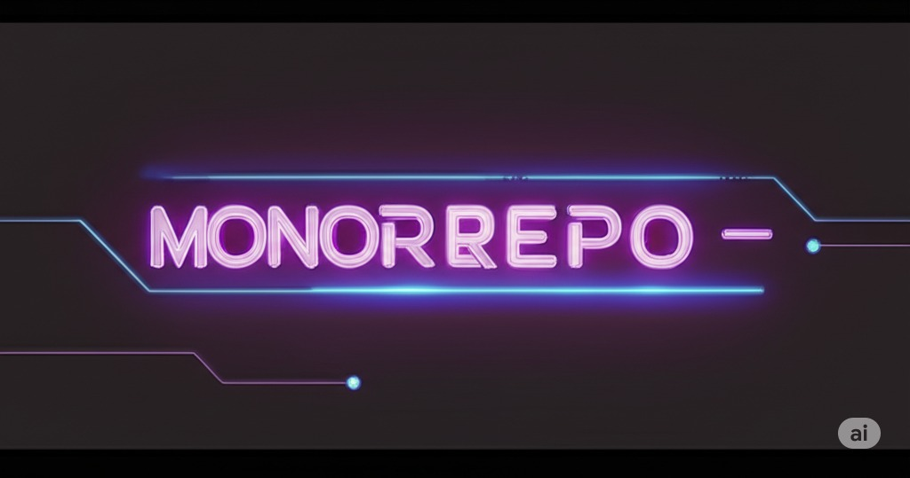

  

<!--more-->

## Introduction
之前介紹了我使用 moon 做為我的 momorepo tool   
今天來比較下 bazel & nx & moon  

## introduce momorepo tool 
### bazel
Bazel 是由 Google 開發的開源建構和測試工具  
它專為大型、多語言專案設計，提供快速可靠的建構  

使用心得: doc 很難理解, 外加功能其實相對較少  
使用門檻極高, 一整個弊大於利
k8s 社群經過一些討論也決定拆掉 bazel  [issues #88553](https://github.com/kubernetes/kubernetes/issues/88553)   
簡單來說 鬼東西 別碰  

### nx
Nx 是由 Nrwl 開發的 monorepo 工具  
但其實使用門檻也挺高  
doc 寫得很隨便 你不去看 source code 根本不會用  
bug 不少, 且官方也沒有很積極在處理 issue  
甚至一些照著 getting start 就會碰到的問題都沒處理  

### moon
Moon 是一個現代化的建構系統和 monorepo 工具，用 Rust 編寫，專注於速度、正確性和開發者體驗  
它旨在提供一種快速有效的方式來管理具有複雜依賴關係的大型專案  
Moon 提供任務編排、依賴圖分析、快取和靈活的配置系統等功能  
它被設計為語言無關的，可以用於各種程式語言和框架  

雖然是蠻新的 porject  
但其功能完善
doc 很清楚  
issue 處理也非常迅速  
另外也不會跟 nx 一樣以營利為主去限制功能  
個人認為是非常好的 tool   

## compare momorepo tool 
| 功能/工具 | Bazel | Nx | Moon |
|---|---|---|---|
| **vcs support** | ❌ | ✅ | ✅ |
| **local cache** | ✅ | ✅ | ✅ |
| **remote cache** | ✅ | ✅*paid feature | ✅ |
| **Learning Curve** | very high | high | low |
| **vcs hook** | ❌ | ❌ | ✅ |

## Conclusion
在選擇一個 tool 時  
除了 feature 外也務必考慮後續維護問題  
否則很容易讓 team member 陷入困擾  
進而產生弊大於利的狀況  
