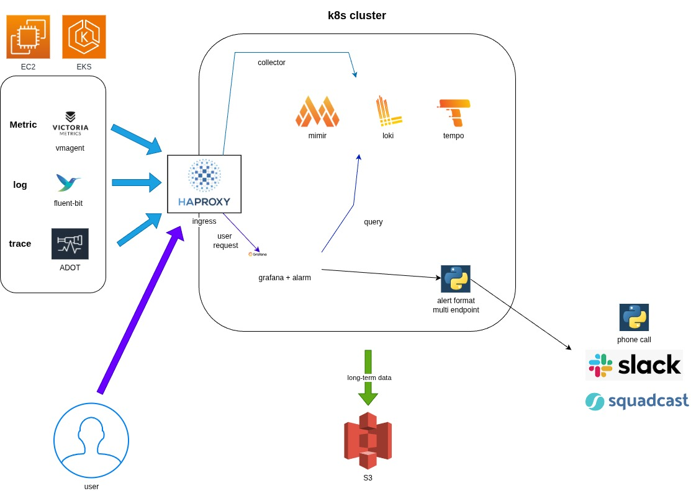
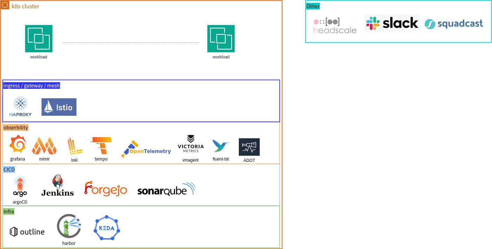

<!--more-->

# Objective:

To migrate the existing monitoring architecture to the Grafana observability stack, unifying metrics, logs, and traces into a single, cohesive platform.

# Challenges (Before):

Inefficient Metric Collection: Relied on custom Bash/Python scripts to collect and send metrics to CloudWatch, resulting in high maintenance overhead and a lack of standardization.
Inefficient Log Analysis: Logs were archived to S3 and required manual download and extraction for querying, making real-time analysis impossible.
Tracing: None.

# Solution (After):

Core Architecture:

* CICD: Manage with IaC(HELM) , and multi-environment rollouts via ArgoCD.
Dynamic Configuration: Managed dashboards and alerts via ConfigMaps or custom container images, support for both automatic and manual provisioning.
* Metrics (Mimir): Collection: Used lightweight VictoriaMetrics agents and custom-built exporters for metric collection.
* Logs (Loki): Collection: Utilized Fluent-bit for log collection, filtering, and parsing at the source.
* Traces (Tempo): Collection: Used AWS Distro for OpenTelemetry for trace collection and processing.

# Results & Achievements:

* Unified Observability: Full support for custom metrics, dashboards, and alerts tailored to various business needs.
* Real-time Log Insights: Enabled real-time log querying, parsing, and the ability to create dashboards and alerts directly from log data.
* Efficient Troubleshooting: Achieved distributed tracing, allowing engineers to correlate logs and metrics via a Trace ID, drastically improving the time to find and resolve issues.
* Streamlined Management: Multi-tenancy improved data governance and usability for different teams.
* Integrated Alerting: Supported multiple alert notification endpoints, including Slack, Squadcast, and phone calls, ensuring timely incident response.
* Cost Optimization: Utilized S3 for long-term trace storage.
* agent: use ansible/helm to deploy agent and exporter.
* Backend: all backend Deployed a highly available and performant distributed cluster.

full architecture  
  

