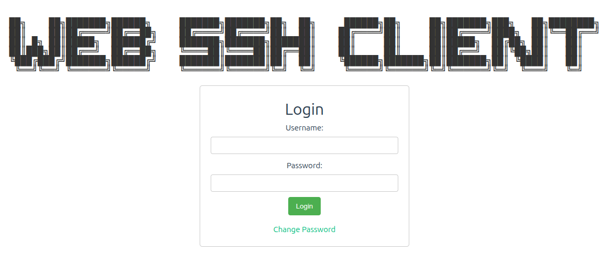

<!--more-->
Use vibe coding develop a lite-weight SSH PAM system.
使用 vibe coding 開發一個輕量級的 SSH PAM 系統。

## Objectives / 目標
* Frontend Interface: To create a user-friendly web interface for entering connection details and displaying the terminal.
* 前端介面：建立一個使用者友好的 Web 介面，用於輸入連線詳細資訊並顯示終端機。
* Backend Service: To develop a backend WebSocket server to handle frontend requests and establish connections with the target SSH servers.
* 後端服務：開發後端 WebSocket 伺服器，處理前端請求並與目標 SSH 伺服器建立連線。

## Key Features / 主要功能

* Web Terminal Interface: Provides a fully functional web-based terminal where users can input commands and see real-time output.
* Web 終端介面：提供功能齊全的網頁終端機，使用者可以輸入指令並查看即時輸出。
* SSH host Management: Allows admins to enter a host, port, username, and RBAC, control user permission to establish an SSH connection with a remote server.
* SSH 主機管理：允許管理員輸入主機、連接埠、使用者名稱和 RBAC，控制使用者權限以建立與遠端伺服器的 SSH 連線。
* lite-weight: system just require 1 core/512MB ram.
* 輕量級：系統僅需 1 核心 / 512MB 記憶體。

github repo: https://github.com/owan-io1992/web-ssh-client