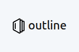

<!--more-->

# Objective:

To unify the company's fragmented documentation platforms (Google Docs, SharePoint) into a single, centralized knowledge base.

# Challenges (Before):

* Information Silos: Team documents were scattered across Google Docs and SharePoint, making them difficult to manage and access.
* Google Drive: Excellent for collaborative documents (Docs, Sheets, Slides) but lacked support for other file types and structured knowledge.
* SharePoint: Supported a wide range of file types but offered a subpar editing experience and an inefficient, unreliable search function.
* Common Limitation: Neither platform provided native support for technical diagrams (e.g., flowcharts, architecture diagrams).

# Solution (After):

* System Deployment: We self-hosted the open-source knowledge base, Outline, on our internal Kubernetes (K8s) cluster.
* Data Migration: We developed a script to convert and import existing documents from legacy platforms into the new system.

# Results & Achievements:

* Security & Access Control: Full support for Single Sign-On (SSO) and granular permission controls.
* Enhanced Productivity: Native support for Markdown and Mermaid, enabling technical teams to write documentation and create diagrams efficiently.
* Real-time Collaboration: Features collaborative editing and a commenting system to streamline teamwork and feedback.
* Version Control: Built-in version history for all documents, allowing for easy tracking of changes and rollbacks.
* Powerful Search: A highly accurate, full-text search engine that significantly reduces the time needed to find information.