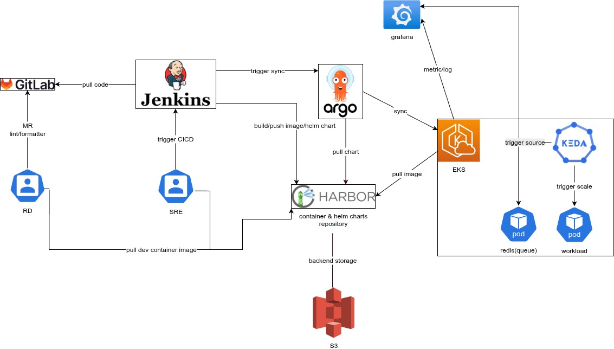

  

<!--more-->

## Objective:

To modernize the development workflow and CI/CD pipeline by migrating 10 projects from a poly-repo architecture to a unified monorepo.

 
## Challenges (Before):

* Management: Complex dependency management across multiple repositories.
* Tech Debt: Services ran on outdated Python 3.5, lacking performance and security updates.
* Poor CI/CD: No code quality gates (linting/formatting). Deployments to EC2 via Ansible were slow, manual, and lacked robust rollback.
* Operations: No custom monitoring led to a high MTTR. Manual scaling took ~30 minutes, failing to handle traffic bursts.

## Solutions (After):

* Monorepo (moonrepo): 
  * project structure 一致, 可以有效減少 project 維護難度
  * use moonrepo Centralized services with intelligent caching to significantly reduce CI build times.
* Standardized Dev Environment:
  * devcontainer: for consistent, one-click development environments.
  * mise: for centralized management of runtimes and tools.
  * uv: for high-speed, reproducible dependency management with lockfiles.
* Tech Stack Modernization: Upgraded Python and related packages for improved performance, features, and security.
* Containerization (K8s): Migrated services K8s for higher reliability, self-healing, and advanced scaling capabilities.
* Integrated CI/CD Pipeline: Built a modern GitOps workflow using GitLab, Jenkins, and ArgoCD.

## Results & Achievements:

* Developer Experience: Environment setup time was reduced from 1 hour to < 1 minute.
* Cost & Performance: Achieved a 50% cost reduction and 30% performance boost by leveraging ARM architecture on K8s.
* CI/CD Efficiency: Overall CI/CD time was reduced by 90% through caching and automation. Deployed reliably using Helm and ArgoCD.
* System Observability: Implemented comprehensive monitoring with Grafana, custom exporters, and alerts, enhancing system transparency.
* Auto-Scaling: Reduced scaling time from 30 minutes to < 2 minutes using KEDA with custom metrics, effectively handling load bursts and lowering MTTR.
* implement connection pool to improve performance
* change more efficiency package to improve performance

