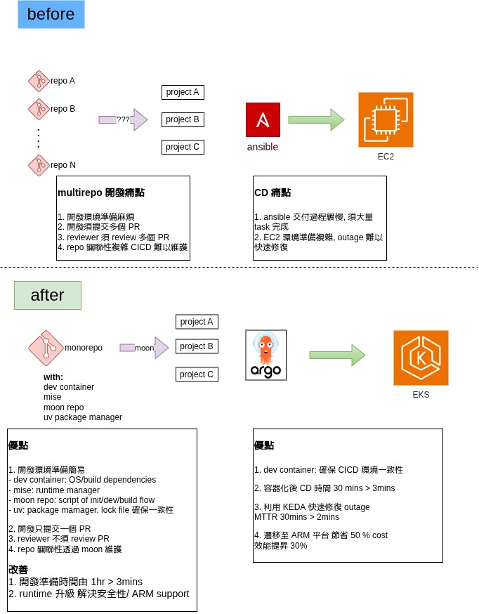

  

<!--more-->

## Objective (目標):

To modernize the development workflow and CI/CD pipeline by migrating 10 projects from a poly-repo architecture to a unified monorepo.

透過將 10 個專案從多倉庫 (poly-repo) 架構遷移到統一的單一倉庫 (monorepo)，實現開發工作流程和 CI/CD 管道的現代化。

## Challenges (Before) (遷移前的挑戰):

* **Management (管理)**: Complex dependency management across multiple repositories.
    * 跨多個倉庫的依賴管理非常複雜。
* **Tech Debt (技術債)**: Services ran on outdated Python 3.5, lacking performance and security updates.
    * 服務運行在過時的 Python 3.5 上，缺乏效能和安全性更新。
* **Poor CI/CD (不完善的 CI/CD)**: No code quality gates (linting/formatting). Deployments to EC2 via Ansible were slow, manual, and lacked robust rollback.
    * 缺乏程式碼品質檢查（linting/formatting）。透過 Ansible 部署到 EC2 的速度緩慢、需手動操作，且缺乏穩健的復原機制。
* **Operations (維運)**: No custom monitoring led to a high MTTR. Manual scaling took ~30 minutes, failing to handle traffic bursts.
    * 缺乏自定義監控導致平均修復時間 (MTTR) 過長。手動擴展需要約 30 分鐘，無法應對突發流量。

## Solutions (After) (解決方案):

* **Monorepo (moonrepo)**:
  * Consistency project structure to simple management.
    * 統一專案結構以簡化管理。
  * Use moonrepo Centralized services with intelligent caching to significantly reduce CI build times.
    * 使用 moonrepo 集中化服務與智慧快取，大幅縮短 CI 建置時間。
* **Standardized Dev Environment (標準化開發環境)**:
  * **devcontainer**: for consistent, one-click development environments.
    * 使用 devcontainer 提供一致且一鍵啟動的開發環境。
  * **mise**: for centralized management of runtimes and tools.
    * 使用 mise 集中管理運行環境與工具。
  * **uv**: for high-speed, reproducible dependency management with lockfiles.
    * 使用 uv 進行高速、可重現的依賴管理（含 lockfiles）。
* **Tech Stack Modernization (技術棧現代化)**: Upgraded Python and related packages for improved performance, features, and security.
    * 升級 Python 及其相關套件，以提升效能、功能與安全性。
* **Containerization (K8s) (容器化)**: Migrated services to K8s for higher reliability, self-healing, and advanced scaling capabilities.
    * 將服務遷移至 K8s，以獲得更高的可靠性、自我修復能力和進階擴展能力。
* **Integrated CI/CD Pipeline (整合 CI/CD 管道)**: Built a modern GitOps workflow using GitLab, Jenkins, and ArgoCD.
    * 使用 GitLab、Jenkins 和 ArgoCD 構建現代化的 GitOps 工作流程。

## Results & Achievements (成果與成就):

* **Developer Experience (開發者體驗)**: Environment setup time was reduced from 1 hour to < 3 minute.
    * 環境設置時間從 1 小時縮短至 3 分鐘以內。
* **Cost & Performance (成本與效能)**: Achieved a 50% cost reduction and 30% performance boost by leveraging ARM architecture on K8s.
    * 透過在 K8s 上利用 ARM 架構，實現了 50% 的成本降低和 30% 的效能提升。
* **CI/CD Efficiency (CI/CD 效率)**: Overall CI/CD time was reduced by 90% through caching and automation. Deployed reliably using Helm and ArgoCD.
    * 透過快取與自動化，整體 CI/CD 時間縮短了 90%。使用 Helm 和 ArgoCD 進行可靠部署。
* **System Observability (系統可觀測性)**: Implemented comprehensive monitoring with Grafana, custom exporters, and alerts, enhancing system transparency.
    * 使用 Grafana、自定義 exporters 和告警實現了全面的監控，增強了系統透明度。
* **Auto-Scaling (自動擴展)**: Reduced scaling time from 30 minutes to < 2 minutes using KEDA with custom metrics, effectively handling load bursts and lowering MTTR.
    * 使用 KEDA 配合自定義指標，將擴展時間從 30 分鐘縮短至 2 分鐘以內，有效應對負載突發並降低 MTTR。
* **Performance Optimization (效能優化)**:
  * Implement connection pool to improve performance.
    * 實作連線池 (connection pool) 以提升效能。
  * Change to more efficient packages to improve performance.
    * 更換為更高效的套件以提升效能。

