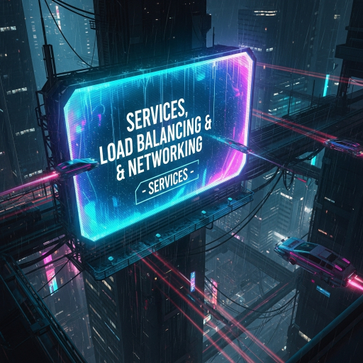

  

<!--more-->
[doc link](https://kubernetes.io/docs/concepts/services-networking/service/)   

k8s 的 Service 間單來說就是一個簡易型的 load balance  

因為 pod 每一次建立都會 assign 一個 IP  
IP 不會是固定的, 也因為 replica/auto scale 的關係  
pod 數量也會隨時變動  
更甚至 pod 的 healthy 也會隨時變動  
因此 k8s 幫忙建立一個 service 來動態 forward request 而不須人工介入  
且 service 會是固定 IP 因此 pod 跟 pod 之間溝通不會輕易失連  

並且 service 除了會建立 cluster IP 外  
也會建立一個 DNS record 方便 pod 使用  
規則後面會再說明  

## Defining a Service 
service 的 manifest 長這樣  

```bash  
apiVersion: v1
kind: Service
metadata:
  name: my-service
spec:
  selector:
    app.kubernetes.io/name: MyApp
  ports:
    - protocol: TCP
      port: 80
      targetPort: 9376

```

簡單來說 service 會建立一個 cluster IP(default 行為)  並 listen 80 port  
然後將 request 轉給 label 包含 `app.kubernetes.io/name: MyApp` 的 pod  
並 forward 給 pod 的 9376 port  

另外因為 service 會根據 pod 的 STATUS 才將 request forward 給 pod  
因此 service 會自動建立 EndpointSlices(另一個 kind) 來紀錄可以 forward 的 pod  
並隨時更新此 EndpointSlices object  


### Port definitions 
在前面的例子是直接使用 targetPort 去決定要送去哪個 port  
port 可以使用 name 的方式去 mapping  

以下範例  
```bash
apiVersion: v1
kind: Pod
metadata:
  name: nginx
  labels:
    app.kubernetes.io/name: proxy
spec:
  containers:
  - name: nginx
    image: nginx:stable
    ports:
      - containerPort: 80
        name: http-web-svc

---
apiVersion: v1
kind: Service
metadata:
  name: nginx-service
spec:
  selector:
    app.kubernetes.io/name: proxy
  ports:
  - name: name-of-service-port
    protocol: TCP
    port: 80
    targetPort: http-web-svc
```

例子中的 pod 會先建立一個 port 叫 http-web-svc  
然後 service 將 targetPort 指定 forward 到 http-web-svc 即可  


### Service type 

service default 會建立 cluster IP  
他還支援其他機種 type  

**ClusterIP**  
建立 cluster IP, 此 IP 僅能 cluster 內部使用  
用在 cluster 內 pod to pod 溝通  
 
**NodePort**
除了建立 cluster IP 外  
在每個 node 身上都會開一個 port 給 cluster 外部存取(所有 node 都是同個 port)  
port 可自訂或隨機分配(default)  

**LoadBalancer**
k8s 沒有 implement  
除了建立 cluster IP 外, 還會再拿到一個 EXTERNAL-IP 給外部存取    
簡單來說就是給 cloud provider 接他們的 loadbalancer  
實際怎麼用就看不同的 cloud provider 怎麼實做  

**ExternalName**
建立一個 DNS CNAME record  
指到你想要的地方  

### Headless Services 
service 的 DNS 解析會指到 cluster IP  
如果希望 pod 能夠直接知道 service 後面有多少 IP(pod)  

可以設定 Headless Services  
那 DNS 解析出來的就是 pod IP 而不是 service IP  


---  

service default 是使用 random 方式 forward 給 pod  
另外可以指定 Traffic policies 來降低 network overhead  
不過就屬比較進階的東西了, 所以這邊不細講  
