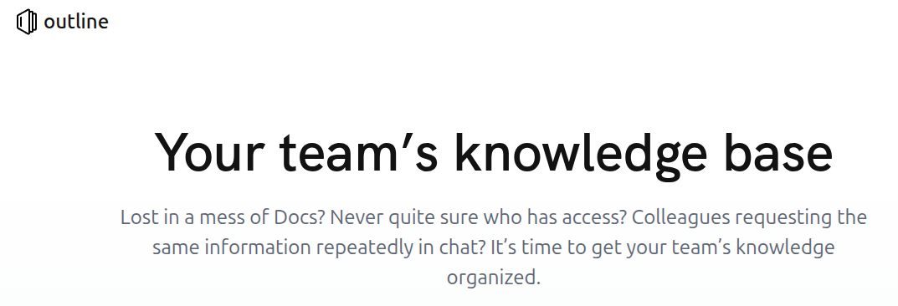

---
tags:
- note
title: "Sharing the Implementation of document system: outline"
---
  

<!-- truncate -->

## Introduction

不管是個人還是在團隊中  
文件都是相當重要的一環  
可以是筆記性質, 也能是 SOP, 也能是 share doc  

而這些需求的背後, 就是要一個文件平台  
儘管現成有 google drive, Dropbox, OneDrive, notion, HackMD 這類平台可以使用  
但仍沒一套能夠滿足需求  

我的需求如下  
- support markdown (best is WYSIWYG, which stands for "What You See Is What You Get")
- collaborative
- permission control
- Single Sign-On
- self-host

於是尋找一套能夠滿足需求的 tool 是我最重是的目標  

## history of chose tool
在這之前, 我曾使用過 google drive, Dropbox, OneDrive, notion, HackMD  
以下稍微說明我不選擇的理由  

### HackMD
HackMD 雖然很知名, 其也有 open-source 方案 ([hedgedoc](https://github.com/hedgedoc/hedgedoc),[CodiMD](https://github.com/hackmdio/codimd))  
我在之前是使用 hedgedoc, hedgedoc 跟 CodiMD 之間是有點故事的   
關於 hedgedoc 跟 CodiMD: https://hedgedoc.org/history/  

在這幾年的追蹤下, 原本 HackMD 沒什麼在維護 CodiMD  
這也是我採用 hedgedoc 的理由  
結果最近反轉了, hedgedoc 2 的進度一直 delay,讓人很懷疑到底還有沒有在繼續開發  
反而 CodiMD 開始積極在更新  
真讓人摸不著頭緒  

但一直讓我很不滿意的是左右兩欄的設計很占版面, 如果能支援 WYSIWYG 就好了  
這就是我很想再令尋他套的理由  

### Dropbox
唯一有印象的就是當文件稍大, performance 就變很差  
且也不算支援 markdown, 雖然 Paper 能使用部份 markdown 語法  

### notion 
唯一挑替的就是要付錢了  
不然絕對是首選 knowledge system

### sharepoint 
商業方案 但其 office 超難用...  
反而 google doc 好用的多  
對 markdown 支援超差  
最要命的是搜尋功能超扯, 基本上根本找不到 ('keyword' 用 'key' 去搜尋會找不到... ,必須使用完整 string 'keyword')  
不知道為什麼微軟的系統搜尋都超爛... 像是 outlook 也是常常找不到東西  
還有些很奇怪的邏輯  
舉例用搜尋找到的文件千萬不能用編輯功能(sharepoint 會幫你另存新檔 WTF...)   

是我接觸過 document 平台用的最不爽的  

### wiki 
wiki 有很多套  
然而大部分都不理想, 就不贅述了  

## what is outline 
[official site](https://www.getoutline.com)

簡單來說 就是一個跟 notion 很像的系統  
對於我想要的功能都支援了   
- support markdown (WYSIWYG mode)  
  很大程度降低編寫文件的困擾  
- collaborative  
  在 team 中使用最重要的功能  
- Single Sign-On  
  管理帳號方便的多  
- permission control  
  能夠避免權限外洩  
- self-host  
  可以安全在 private network 使用  
- history  
- comment  
- support mermaid diagram  

至於實際還有那些功能  
可以先使用其 cloud 版本體驗看看  

想要 self-host 可以參考 doc [hosting-outline](https://docs.getoutline.com/s/hosting)  
不過請再注意功能上會有稍微差異 [pricing](https://www.getoutline.com/pricing)  

## Conclusion

俗話說 萬丈高樓平地起  
document system 是我認為最重要的基本生產力工具  
一旦沒有好用的系統  
不只自身筆記難以紀錄(沒人可以記所有東西)  
也很難在團隊之間分享知識  
進而導致自己/團隊生產力低下  
