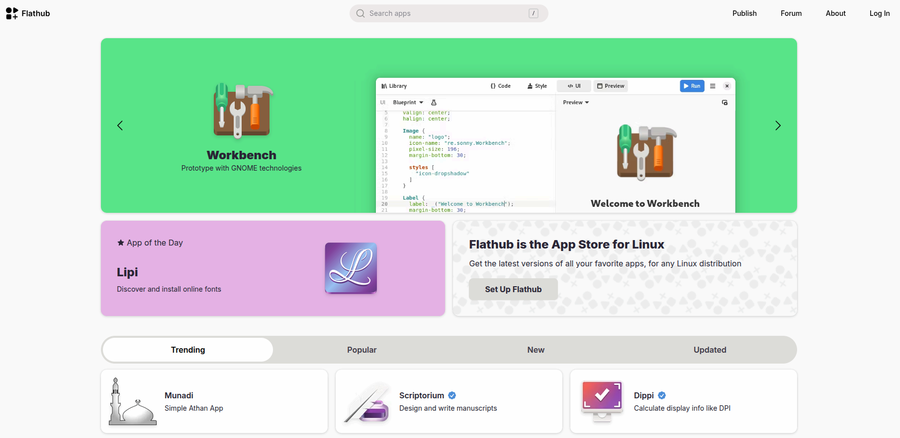

<!-- truncate -->
[flathub](https://flathub.org/en) 是 linux 常用的應用程式商店  

flathub 具有以下優點  
1. 跨發行版（Universal）
Flathub 的最大目標是解決 Linux 軟體破碎化的問題。無論你使用的是 Ubuntu、Fedora、Arch Linux 還是 SteamOS，只要系統安裝了 Flatpak 運作環境，就可以從 Flathub 下載並執行同樣的軟體包，無需擔心相依性問題。

2. 豐富的軟體庫
它是目前全球最大的 Flatpak 託管平台。你可以在上面找到：

主流軟體： 如 Spotify、Discord、VS Code、Steam、Obsidian、VLC 等。

開源工具： 許多著名的開源專案（如 GIMP、LibreOffice）都將 Flathub 作為官方發佈的首選管道。

3. 沙盒安全機制（Sandboxing）
Flathub 上的應用程式預設運行在隔離的沙盒環境中。這意味著應用程式無法隨意存取你的個人檔案、攝像頭或網路，除非在打包時已聲明權限，或由使用者手動授權。這大大提升了執行第三方或不信任軟體時的安全性。

4. 驗證標章（Verified Apps）
為了確保安全與真實性，Flathub 引入了「已驗證」標誌。如果軟體旁邊有一個藍色勾勾，表示該軟體包是由原始開發者或官方團隊維護的，而非社群第三方打包。

5. 更新快速
由於 Flatpak 獨立於系統的基礎庫，開發者可以直接將最新版本的軟體推送到 Flathub，而不需要等待 Linux 發行版維護者（如 Ubuntu 團隊）進行審核或打包。這讓使用者能比透過系統傳統套件管理員（如 apt 或 dnf）更快獲得新功能。

---
看起來很美好  
但由於其 Sandbox 機制  
很常導致 application 功能異常 (無法取得所需權限)  
比如說 browser 使用 passkey 但無法使用藍芽  
postman 無法使用 system tool  
即便有 [Flatseal](https://flathub.org/en/apps/com.github.tchx84.Flatseal) 有 UI 工具方便調整 permission  
但現實是 Sandbox 機制下, 很多東西不是權限打開就好  
有些是路徑就被改了, 實務上要讓 apllication 能正常運作相當困難  
在經過多次的踩坑後  
最後的結論是 **能不用 Flathub 就別用**