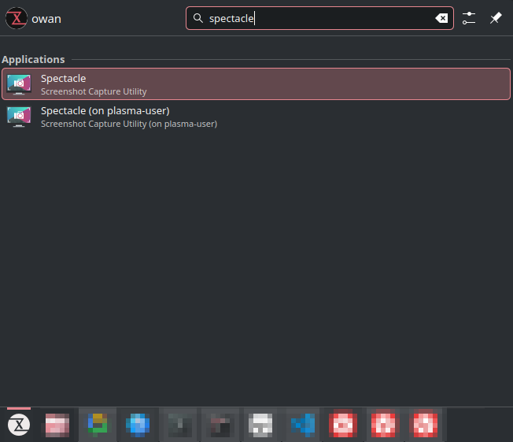
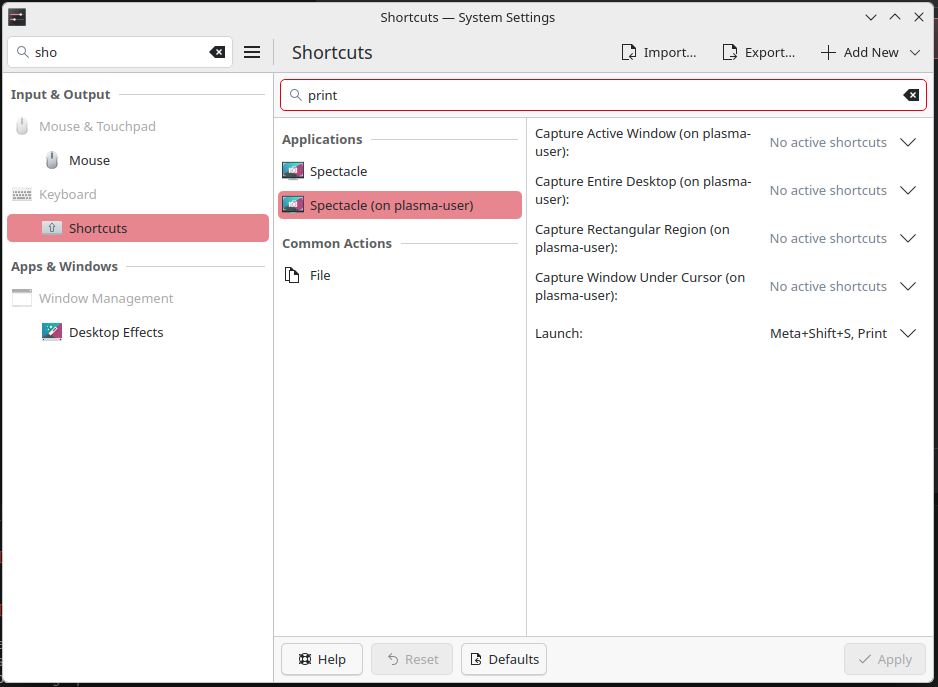

<!-- truncate -->

[distrobox](https://distrobox.it)

## 前言
我使用中的 tuxedo linux  
KDE 的版本稍微落後了  
也明確有消息指出忙著相容 ubuntu 26.04 短時間內不會更新  
好死不死碰到一個有點惱人的問題  
spectacle 在截圖後有時候沒辦法正確將截圖 copy to clipboard  
一查 目前版本是 6.5.2 而官方已經 release 到 6.6.4  

在看解法時  
赫然發現到有個東西 [distrobox](https://distrobox.it)  
一查笑出來, 這就是 linux 版的 WSL  

簡單來說就是利用容器的技術(docker,podman)  
來啟動容器, 並高度整合至你的 host  
包含 HOME directory of the user, external storage, external USB devices and graphical apps (X11/Wayland), and audio.  

好處是 讓軟體可以輕鬆向前 or 向後支援  
以我的例子來說 spectacle 是跟 KDE 有高度相依  
因此無法單純升級 spectacle 搞定, 必須更新 KDE 才行  

而 distrobox 正好解決了此痛點  

## getting start 

使用上相當簡單  
直接使用 command 說明
```bash
# 建立容器
# registry https://community.kde.org/Neon/Containers
distrobox create --root --name neon-user --image invent-registry.kde.org/neon/docker-images/plasma:user

# 進入容器
distrobox enter --root neon-user  

# 啟動容器中的 spectacle, 確認功能是否正常
spectacle

# exports a desktop file to your host system's menu
distrobox-export --app spectacle
```

在最後一步 可以看到系統選單出現了spectacle(neon-user)  


最後更新系統快捷鍵  


就完成無縫切換 spectacle 版本了  
意外的簡單, 可喜可賀  

## update 
進行 distrobox 更新  
```
# list box
❯ distrobox ls --root
ID           | NAME                 | STATUS             | IMAGE
b823983a6e3d | neon-user            | Up 4 hours         | invent-registry.kde.org/neon/docker-images/plasma:user

# update box
distrobox upgrade neon-user --root

```
