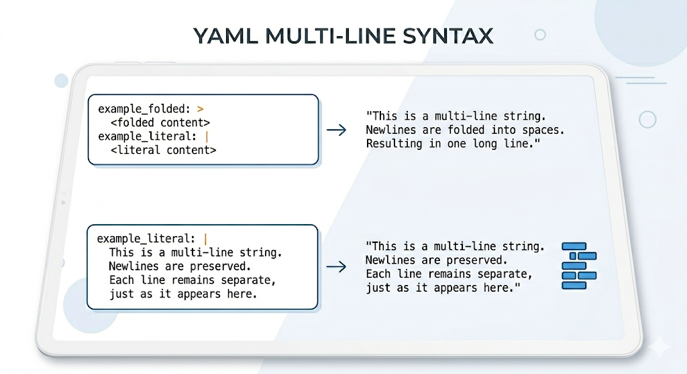
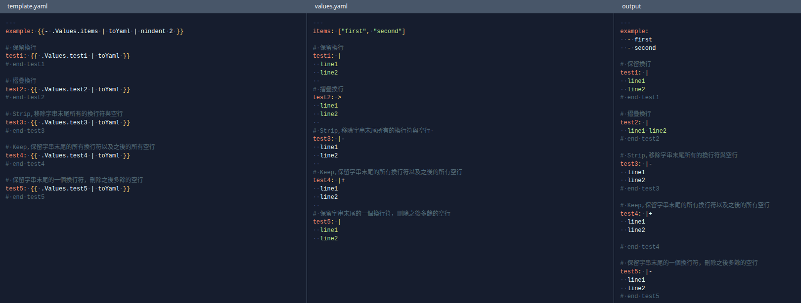

<!-- truncate -->

## 前言

由於 yaml multi-line 使用方法有幾種方式，這邊把它詳細紀錄差異。

先來看看 playground 結果：[https://reurl.cc/epkln7](https://reurl.cc/epkln7)

## 解釋

### 保留換行 (Literal Block Scalar): `|`

如果你希望字串完全照你寫的方式輸出（保留每一行的換行），請使用直線符號。

效果：你在編輯器裡怎麼換行，輸出的字串就有換行。

### 摺疊換行 (Folded Block Scalar): `>`

如果你是為了方便閱讀才在 YAML 裡換行，但希望程式讀取時將它們合併成一長行，請使用大於符號。

### 末尾換行的控制 (Chomping)

在 `|` 或 `>` 後面還可以加上後綴，用來決定字串「最後面」的空白或換行要怎麼處理。

| 符號   | 名稱         | 行為                                         | 適用情境                                       |
| ------ | ------------ | -------------------------------------------- | ---------------------------------------------- |
| （無） | Clip（預設） | 保留字串末尾的一個換行符，刪除之後多餘的空行 | 一般配置、多行描述                             |
| `-`    | Strip        | 移除字串末尾所有的換行符與空行               | 確保變數乾淨，避免輸出後多出空白行             |
| `+`    | Keep         | 保留字串末尾的所有換行符以及之後的所有空行   | 需要嚴格保持原始文件格式時（如詩歌或特定文檔） |
