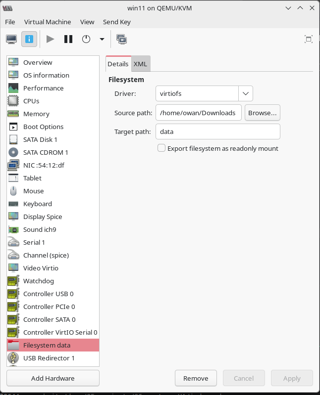
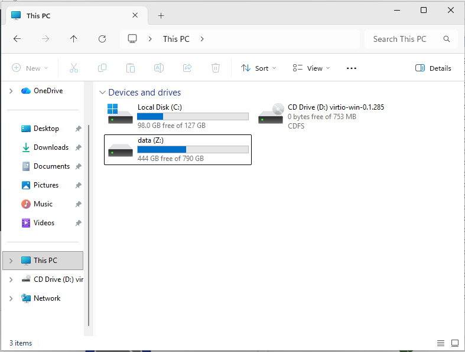

<!-- truncate -->

virt-manager 使用上沒有像 virtualBox 那麼簡易  
多少有些需要人工介入的地方  

### install qemu-guest-agent
對於虛擬機, agent 就等於是 driver, 想要發揮效能就必裝  
在 host 可以下載 [Stable virtio-win ISO](https://fedorapeople.org/groups/virt/virtio-win/direct-downloads/stable-virtio/virtio-win.iso)  
mount 給 windows 安裝  
只要執行 `virtio-win-guest-tools.exe` 即可  

ref. https://github.com/virtio-win/virtio-win-pkg-scripts/blob/master/README.md

### 開啟 3D acceleration
- Video - model - Virtio
- Display Spice - enable OpenGL
- Display Spice - Listen Type "None"

### mount linux folder to windows 
windows 要先安裝 [winFSP](https://winfsp.dev)  
啟動服務 VirioFsSvc  
設定 filesystem data  
  

之後在檔案管理援救可以看到 mount disk  
  

ref. https://github.com/virtio-win/kvm-guest-drivers-windows/wiki/Virtiofs:-Shared-file-system

### share clipboard 
預設情況

在 windows 中安裝 [spice-guest-tools](https://www.spice-space.org/download.html)  
