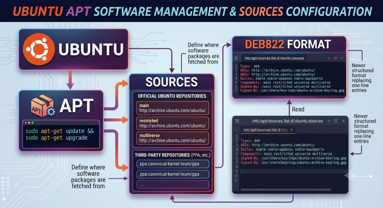

<!-- truncate -->

自 [deb822 format](https://repolib.readthedocs.io/en/latest/deb822-format.html) 出來後  
ubuntu 24.04 預設改用 deb822 格式 (.sources)  
至於 .list 格式目前沒有明確 EOL 時間  

反正用新的就對了  
回到主題  
我有個需求是 ubuntu 24.04 使用的 virt-manager 版本實在太舊了(4.1.0)  
我想要用新的 5.1.0  
所以我要新增 sources 將 virt-manager 套件改用 ubuntu 26.04 的 source  

`/etc/apt/sources.list.d/ubuntu2604.sources`
```
Enabled: yes
Types: deb
URIs: http://archive.ubuntu.com/ubuntu
Suites: resolute resolute-updates
Components: main universe
Signed-By: /usr/share/keyrings/ubuntu-archive-keyring.gpg
```

但光是新增 source 還不夠  
apt 會把 resolute repo 裡所有套件都列入候選，可能導致 `apt upgrade` 時其他套件也被升到 26.04 版本  
所以要搭配 **apt pinning** 限制只有 virt-manager 才從 resolute 安裝  

`/etc/apt/preferences.d/virt-manager`
```
Package: *
Pin: release n=resolute
Pin-Priority: 1

Package: virt-manager
Pin: release n=resolute
Pin-Priority: 900
```

之後只要執行 `apt update && apt install virt-manager` 即可安裝 ubuntu 26.04 的來源  