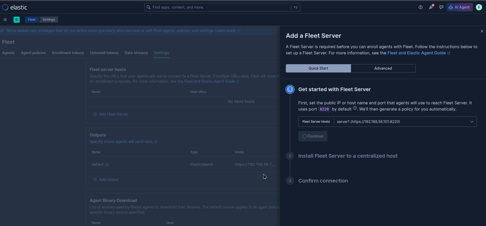

<!-- truncate -->

紀錄安裝 ELK version 9, 6 node (3 master, 3 data)
# install elasticsearch
## Important system configuration
https://www.elastic.co/docs/deploy-manage/deploy/self-managed/important-system-configuration

使用 ubuntu 24.04 並使用 deb package 需設定
```
tee /etc/sysctl.d/99-elk.conf <<EOF
# https://www.elastic.co/docs/deploy-manage/deploy/self-managed/system-config-tcpretries
net.ipv4.tcp_retries2=5

# https://www.elastic.co/docs/deploy-manage/deploy/self-managed/setup-configuration-memory#swappiness 
vm.swappiness=1
EOF
```


## install first node 

install package
```
wget -qO - https://artifacts.elastic.co/GPG-KEY-elasticsearch | sudo gpg --dearmor -o /usr/share/keyrings/elasticsearch-keyring.gpg
sudo apt-get install apt-transport-https
echo "deb [signed-by=/usr/share/keyrings/elasticsearch-keyring.gpg] https://artifacts.elastic.co/packages/9.x/apt stable main" | sudo tee /etc/apt/sources.list.d/elastic-9.x.list
sudo apt-get update && sudo apt-get install -y elasticsearch
```

config elasticsearch `vi /etc/elasticsearch/elasticsearch.yml`
```
cluster.name: my-cluster
network.host: 0.0.0.0
transport.host: 0.0.0.0

# Enable automatic creation of system indices
action.auto_create_index: .monitoring*,.watches,.triggered_watches,.watcher-history*,.ml*
```

setup JVM 
```
sudo tee /etc/elasticsearch/jvm.options.d/memory.options <<EOF
-Xms1g
-Xmx1g
EOF
```

start first node 
```
sudo systemctl daemon-reload
sudo systemctl enable elasticsearch.service --now
```


Reset the elastic superuser password
```
sudo /usr/share/elasticsearch/bin/elasticsearch-reset-password -u elastic
# save 
echo 'export ELASTIC_PASSWORD="your_password"' >> ~/.bashrc
```

check 
```
sudo curl --cacert /etc/elasticsearch/certs/http_ca.crt \
-u elastic:$ELASTIC_PASSWORD https://localhost:9200

sudo curl --cacert /etc/elasticsearch/certs/http_ca.crt \
-u elastic:$ELASTIC_PASSWORD https://localhost:9200/_cat/nodes?v
```


## add other node
in first master node 
generate a node enrollment token (lifespan of 30 minutes)
```
sudo /usr/share/elasticsearch/bin/elasticsearch-create-enrollment-token -s node
```

on other node execute
```
sudo /usr/share/elasticsearch/bin/elasticsearch-reconfigure-node --enrollment-token <enrollment-token>
```

command 會自動更新 `/etc/elasticsearch/elasticsearch.yml` several settings

接著手動更新**所有節點** `sudo vi /etc/elasticsearch/elasticsearch.yml`
```
cluster.name: my-cluster

# commentout cluster.initial_master_nodes

# add discovery.seed_hosts
discovery.seed_hosts: ["192.168.56.101:9300", "192.168.56.102:9300","192.168.56.103:9300"]

# (optional)  
network.host: 0.0.0.0

# (optional) example warm node 
# https://www.elastic.co/docs/deploy-manage/distributed-architecture/clusters-nodes-shards/node-roles#data-node-role
node.roles: [ data_warm ]
```

start elasticsearch
```
sudo systemctl daemon-reload
sudo systemctl enable elasticsearch.service --now
```


# install kibana 

install package 
```
wget -qO - https://artifacts.elastic.co/GPG-KEY-elasticsearch | sudo gpg --dearmor -o /usr/share/keyrings/elasticsearch-keyring.gpg
sudo apt-get install apt-transport-https
echo "deb [signed-by=/usr/share/keyrings/elasticsearch-keyring.gpg] https://artifacts.elastic.co/packages/9.x/apt stable main" | sudo tee /etc/apt/sources.list.d/elastic-9.x.list
sudo apt-get update && sudo apt-get install -y kibana
```


update config `vi /etc/kibana/kibana.yml`
```
server.host: 0.0.0.0
```

```
sudo /usr/share/elasticsearch/bin/elasticsearch-create-enrollment-token -s kibana
```

start 
```
sudo /bin/systemctl daemon-reload
sudo /bin/systemctl enable kibana.service --now
```

open <server ip>:5601
patse token 
and get verification code
```
journalctl -eu kibana | grep "verification code"
```


# Fleet Server 
https://www.elastic.co/docs/reference/fleet/add-fleet-server-on-prem

設定 encryptedSavedObjects 啟用 Fleet 功能 `sudo vi /etc/kibana/kibana.yml`
```
xpack.encryptedSavedObjects.encryptionKey: "your-at-least-32-char-random-string-here"
```

建立
fleet server


URL 輸入
``` 
https://<Fleet-Server-IP-or-Hostname>:8220
```

接著根據提供的 commnad 安裝即可  

# 後記 
## how to reset node 

```bash
sudo systemctl stop elasticsearch
sudo rm -rf /var/lib/elasticsearch/*
sudo rm -rf /var/log/elasticsearch/*
sudo rm -rf /etc/elasticsearch/certs/
sudo rm -f /etc/elasticsearch/elasticsearch.keystore
```
