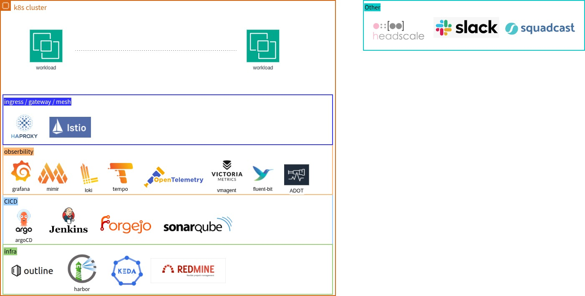

隨手紀錄我個人的 infra architecture  

## v1

### 架構組成說明

#### 1. k8s Cluster（Kubernetes 叢集內服務）

* **Workloads**: 業務應用服務工作負載 (Workloads)
* **Ingress / Gateway / Mesh（網路與流量控制）**:
  * **HAProxy**: 負載平衡器 / Ingress Gateway
  * **Istio**: Service Mesh 服務網格管理
* **Observability（可觀測性）**:
  * **Grafana**: 視覺化儀表板
  * **Mimir**: 分散式 Metrics 儲存與查詢
  * **Loki**: 日誌收集與查詢 (Log Aggregation)
  * **Tempo**: 分散式追蹤 (Distributed Tracing)
  * **OpenTelemetry**: 遙測資料標準與收集 SDK/Collector
  * **VictoriaMetrics (vmagent)**: 指標採集與儲存代理
  * **Fluent-bit**: 輕量級日誌處理與轉發
  * **ADOT (AWS Distro for OpenTelemetry)**: OpenTelemetry 收集器發行版
* **CICD（持續整合與交付）**:
  * **ArgoCD**: GitOps 持續交付工具
  * **Jenkins**: CI/CD 自動化建置伺服器
  * **Forgejo**: 自託管 Git 程式碼倉庫 (Git Forge)
  * **SonarQube**: 程式碼品質與安全性靜態掃描分析
* **Infra / Core Services（基礎設施與支援服務）**:
  * **Outline**: 知識庫與團隊文件協作平台
  * **Harbor**: 容器映像檔倉庫 (Container Registry)
  * **KEDA**: 基於事件驅動的 Kubernetes 自動縮放 (Kubernetes Event-driven Autoscaling)
  * **Redmine**: 專案管理與 Issue Tracking 系統

---

#### 2. Other（叢集外 / 外部整合服務）

* **Headscale**: 自託管 Tailscale 控制伺服器 (VPN / 私有網路互連)
* **Slack**: 團隊通訊與告警通知接收
* **Squadcast**: 事件響應與 On-Call 輪值管理平台 (Incident Management) 

## v2

```mermaid
flowchart TB
    subgraph Users_Admins["外部使用者 & 維運人員"]
        Admin["維運工程師 (kubectl / Admin)"]
        User["終端使用者 (Web / Apps)"]
        GoogleAuth["Google OAuth 2.0"]
    end

    subgraph Security_Edge["Cloudflare Edge (Zero Trust & CDN)"]
        CF_WARP["Cloudflare One (WARP / ZTNA)\nPrivate Routing"]
        CF_Tunnel["Cloudflare Tunnel (cloudflared)\nZero Inbound Ports"]
    end

    subgraph RKE2_Cluster["RKE2 HA Kubernetes Cluster (3 Server Nodes)"]
        subgraph ControlPlane["控制平面 (Control Plane)"]
            PrivateLB["Private Internal Load Balancer"]
            APIServer["Kube-API-Server (6443)"]
            ETCD[("etcd Quorum (SSD/NVMe)")]
            PrivateLB --> APIServer
            APIServer --> ETCD
        end

        subgraph Ingress_Mesh["網路、入口與服務網格"]
            Cilium["Cilium CNI & Gateway API\n(eBPF + Envoy)"]
            Linkerd["Linkerd Service Mesh\n(mTLS + L7 Traffic Policy)"]
            CertManager["cert-manager\n(Let's Encrypt / Wildcard TLS)"]
            Cilium --> Linkerd
        end

        subgraph Core_Services["核心基礎設施 & IAM"]
            Keycloak["Keycloak IAM / SSO"]
            Harbor["Harbor Container Registry"]
            Outline["Outline Knowledge Base"]
            KEDA["KEDA Autoscaling"]
            CNPG[("CloudNativePG (HA PostgreSQL)")]
            
            Keycloak -.-> CNPG
            Harbor -.-> CNPG
            Outline -.-> CNPG
        end

        subgraph CICD_GitOps["CI/CD 與 GitOps"]
            GitLab["GitLab & GitLab CI"]
            ArgoCD["ArgoCD GitOps Engine"]
            SOPS["helm-secrets (SOPS)"]
            Jenkins["(Optional) Jenkins"]

            GitLab -.-> CNPG
            ArgoCD --> SOPS
            ArgoCD -->|Sync Manifests| Cilium
        end

        subgraph Observability_Stack["可觀測性堆疊 (LGTM + OTel)"]
            Grafana["Grafana 儀表板"]
            Mimir[("Mimir (Metrics)")]
            Loki[("Loki (Logs)")]
            Tempo[("Tempo (Traces)")]
            OTel["OpenTelemetry / ADOT / Fluent-bit"]
            VMAgent["VictoriaMetrics (vmagent)"]

            OTel --> Mimir & Loki & Tempo
            VMAgent --> Mimir
            Grafana --> Mimir & Loki & Tempo
        end

        subgraph Storage_Layer["分散式儲存 (Rook-Ceph)"]
            Ceph_RBD[("Ceph RBD (Block / PVC)")]
            Ceph_CephFS[("CephFS (Shared RWX)")]
            Ceph_RGW[("Ceph RGW (S3 Object Storage)")]
        end

        subgraph Backup_DR["備份與災難復原"]
            Velero["Velero Backup\n(K8s Resources + PVC)"]
            ETCD_Backup["RKE2 etcd Auto Snapshot"]
        end
    end

    subgraph External_Backup["異地災難備份"]
        ExtS3[("外部異地 S3 / Cloud Storage")]
    end

    %% 連線關係
    Admin -->|WARP VPN + Keycloak SSO| CF_WARP
    CF_WARP -->|Private Tunnel| PrivateLB

    User -->|HTTPS 443| CF_Tunnel
    CF_Tunnel --> Cilium

    Keycloak <-->|OIDC Auth| GoogleAuth
    CF_WARP <-->|Auth Provider| Keycloak

    %% 儲存關係
    CNPG --> Ceph_RBD
    Mimir & Loki & Tempo & Harbor --> Ceph_RGW
    Velero & ETCD_Backup --> ExtS3
```

#### 1. k8s Cluster（Kubernetes 叢集 - RKE2 HA）

* **Cluster Base**: **RKE2 (Rancher Kubernetes Engine 2)** - 高可用 (HA) 叢集基底（推薦 3 台 Server 節點確保 etcd Quorum 穩定，並使用私有內網外部 LoadBalancer for API-Server；**嚴格禁止 API-Server 暴露於 Public IP 公網**）
* **Security & Remote Access（安全連線與存取控制）**:
  * **Cloudflare One (Zero Trust / WARP)**: 雲原生零信任網路存取架構（透過 Cloudflare Tunnel 建立 Private Network Routing 直連私有 K8s 網段；結合 **Keycloak OIDC / Google OAuth** 進行集中身分驗證與 2FA 存取控制，API-Server 維持零公網 Inbound 暴露）
* **Node Resource（硬體/節點規格要求）**:
  * **OS Disk**: 必須採用 **SSD / NVMe**（確保 etcd fsync 效能與節點 IO 穩定，避免磁碟延遲造成 etcd 斷連）
* **CNI（叢集網路）**: **Cilium** (基於 eBPF 的高效能網路、安全策略與 Service 路由)
* **Storage（分散式儲存）**: **Rook-Ceph** (提供 RBD 區塊儲存 PVC、CephFS 檔案共享、RGW S3 物件儲存)
* **Ingress / Gateway / Mesh（網路與流量控制）**:
  * **Cilium Ingress & Gateway API**: 統一採用 Cilium 作為流量入口（優先推薦使用 **Gateway API** 搭配 **Wildcard Certificate** 簡化各服務路由與憑證維運；亦相容各服務獨立之傳統 Ingress Manifest）
  * **Linkerd**: 超輕量且高效的 Service Mesh 服務網格管理 (取代 Istio)
* **Observability（可觀測性）**:
  * **Grafana**: 視覺化儀表板
  * **Mimir**: 分散式 Metrics 儲存與查詢
  * **Loki**: 日誌收集與查詢 (Log Aggregation)
  * **Tempo**: 分散式追蹤 (Distributed Tracing)
  * **OpenTelemetry**: 遙測資料標準與收集 SDK/Collector
  * **VictoriaMetrics (vmagent)**: 指標採集與儲存代理
  * **Fluent-bit**: 輕量級日誌處理與轉發
  * **ADOT (AWS Distro for OpenTelemetry)**: OpenTelemetry 收集器發行版
* **CICD（持續整合與交付）**:
  * **GitLab**: 自託管一體化 DevOps / Git 程式碼倉庫平台與 GitLab CI（DB 是否外接 CNPG 待考慮，參考資料：[GitLab External DB Docs](https://docs.gitlab.com/charts/advanced/external-db/)）
  * **ArgoCD**: GitOps 持續交付工具
  * **helm-secrets (SOPS)**: 機密資料管理工具（透過 SOPS 加密 Helm values 中的敏感資訊，安全存放在 Git 倉庫中，由 ArgoCD / CI 整合解密發布）
  * **(Optional) Jenkins**: CI/CD 自動化建置伺服器 (視特定專案/舊 Pipeline 需求選配)
* **Infra / Core Services（基礎設施與支援服務）**:
  * **CloudNativePG (CNPG)**: 雲原生高可用 PostgreSQL Operator（支援自動容錯轉移 HA、串流複製與 WAL 即時備份至 Rook-Ceph S3 / PITR 秒級還原；**Keycloak、Harbor、Outline 採用此高可用資料庫來源；GitLab 待考慮**）
  * **Keycloak**: 集中式身分驗證與存取管理 (IAM / SSO)，認證來源串接 Google OAuth (Auth Source -> Google OAuth)
  * **cert-manager**: 自動化 TLS/SSL 憑證簽發與管理 (支援 Let's Encrypt、Wildcard 憑證與 ACME DNS01/HTTP01 挑戰)
  * **Outline**: 知識庫與團隊文件協作平台 (DB 採用 CloudNativePG)
  * **Harbor**: 容器映像檔倉庫 (Container Registry，DB 採用 CloudNativePG)
  * **KEDA**: 基於事件驅動的 Kubernetes 自動縮放 (Kubernetes Event-driven Autoscaling)
* **Backup & Disaster Recovery（備份與災難復原）**:
  * **Velero**: 負責應用層、K8s 資源與 PVC 資料的備份（日常使用、粒度細、支援異地 S3）
  * **RKE2 內建 etcd Snapshot**: 在 RKE2 設定檔開啟自動排程（純背景自動執行，完全不需維護），作為控制平面底層的保險絲

---

#### 3. 其他備註（資安與維運守則）

* **GitOps 資安原則（絕對不要 Commit 的東西）**:
  * 明文密碼、API Tokens、資料庫帳密、TLS Private Key、Kubeconfig、未加密的 `.env` 或 `values.yaml` 機密欄位。
  * 所有機密必須經由 **helm-secrets (SOPS)** 加密後方可推至 Git 倉庫（私鑰/Age Key/GPG 僅保留在本地與 ArgoCD 內）。
  * 參考文章：[絕對不要 Commit 的東西 - iT 邦幫忙](https://ithelp.ithome.com.tw/articles/10396857)
* **叢集存取與網路安全規範**:
  * **API-Server 嚴格禁止使用 Public IP**，不得對公開網際網路開放 6443 / 9345 Port。
  * 所有維運人員與 CI/CD Agent 必須透過 **Cloudflare One (WARP)** 登入 **Keycloak / Google SSO** 進入私有網路後方可與叢集 API 通訊。
