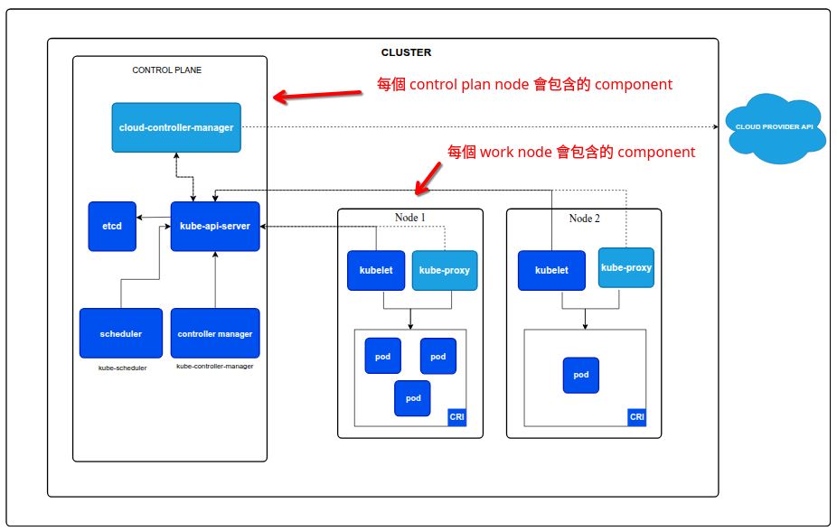
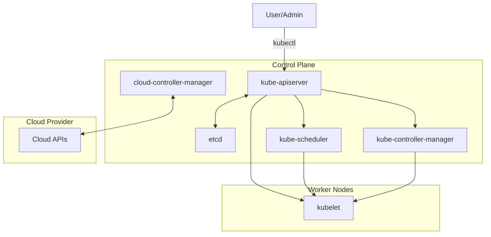

---
tags:
- k8s-reading
---
# Concepts - Cluster Architecture
  
concepts-cluster-architecture

[doc link](https://kubernetes.io/docs/concepts/overview/components/)

## K8s 架構概覽：大腦與身體

要理解 Kubernetes (K8s) 的架構，我們可以將其比喻為人體：

-   **控制平面 (Control Plane)**：是叢集的「**大腦**」。它負責儲存叢集的狀態、做出全局決策（例如調度），以及偵測和回應叢集事件。它不運行使用者應用程式，只專注於管理。
-   **工作節點 (Worker Nodes)**：是叢集的「**身體**」和「**四肢**」。它們是真正負責執行您應用程式容器（Pods）的地方。每個 Worker Node 都會接收來自「大腦」的指令，並據此管理在本機運行的容器。

一個典型的生產環境叢集，通常會有多個 Control Plane 節點以實現高可用性 (HA)，以及更多的 Worker Node 來提供運算能力。

## 控制平面 (大腦) 組件詳解

控制平面的所有組件協同工作，為叢集提供統一的視圖和決策中心。

### `kube-apiserver`：叢集的統一入口
-   **核心職責**：暴露 Kubernetes API，是所有內部和外部通訊的**唯一入口**。
-   **作用**：處理 REST 請求、驗證請求、並更新 `etcd` 中的物件狀態。無論是使用者透過 `kubectl` 下達指令，還是叢集內部組件之間的溝通，都必須經過 API Server。如果它故障，您將暫時失去對整個叢集的控制能力。

### `etcd`：叢集的記憶體
-   **核心職責**：一個高可用性的鍵值儲存系統，是 K8s 的**唯一資料庫**。
-   **作用**：儲存了叢集的所有狀態資料，包括 Pod、Service、Secret 等所有物件的設定和當前狀態。`etcd` 的穩定性和備份是維運 K8s 最重要的任務之一。

### `kube-scheduler`：Pod 的調度員
-   **核心職責**：監控新建立的、尚未被分配到節點的 Pod，並為它們**選擇一個最合適的 Worker Node**。
-   **作用**：調度決策會基於多種因素，包括資源需求 (requests)、節點親和性 (affinity)、污點與容忍 (taints/tolerations) 以及節點的當前負載等。

### `kube-controller-manager`：狀態的維護者
-   **核心職責**：運行一系列的**控制器 (Controller)**，持續地將叢集的「當前狀態」調整為您在物件中定義的「期望狀態」。
-   **作用**：每個控制器負責一種特定資源。例如：
    -   **Node Controller**：偵測 Node 是否故障。
    -   **Deployment Controller**：確保運行的 Pod 數量符合 Deployment 的設定。
    -   **Job Controller**：監看一次性任務 (Job)，並建立 Pod 來執行它們。

### `cloud-controller-manager`：與雲端的橋樑
-   **核心職責**：(可選) 讓 K8s 能夠與特定的雲端供應商 (AWS, GCP, Azure) 的 API 互動。
-   **作用**：它將原本內建於 `kube-controller-manager` 中的雲端相關邏輯分離出來，使得 K8s 核心能夠獨立於各家雲平台發展。它負責處理如雲端負載平衡器、區塊儲存等資源的建立與管理。

## 工作節點 (身體) 組件詳解

每個 Worker Node 上都運行著以下關鍵組件，負責管理在本機運行的 Pod。

### `kubelet`：節點上的總管
-   **核心職責**：在每個 Node 上運行的代理程式 (Agent)，確保容器在 Pod 中正常運行。
-   **作用**：`kubelet` 會從 API Server 接收 Pod 的規格定義 (PodSpec)，並指示容器運行時 (Container Runtime) 根據這些規格來啟動、停止或重啟容器。它也負責定期向 API Server 回報 Node 和 Pod 的健康狀態。

### `kube-proxy`：叢集的網路工程師
-   **核心職責**：在每個 Node 上維護網路規則，實現 K8s 的 **Service** 概念。
-   **作用**：`kube-proxy` 確保您能夠透過一個穩定的虛擬 IP (ClusterIP) 來存取一組 Pod，並在這些 Pod 之間進行負載平衡。它通常透過 `iptables` 或 `IPVS` 來實現這些網路規則。

### `Container Runtime`：容器的執行者
-   **核心職- 責**：真正負責運行容器的軟體。
-   **作用**：K8s 支援所有符合 [CRI (Container Runtime Interface)](https://kubernetes.io/docs/concepts/architecture/cri/) 標準的容器運行時，最常見的包括 **containerd** 和 **CRI-O**。

## 不可或缺的附加元件 (Addons)

Addons 是擴展 K8s 功能的 Pod 和 Service。它們雖然不是核心組件，但對於建立一個功能完備的叢集至關重要。

### K8s 的插件化哲學
您會發現，許多基礎功能（如網路、監控、日誌）K8s 本身並**不提供預設的實作**。這並非疏忽，而是一種刻意的設計哲學。K8s 選擇只定義**標準介面**（如 CNI, CSI），並將具體的實作交給廣大的社群和廠商。這種插件化的設計，催生了 K8s 豐富而強大的生態系，讓使用者可以根據自身需求，自由選擇最適合的解決方案。

### 關鍵 Addons
-   **DNS**：叢集 DNS 是必不可少的 Addon，它為 Service 提供名稱解析，讓 Pod 之間可以透過服務名稱而非 IP 位址進行通訊。最常見的實作是 **CoreDNS**。
-   **網路插件 (CNI)**：K8s 要求每個 Pod 都必須擁有一個獨一無二的 IP 位址，並能與其他 Pod 直接通訊。實現這個網路模型的責任就落在 CNI 插件上。常見的選擇包括 Calico, Cilium, Flannel 等。
-   **監控與日誌**：K8s 本身不包含完整的監控和日誌方案，您需要自行部署如 Prometheus, Grafana, ELK Stack 等工具來收集和分析叢集的指標與日誌。

---

理解 K8s 的架構和各組件的職責，是深入學習和有效維運 K8s 的第一步。這個分佈式系統的每一部分都各司其職，共同協作，最終為您的應用程式提供了一個強大、穩定且富有彈性的運行平台。
