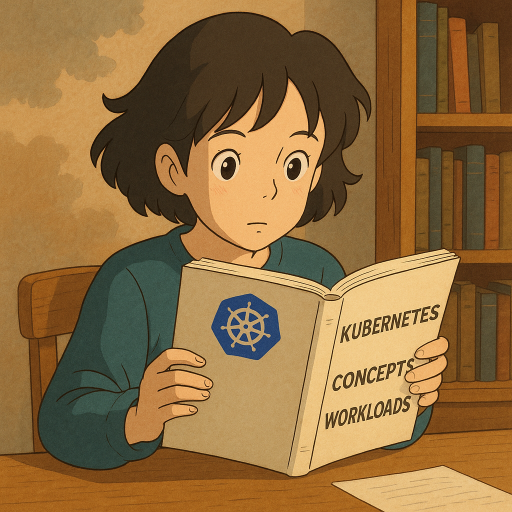
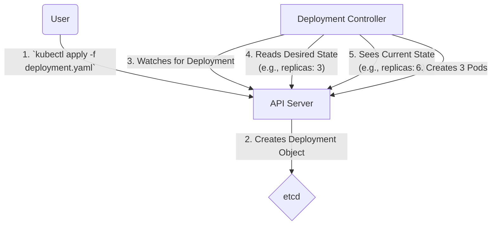

---
tags:
- k8s-reading
---
# Concepts - workloads
  

[doc link](https://kubernetes.io/docs/concepts/workloads/)

## Pod：K8s 的原子單元

在 Kubernetes (K8s) 的世界裡，**Pod** 是您可以建立和管理的、**最小的可部署運算單元**。它就像是原子，是構成所有應用程式的基本粒子。

一個 Pod 代表了叢集上一個正在運行的進程。它可以包含一個或多個緊密耦合的容器。

### Pod 的設計模式

-   **單容器 Pod**：這是最常見的模式，一個 Pod 只封裝一個主應用程式容器。K8s 管理的是 Pod，而不是直接管理容器。
-   **多容器 Pod (Sidecar 模式)**：當您有一些需要與主應用程式共享網路和儲存空間的輔助功能時，就可以使用此模式。例如：
    -   **日誌收集器 (Logging Agent)**：一個 Sidecar 容器負責讀取主應用程式寫在共享 Volume 中的日誌，並將其轉發出去。
    -   **服務網格代理 (Service Mesh Proxy)**：像 Istio 的 Envoy 代理，它會以 Sidecar 的形式注入到 Pod 中，攔截所有進出主容器的網路流量。

**設計原則**：只有當容器之間**高度耦合**、**生命週期必須一致**時，才應該將它們放在同一個 Pod 中。一般情況下，例如 Web Server 和 Database，應該要被部署在**各自獨立的 Pod** 中，以便能夠獨立地擴展和管理。

## 為什麼不直接用 Pod？

既然 Pod 是部署的最小單位，我們為什麼不直接建立 Pod，而是要透過更高層次的物件來管理它們？

因為單獨的 Pod 是「脆弱」的。一旦您建立了一個 Pod，它就與特定的節點綁定。如果該節點故障，Pod 就會隨之消失，K8s **不會**自動在其他節點上重建它。

為了實現高可用性、擴展性和方便的生命週期管理，我們需要 **Workload Resources**。

## 認識五種核心 Workload Resources

Workload Resources 是 K8s 提供的更高層次的 API 物件，它們內部包含了 Pod 的模板 (`.spec.template`)，並由對應的**控制器 (Controller)** 負責管理這些 Pod 的生命週期。

您可以將 Controller 想像成一位盡責的管家，它會持續地將現實（實際運行的 Pod 狀態）與您在 Workload 物件中定義的期望狀態進行比較，並採取行動來彌平差異。

以下是 K8s 內建的五種核心 Workload Resources，它們分別對應了不同的應用程式部署模式：

| Workload | 核心用途 | 狀態 | Pod 標識 | 適合場景 |
| :--- | :--- | :--- | :--- | :--- |
| **[Deployment](/docs/k8s-doc-reading/k8s-doc-reading-workload-management-deployments/)** | 管理一組完全相同的 Pod | **無狀態** | 隨機 | Web 伺服器、API 後端、無狀態應用 |
| **[StatefulSet](/docs/k8s-doc-reading/k8s-doc-reading-workload-management-statefulsets/)** | 管理一組各自獨立的 Pod | **有狀態** | **穩定、唯一** | 資料庫、訊息佇列、需要穩定網路/儲存的應用 |
| **[DaemonSet](/docs/k8s-doc-reading/k8s-doc-reading-workload-management-demonset/)** | 確保每個節點都運行一個 Pod | 無狀態 | 隨機 | 節點監控代理、日誌收集器、CNI 插件 |
| **[Job](/docs/k8s-doc-reading/k8s-doc-reading-workload-management-jobs/)** | 執行**一次性**的任務 | 無狀態 | 隨機 | 資料庫遷移、批次處理、CI/CD 任務 |
| **[CronJob](/docs/k8s-doc-reading/k8s-doc-reading-workload-management-cronjob/)** | 執行**定時**的任務 | 無狀態 | 隨機 | 定期備份、排程報告、週期性清理 |

-   **Deployment**、**StatefulSet** 和 **DaemonSet** 追求的是「**持續運行**」，它們會確保 Pod 一直活著。
-   **Job** 和 **CronJob** 追求的是「**最終完成**」，它們允許 Pod 在任務結束後正常退出。

## 無限的可能性：Custom Resources
如果上述內建的 Workload Resources 仍然無法滿足您的需求，K8s 強大的可擴展性允許您透過 **CRD (Custom Resource Definition)** 來定義自己想要的資源物件，並編寫對應的控制器來實現您獨特的業務邏輯。社群中許多優秀的專案（如 ArgoCD, OpenKruise）就是基於 CRD 建立的。
