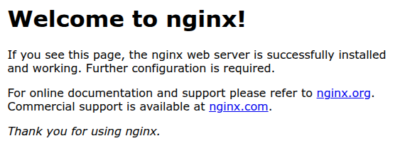

---
tags:
- k8s-reading
---
# Concepts: Getting started
  


在學習了 Kubernetes (K8s) 的基本概念後，是時候動手實作了！本篇文章將引導您完成從無到有，建立一個本地的 K8s 實驗環境，並部署您的第一個應用程式。

## 選擇你的遊樂場：為什麼用 k3s？

要建立一個 K8s 叢集，社群提供了許多工具，但對於初學者來說，選擇一個**輕量、快速且功能完整**的工具至關重要。

| 工具 | 優點 | 缺點 | 推薦度 |
| :--- | :--- | :--- | :--- |
| **k3s** | **極度輕量、安裝快速 (一條指令)、內建電池 (Ingress, Service LB)** | 社群相對較小 | ⭐⭐⭐⭐⭐ |
| **minikube** | 官方推薦、功能豐富 | 基於 Docker/VM，網路和儲存層與生產環境有差異 | ⭐⭐⭐ |
| **kind** | 快速建立多節點叢集、CI/CD 整合佳 | 同 minikube，底層依賴 Docker | ⭐⭐⭐ |
| **kubeadm** | **最原生**、最能理解底層原理 | **安裝極度複雜**、耗時、容易出錯 | ⭐ (不推薦初學者) |

基於以上比較，本系列將採用由 Rancher (SUSE) 開發的輕量級 K8s 發行版 **[k3s](https://k3s.io/)** 作為我們的實驗環境。它移除了許多不必要的功能，將所有核心組件打包成一個小於 100MB 的執行檔，讓您可以在一分鐘內擁有一個功能齊全的 K8s 叢集。

### 安裝 k3s
**前提**：準備一台 Linux 虛擬機 (建議 Ubuntu 24.04)，至少 2 Cores / 2GB RAM。

**執行安裝腳本：**
```bash
# 一鍵安裝 k3s，並設定 kubeconfig 權限為所有人可讀
curl -sfL https://get.k3s.io | sh -s - --write-kubeconfig-mode 644

# 設定 alias 和自動補全，讓操作更方便
# 這是 K8s 社群的通用慣例，'k' 就是 'kubectl' 的縮寫
tee -a ~/.bashrc <<EOF
source <(k3s kubectl completion bash)
alias kubectl="k3s kubectl"
alias k="k3s kubectl"
complete -o default -F __start_kubectl k
EOF

# 立刻讓設定生效
source ~/.bashrc
```

**驗證安裝：**
```bash
$ k get node
NAME    STATUS   ROLES                  AGE    VERSION
node1   Ready    control-plane,master   112s   v1.32.5+k3s1
```
看到節點狀態為 `Ready`，恭喜您，您的 K8s 遊樂場已經準備就緒！

## Part 1：部署你的第一個應用 (Deployment)
現在，讓我們來部署一個 NGINX 網站。我們將使用 `kubectl apply` 指令，並直接引用官方提供的 YAML 設定檔。

```bash
# 建立一個 Deployment 物件
k apply -f https://k8s.io/examples/controllers/nginx-deployment.yaml

# 查看 Deployment 的狀態
$ k get deploy
NAME               READY   UP-TO-DATE   AVAILABLE   AGE
nginx-deployment   3/3     3            3           2m24s
```
-   `k apply`：告訴 K8s 根據指定的 YAML 檔，建立或更新物件。
-   `k get deploy`：查看 Deployment 的狀態。`READY 3/3` 表示我們期望的 3 個 Pod 副本都已經成功啟動並處於就緒狀態。

## Part 2：讓應用在叢集中被看見 (Service)
雖然我們的 NGINX Pod 已經在運行，但它們目前是孤立的，叢集中的其他應用無法存取它們。為了讓它們能被「看見」，我們需要建立一個 **Service**。

```bash
# 建立一個 Service 物件
k apply -f https://k8s.io/examples/service/nginx-service.yaml

# 查看 Service 的狀態
$ k get service
NAME            TYPE        CLUSTER-IP     EXTERNAL-IP   PORT(S)    AGE
nginx-service   ClusterIP   10.43.163.91   <none>        8000/TCP   13s
```
-   **Service**：為一組功能相同的 Pod 提供一個**穩定**的、**單一**的存取入口。
-   **`ClusterIP`**：這是 Service 的預設類型。它會建立一個僅能在**叢集內部**存取的虛擬 IP。現在，叢集內任何一個 Pod 都可以透過存取 `10.43.163.91:8000` 來訪問我們的 NGINX 服務，Service 會自動將流量負載平衡到後端的 3 個 NGINX Pod 之一。

## Part 3：將應用暴露到叢集外部
`ClusterIP` 只能對內，如果我們想讓外部使用者也能看到我們的 NGINX 歡迎頁面，該怎麼辦？我們需要將 Service 的類型變更為 `LoadBalancer`。

```bash
# 使用 edit 指令直接編輯已存在的 Service
# 這會開啟一個 vi 編輯器
k edit service nginx-service
```
在編輯器中，找到 `spec.type` 這一行，將其值從 `ClusterIP` 改為 `LoadBalancer`，然後保存並退出。

```bash
# 再次查看 Service 狀態
$ k get svc
NAME            TYPE           CLUSTER-IP     EXTERNAL-IP      PORT(S)          AGE
nginx-service   LoadBalancer   10.43.163.91   192.168.56.101   8000:31509/TCP   15m
```
-   **`LoadBalancer`**：這個 Service 類型會利用 K8s 所在環境的負載平衡器（在公有雲上是雲端 LB，在 k3s 中是內建的 [ServiceLB](https://docs.k3s.io/networking/service-load-balancer)），為您的服務分配一個可從**外部**存取的 IP 位址。
-   **`EXTERNAL-IP`**：這就是我們可以從外部存取的 IP。
-   **`PORT(S)`**：`8000:31509/TCP` 表示 Service 的 `8000` 埠號，被對應到節點上的 `31509` 埠號。

現在，打開您的瀏覽器，訪問 `http://<YOUR-NODE-IP>:8000` (請將 `<YOUR-NODE-IP>` 替換為您 VM 的實際 IP)，您應該就能看到 NGINX 的歡迎頁面了！



## 清理戰場
實驗結束後，使用 `delete` 指令來清理我們建立的物件。
```bash
k delete service nginx-service
k delete deployment nginx-deployment
```

---
透過這個快速的實作，您已經體驗了 K8s 最核心的工作流程：**部署 (Deployment)** -> **對內暴露 (Service - ClusterIP)** -> **對外暴露 (Service - LoadBalancer)**。在接下來的章節中，我們將會深入探討每一個物件的細節。
