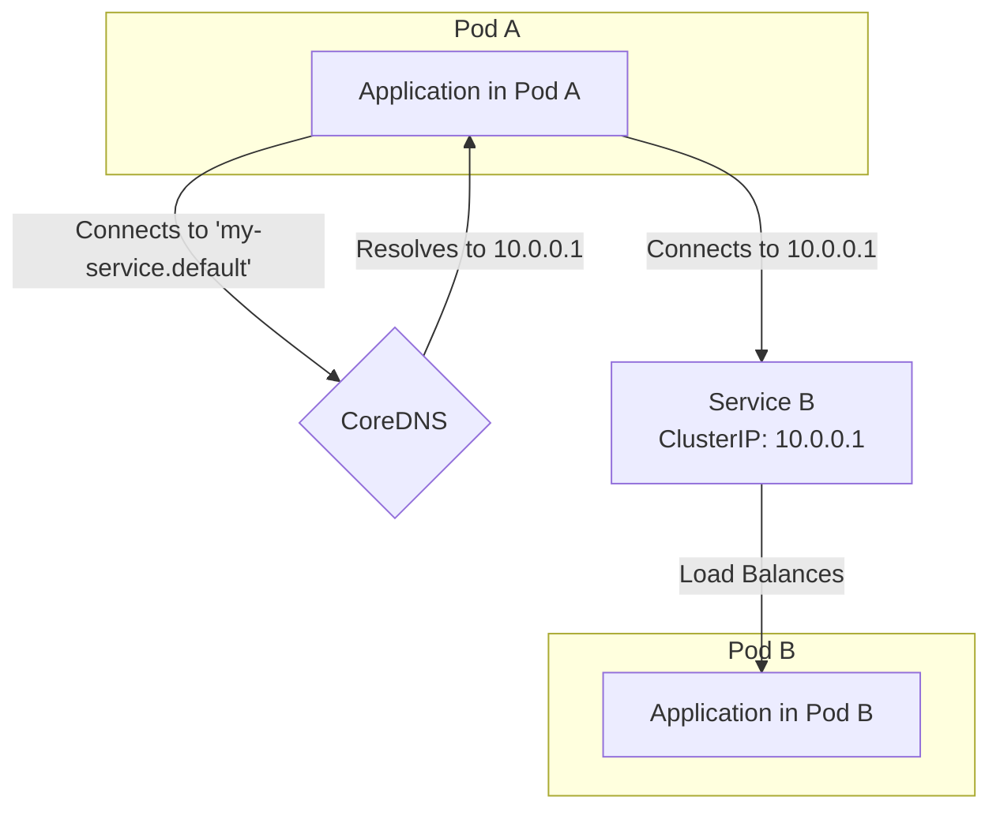

---
tags:
- k8s-reading
---
# Concepts - Services, Load Balancing, and Networking - dns
  

[doc link](https://kubernetes.io/docs/concepts/services-networking/dns-pod-service/)

pod/service 每一次新增刪除都會 assigin new ip  
因此 connection 要去使用 ip 連線是不現實的, 因為他會一直異動  

在 cloud 的世界, 不管是公有雲還是 k8s 都是同樣的狀況  
因此會提供 DNS name 來讓 access pod/service 能夠輕易達成  

這帶來一個問題：如果服務 A 要與服務 B 通訊，它該如何找到服務 B 的 IP 位址？直接依賴 Pod 的 IP 顯然是不可行的。

為了解決這個問題，K8s 提供了一個內建的 DNS 服務，就像是為整個叢集提供了一本「**智慧型通訊錄**」。

-   **Pod 的 IP**：就像朋友的**手機號碼**，可能隨時更換。
-   **Service 的 DNS 名稱**：就像您手機通訊錄裡朋友的**名字**。

您只需要讓服務 A 透過「`service-b`」這個不變的名字來尋找服務 B，而 K8s 的 DNS 系統（通常是 **CoreDNS**）會自動地、即時地將這個名字解析到服務 B 當前正確的虛擬 IP (ClusterIP) 上。

**這個機制的關鍵優點是「解耦」**。應用程式之間不再需要關心彼此的網路位置，從而實現了真正的彈性和可攜性。

## Service DNS 記錄

K8s 會為每種 Service 自動建立對應的 DNS 記錄。

### A/AAAA 記錄 (標準服務)
對於一個普通的 `ClusterIP` 類型的 Service，DNS 查詢會回傳其**單一的、穩定的虛擬 IP (ClusterIP)**。

-   **格式**：`<service-name>.<namespace>.svc.<cluster-domain>`
-   **範例**：`my-service.default.svc.cluster.local`
-   **簡寫**：在同一個 Namespace 內，可以直接使用 `<service-name>` (`my-service`) 來存取。

### A/AAAA 記錄 (Headless 服務)
對於一個 `clusterIP: None` 的 **Headless Service**，DNS 查詢會回傳其後端**所有就緒 (Ready) Pod 的 IP 位址列表**。這常用於需要進行點對點通訊的有狀態應用（如資料庫叢集）。

## Pod DNS 記錄

K8s 也會為 Pod 建立 DNS 記錄，但它通常不直接用於服務間通訊。
-   **格式**：`<pod-ip-address>.<namespace>.pod.<cluster-domain>`
-   **範例**：`172-17-0-3.default.pod.cluster.local` (其中 `-` 取代了 `.` )

## 進階設定：Pod 的 DNS 策略

Pod 的 `dnsPolicy` 欄位決定了該 Pod 該如何進行 DNS 查詢。

| `dnsPolicy` | 描述 | 適用場景 |
| :--- | :--- | :--- |
| **`ClusterFirst`** | **(預設)** 任何不包含 `.` 的 DNS 查詢都會先被轉發到叢集內部的 DNS 伺服器 (CoreDNS)。如果查詢失敗，才會轉發到節點上的上游 DNS 伺服器。 | **絕大多數**的 K8s 工作負載。 |
| **`Default`** | Pod 直接繼承其所在**節點 (Node)** 的 `/etc/resolv.conf` 設定。它會完全**繞過** K8s 的叢集 DNS。 | 當您不希望 Pod 使用叢集 DNS，而是想直接查詢外部 DNS 時。 |
| **`ClusterFirstWithHostNet`**| 對於使用 `hostNetwork: true` 的 Pod，`ClusterFirst` 會失效。此策略確保即使在 `hostNetwork` 模式下，Pod 也能優先使用叢集 DNS。 | 需要直接使用節點網路，但又想存取叢集內部服務的 Pod（例如某些 CNI 插件）。 |
| **`None`** | K8s 完全不為此 Pod 設定任何 DNS。您必須透過 `dnsConfig` 欄位**手動**指定所有的 DNS 解析設定（如 nameservers, searches, options）。 | 需要高度自訂 DNS 解析行為的特殊場景。 |

---
總結來說，DNS 是 K8s 服務發現機制的核心。在開發應用程式時，**永遠應該透過 Service 的 DNS 名稱來進行服務間的通訊**，這是確保您的應用在 K8s 這個動態環境中能夠穩定運行的黃金法則。
