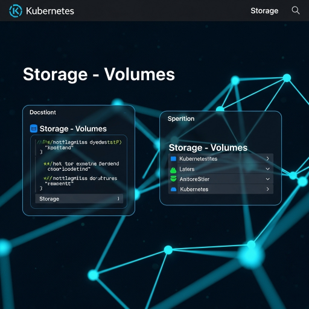
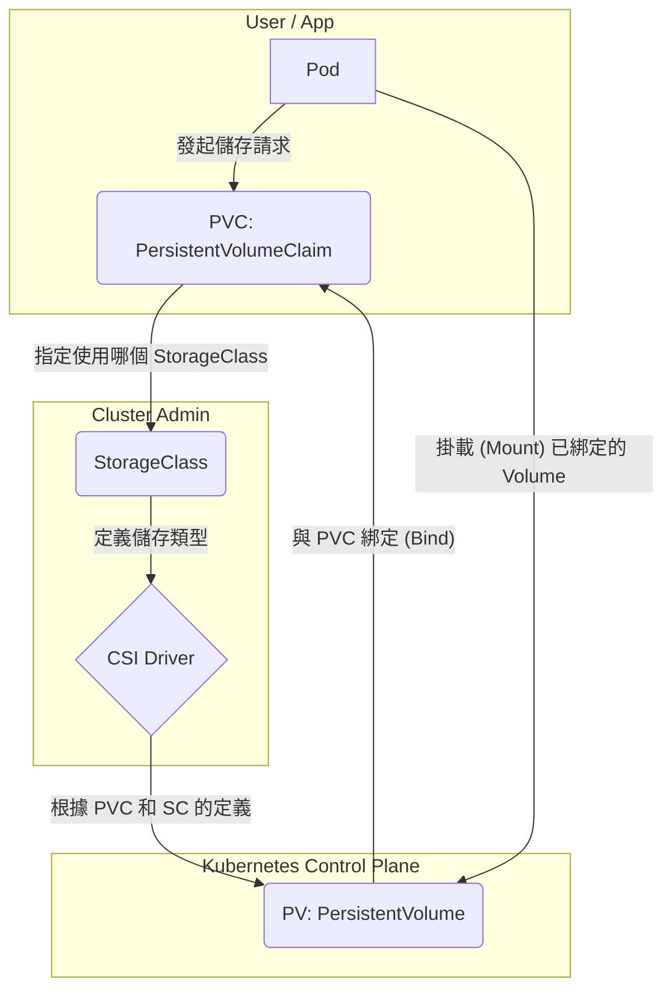

---
tags:
- k8s-reading
---
# Concepts - Storage - Volumes - Storage
  

[doc link - CSI](https://kubernetes.io/docs/concepts/storage/volumes/#csi)
[doc link - Storage Classes](https://kubernetes.io/docs/concepts/storage/storage-classes/)
[doc link - Dynamic Volume Provisioning](https://kubernetes.io/docs/concepts/storage/dynamic-provisioning/)
[doc link - Persistent Volumes](https://kubernetes.io/docs/concepts/storage/persistent-volumes/)

## K8s 儲存的核心思想：分離

在 Kubernetes (K8s) 的世界裡，Pod 是短暫的、隨時可能被銷毀和重建的。那麼，如果我們的應用程式（如資料庫）需要將資料**持久化 (Persistent)**，該怎麼辦？

K8s 的解決方案是將「**運算 (Compute)**」和「**儲存 (Storage)**」徹底分離。Pod 專注於運算，而資料則儲存在獨立於 Pod 生命週期的「**儲存卷 (Volume)**」中。

為了讓這個機制更靈活、更適應不同的儲存環境，K8s 設計了一套精巧的抽象層。我們可以把它比喻成去餐廳點牛排的過程：

| K8s 物件 | 餐廳比喻 | 角色 |
| :--- | :--- | :--- |
| **Pod** | 顧客 | 需要儲存空間的應用程式。 |
| **PersistentVolumeClaim (PVC)** | 訂單 | 顧客向餐廳下的訂單，描述了需要什麼樣的儲存（大小、效能等級）。 |
| **StorageClass (SC)** | 菜單 | 餐廳提供的菜單，定義了不同種類的儲存選項（如 `ssd`, `hdd`）及其特性。 |
| **Container Storage Interface (CSI)**| 廚房 | 實際提供儲存資源的後端系統（如 AWS EBS, Ceph, NFS）的驅動程式。 |
| **PersistentVolume (PV)** | 牛排 | 由廚房根據訂單實際準備好的、獨一無二的那份儲存空間，準備給顧客使用。 |

## 儲存系統的四大金剛

這四個物件協同工作，構成了 K8s 持久化儲存的基礎。



### 1. CSI Driver (廚房)
**Container Storage Interface (CSI)** 是一個標準介面，它允許各種第三方儲存廠商（如 AWS, Google, NetApp, Ceph）將自己的儲存系統無縫地接入 K8s，而無需修改 K8s 的核心程式碼。您可以將它理解為 K8s 的「儲存驅動程式」。

### 2. StorageClass (菜單)
一個 **StorageClass (SC)** 物件定義了一種「儲存的類型」。它會告訴 K8s 當收到儲存請求時，應該使用哪個 `provisioner` (即哪個 CSI Driver)，以及在建立儲存時需要傳遞哪些參數（如效能等級 `io1`、檔案系統類型 `xfs` 等）。叢集管理者可以定義多個 StorageClass，例如 `fast-ssd` 和 `slow-hdd`，以滿足不同應用的需求。

```yaml
apiVersion: storage.k8s.io/v1
kind: StorageClass
metadata:
  name: ebs-sc
provisioner: ebs.csi.aws.com # 指定使用 AWS EBS 的 CSI Driver
parameters:
  type: io1
  iopsPerGB: "50"
  encrypted: "true"
```

### 3. PersistentVolumeClaim (訂單)
**PersistentVolumeClaim (PVC)** 是開發者（使用者）向叢集發出的「儲存請求」。它描述了應用程式需要多大的空間、需要什麼樣的存取模式，以及期望使用哪個 `storageClassName`。

```yaml
apiVersion: v1
kind: PersistentVolumeClaim
metadata:
  name: my-app-pvc
spec:
  accessModes:
    - ReadWriteOnce
  storageClassName: ebs-sc # 指定使用上面定義的 StorageClass
  resources:
    requests:
      storage: 10Gi # 請求 10 GiB 的儲存空間
```

### 4. PersistentVolume (牛排)
**PersistentVolume (PV)** 代表了叢集中一塊已經被配置好的、實際存在的網路儲存。它包含了儲存的詳細資訊，如容量、存取模式、以及它所屬的 StorageClass。

## 動態配置 vs. 靜態配置

PV 和 PVC 的互動模式有兩種：

-   **動態配置 (Dynamic Provisioning) - 推薦**：
    這是最常用、也是推薦的方式。如上面的流程圖所示，管理者只需設定好 CSI Driver 和 StorageClass。開發者提交 PVC 請求後，CSI Driver 會**自動地**根據 PVC 的要求，去後端儲存系統（如 AWS EBS）建立一塊對應的儲存空間，並將其註冊為一個新的 PV 物件，最後再與 PVC 進行綁定。整個過程全自動完成。

-   **靜態配置 (Static Provisioning)**：
    在這種模式下，叢集管理者需要**手動地**預先建立好一批 PV。當開發者提交 PVC 請求時，K8s 會去尋找現有的、尚未被綁定的 PV 中，是否有符合該 PVC 要求的（例如 StorageClass、容量、存取模式），如果找到，就將它們綁定在一起。這種方式較不靈活，通常只在特殊場景下使用。

## Access Modes 詳解

Access Mode 定義了 PV 可以被如何掛載。

| Access Mode | 縮寫 | 描述 | 常見支援的儲存類型 |
| :--- | :--- | :--- | :--- |
| `ReadWriteOnce` | RWO | 該儲存卷**一次只能被一個節點**以讀寫模式掛載。但該節點上的多個 Pod 可以同時存取。 | 區塊儲存 (如 AWS EBS, GCP PD) |
| `ReadOnlyMany` | ROX | 該儲存卷可以被**多個節點**以**唯讀**模式同時掛載。 | 所有類型 |
| `ReadWriteMany` | RWX | 該儲存卷可以被**多個節點**以**讀寫**模式同時掛載。 | 檔案儲存 (如 NFS, AWS EFS, CephFS) |
| `ReadWriteOncePod`| RWOP | 該儲存卷**一次只能被叢集中的單一 Pod** 掛載。 | CSI v1.5+ |

> **重要**：一個儲存系統是否支援某種 Access Mode，完全取決於其 **CSI Driver 的實作**。在選擇儲存方案前，務必確認其支援的存取模式。

---
K8s 的儲存系統雖然初看複雜，但其分層的抽象設計，正是它能夠適應各種複雜環境、實現儲存即服務 (Storage-as-a-Service) 的關鍵。對於正式環境，特別是本地部署 (On-Premises)，深入理解並謹慎選擇儲存方案，是保障資料安全與系統效能的重中之重。
