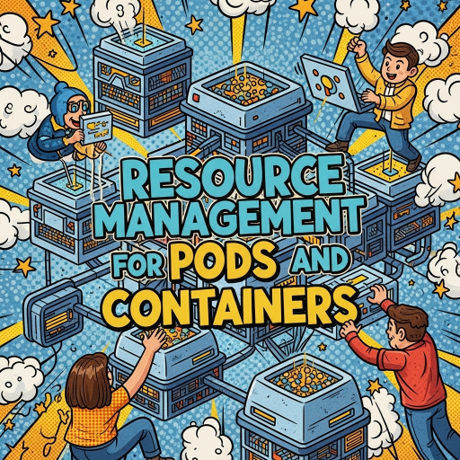
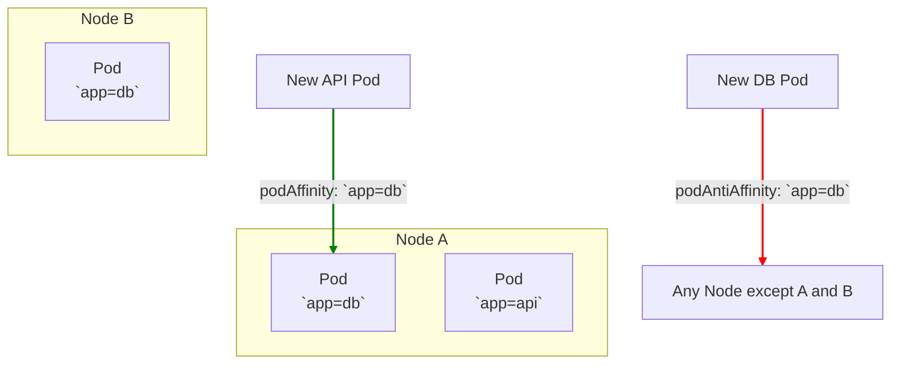

---
tags:
- k8s-reading
---
# Concepts - configuration - Assigning Pods to Nodes
  

[doc link](https://kubernetes.io/docs/concepts/scheduling-eviction/assign-pod-node/)

## 為什麼需要控制 Pod 調度？

在一個典型的 Kubernetes (K8s) 叢集中，節點 (Node) 之間往往存在差異。有些節點可能擁有更強大的 CPU、配備了 GPU，或者位於特定的可用區 (Availability Zone)。

預設情況下，K8s Scheduler 會嘗試在所有可用的節點上平均地分佈 Pod。但有時，我們需要更精細地控制，將特定的 Pod **指派**到特定的節點上，以滿足效能、高可用性或成本等方面的需求。

K8s 提供了一套從簡單到複雜的工具箱，來幫助我們實現這個目標。

| 調度機制 | 靈活性 | 表達能力 | 約束類型 | 推薦度 |
| :--- | :--- | :--- | :--- | :--- |
| `nodeName` | 差 | 極低 | 硬性 | ⭐ (不推薦) |
| `nodeSelector` | 中 | 低 | 硬性 | ⭐⭐ (簡單場景可用) |
| **Affinity / Anti-Affinity** | **高** | **高** | **硬性 + 軟性** | ⭐⭐⭐⭐⭐ **(推薦)** |

## Level 1: `nodeName` (不推薦)
這是最簡單、也是最不靈活的方式。您可以直接在 Pod 的 `.spec` 中指定 `nodeName`，強制將 Pod 調度到該節點上。

```yaml
apiVersion: v1
kind: Pod
metadata:
  name: nginx
spec:
  containers:
  - name: nginx
    image: nginx
  nodeName: kube-01 # 直接綁定到 kube-01 節點
```
**缺點**：這種方式完全繞過了 Scheduler，如果指定的節點不存在或資源不足，Pod 將會調度失敗。它缺乏彈性，應盡量避免在生產環境中使用。

## Level 2: `nodeSelector` (簡單易用)
`nodeSelector` 提供了一種基於**節點標籤 (Node Labels)** 來選擇目標節點的簡單方法。您只需要為節點打上標籤，然後在 Pod 的 `.spec` 中指定這些標籤即可。

**步驟 1：為 Node 打上標籤**
```bash
# 為 node-1 加上一個標籤 disktype=ssd
kubectl label nodes node-1 disktype=ssd
```

**步驟 2：在 Pod 中使用 `nodeSelector`**
```yaml
apiVersion: v1
kind: Pod
metadata:
  name: nginx
spec:
  containers:
  - name: nginx
    image: nginx
  nodeSelector:
    disktype: ssd # 只選擇帶有 disktype=ssd 標籤的節點
```
Scheduler 只會將這個 Pod 調度到同時滿足所有指定標籤的節點上。這是一種**硬性約束 (hard requirement)**。

## Level 3: Affinity / Anti-Affinity (強大靈活)
`Affinity` (親和性) 和 `Anti-Affinity` (反親和性) 是 `nodeSelector` 的超集，它們提供了更強大、更富表達力的調度規則。

### Node Affinity (節點親和性)
讓您可以根據節點上的標籤來「吸引」Pod。它分為兩種約束：
-   **`requiredDuringSchedulingIgnoredDuringExecution` (硬性約束)**：規則**必須**被滿足，否則 Pod 不會被調度。
-   **`preferredDuringSchedulingIgnoredDuringExecution` (軟性約束)**：Scheduler 會**盡力**滿足規則，但如果無法滿足，仍然會將 Pod 調度到其他節點上。您可以為不同的偏好設定**權重 (weight)**。

**範例**：要求 Pod 必須運行在 Linux 節點上，並且優先選擇帶有 `label-2=key-2` 標籤的節點。
```yaml
spec:
  affinity:
    nodeAffinity:
      requiredDuringSchedulingIgnoredDuringExecution:
        nodeSelectorTerms:
        - matchExpressions:
          - key: kubernetes.io/os
            operator: In
            values:
            - linux
      preferredDuringSchedulingIgnoredDuringExecution:
      - weight: 100
        preference:
          matchExpressions:
          - key: label-2
            operator: In
            values:
            - key-2
```

### Inter-pod Affinity / Anti-Affinity (Pod 間的親和/反親和性)
這是更進階的功能，它允許您根據**已經在節點上運行的 Pod 的標籤**來決定新 Pod 的調度位置。



-   **Pod Affinity (親和性)**：將 Pod 調度到與特定 Pod **相同**的拓撲域（如節點、可用區）。
    -   **用途**：將需要頻繁通訊的前端和後端 Pod 部署在同一個節點上，以降低網路延遲。
-   **Pod Anti-Affinity (反親和性)**：**避免**將 Pod 調度到與特定 Pod 相同的拓撲域。
    -   **用途**：為了高可用性，將同一個應用的多個副本分散到不同的節點或可用區，以避免單點故障。

**範例**：要求此 Pod **不要**與任何帶有 `app=redis` 標籤的 Pod 部署在同一個節點上。
```yaml
spec:
  affinity:
    podAntiAffinity:
      requiredDuringSchedulingIgnoredDuringExecution:
      - labelSelector:
          matchExpressions:
          - key: app
            operator: In
            values:
            - redis
        topologyKey: "kubernetes.io/hostname"
```
-   `topologyKey`：定義了「相同拓撲域」的範圍。`kubernetes.io/hostname` 表示「同一個節點」。

---
總結來說，K8s 提供了多層次的調度工具。在絕大多數情況下，**`Node Affinity`** 和 **`Pod Anti-Affinity`** 的組合，是實現高效、高可用應用程式部署的最佳實踐。