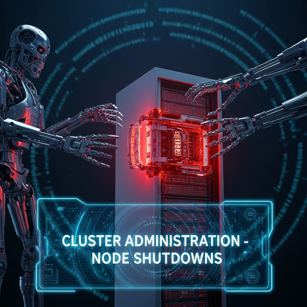
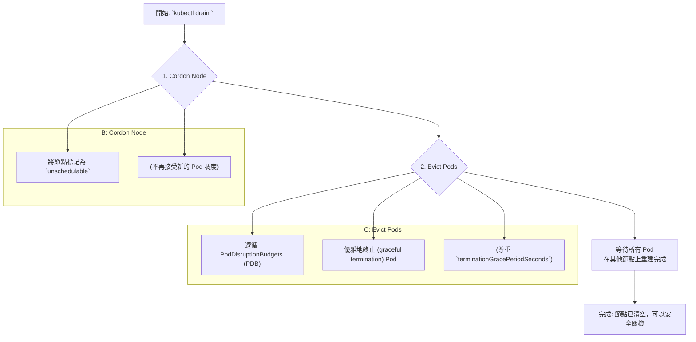

---
tags:
- k8s-reading
---
# Concepts - cluster-administration - node-shutdown
  

[doc link](https://kubernetes.io/docs/concepts/cluster-administration/node-shutdown/)
[doc link](https://kubernetes.io/blog/2021/04/21/graceful-node-shutdown-beta/)

在 Kubernetes (K8s) 叢集的生命週期中，節點 (Node) 停機是不可避免的常態。無論是計畫性的核心升級、硬體維護，還是突發性的斷電、硬體故障，我們都必須有一套成熟的應對策略，以確保叢集上的應用程式能盡可能地不受影響。

本篇文章將從「計畫性」和「非計畫性」兩個維度，探討 K8s 中處理節點關閉的各種機制。

## 場景一：計畫性維護 (手動優雅關機)

當您需要對某個節點進行可預期的維護時（例如：升級作業系統、更換硬體），最推薦、也最安全的方式是使用 `kubectl drain` 指令。

`drain` 指令會優雅地將節點上的 Pod 驅逐，它的工作流程如下：



**操作指令：**
```bash
# 1. 將 node-1 標記為不可調度，並驅逐其上所有 Pod
# --ignore-daemonsets: 因為 DaemonSet Pod 會被自動忽略，所以通常會加上此參數
# --delete-emptydir-data: 如果 Pod 使用了 emptyDir，加上此參數以刪除資料
kubectl drain node-1 --ignore-daemonsets --delete-emptydir-data

# 2. 進行節點維護 (重啟、關機等)
# ...

# 3. 維護完成後，讓節點重新回到可調度狀態
kubectl uncordon node-1
```
> 關於 `drain` 的更詳細介紹，可以參考 [節點維護 (Maintaining a Node)](/docs/k8s-doc-reading/k8s-doc-reading-concepts-cluster-architecture-node/#maintain-a-node) 一文。

## 場景二：預期內關機 (自動優雅關機)

有些關機事件雖然是自動觸發，但系統有機會提前通知 `kubelet`。例如：
-   UPS 偵測到斷電，發送關機訊號。
-   雲端上的 Spot 實例即將被回收。

在這種情況下，我們可以設定 `kubelet`，讓它在收到系統的關機訊號後，執行一個優雅的 Pod 終止流程。

### Kubelet 優雅關機設定
這個功能預設是**關閉**的。您需要修改 `kubelet` 的設定檔來啟用它。

**設定檔範例 (`/etc/kubernetes/kubelet.conf`):**
```yaml
apiVersion: kubelet.config.k8s.io/v1beta1
kind: KubeletConfiguration
# --- 優雅關機設定 ---
# 總寬限期
shutdownGracePeriod: 30s
# 留給「關鍵 Pod」的寬限期
shutdownGracePeriodCriticalPods: 10s
```

這個設定的運作流程如下：
1.  `kubelet` 偵測到節點即將關機。
2.  它會給予一個總共 `30s` 的寬限期。
3.  在前 `20s` (`30s - 10s`)，`kubelet` 會嘗試終止所有**非關鍵**的普通 Pod。
4.  在最後的 `10s`，`kubelet` 會嘗試終止被標記為**關鍵**的 Pod ([Critical Pods](https://kubernetes.io/docs/tasks/administer-cluster/guaranteed-scheduling-critical-addon-pods/))，例如系統自帶的 CNI、CSI 等插件。

## 場景三：突發性故障 (非優雅關機)

最糟糕的情況是節點在沒有任何預警下直接「失聯」，例如：硬體故障、網路中斷。

在這種情況下，`kubelet` 完全沒有機會去優雅地終止 Pod。這會導致一些問題，特別是對於有狀態的應用 (`StatefulSet`)：
-   **Pod 卡在 `Terminating` 狀態**：Control Plane 因為無法從失聯的 `kubelet` 收到 Pod 已終止的確認，所以會一直等待。
-   **Volume 無法分離**：由於 Pod 未被正常刪除，它所掛載的持久化儲存 (PV) 也會一直處於 `Attached` 狀態，導致新的 Pod 無法在其他節點上掛載同一個 PV。

### 手動介入：`out-of-service` Taint
為了解決這個僵局，K8s 提供了一個「最終手段」。如果叢集管理者確認一個節點已經永久性地無法恢復，可以手動為該節點加上一個特殊的 Taint：

```bash
# 為失聯的 node-2 加上 out-of-service Taint
# 效果可以是 NoExecute 或 NoSchedule
kubectl taint nodes node-2 node.kubernetes.io/out-of-service=nodes.kubernetes.io/out-of-service:NoExecute
```
當 `kube-controller-manager` 偵測到這個 Taint 後，它會理解為「這個節點上的 Pod 可以被強制刪除了」。此時，它會：
1.  **強制刪除**卡在 `Terminating` 狀態的 Pod。
2.  **強制分離** (detach) 與該節點關聯的 VolumeAttachments。

這使得 StatefulSet 的 Pod 能夠在其他健康的節點上被重新建立，並重新掛載其所需的 PV，從而恢復服務。

---
總結來說，熟悉 K8s 處理節點停機的各種機制，並為您的叢集做好適當的設定（例如啟用 `kubelet` 優雅關機、為重要應用設定 PDB），是保障叢集穩定性和應用高可用性的重要一環。

