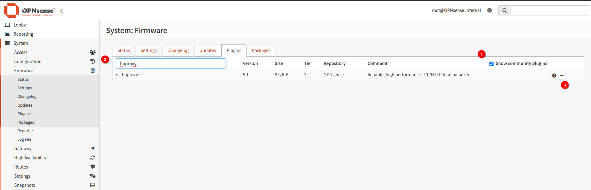
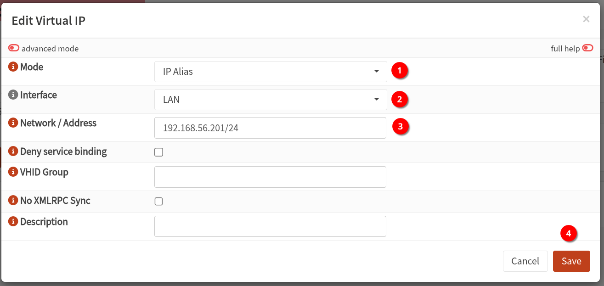
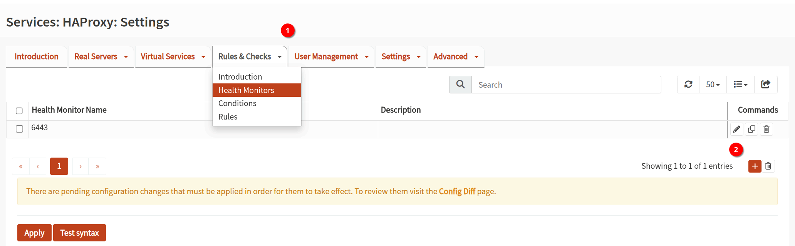
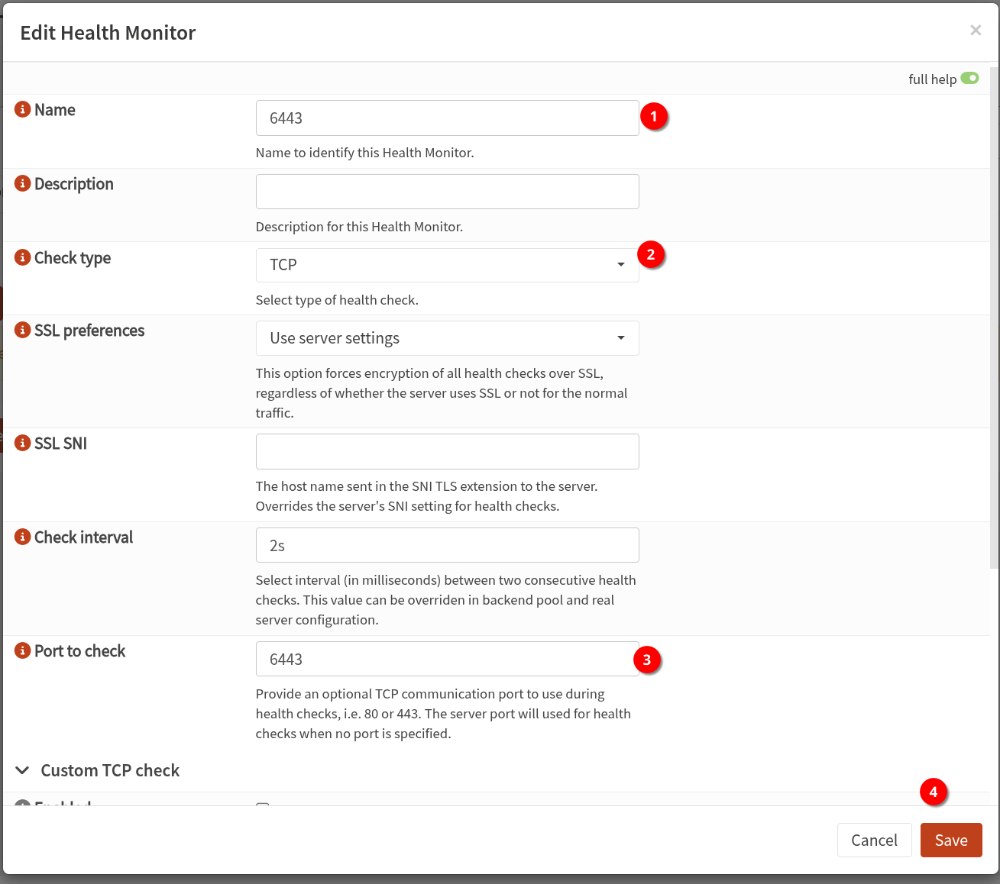
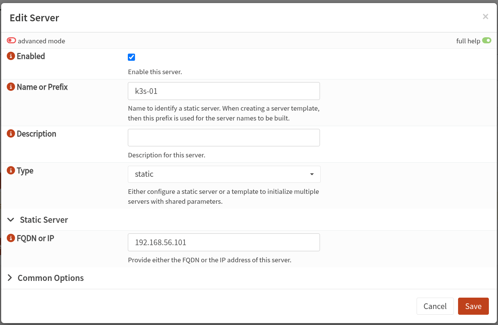
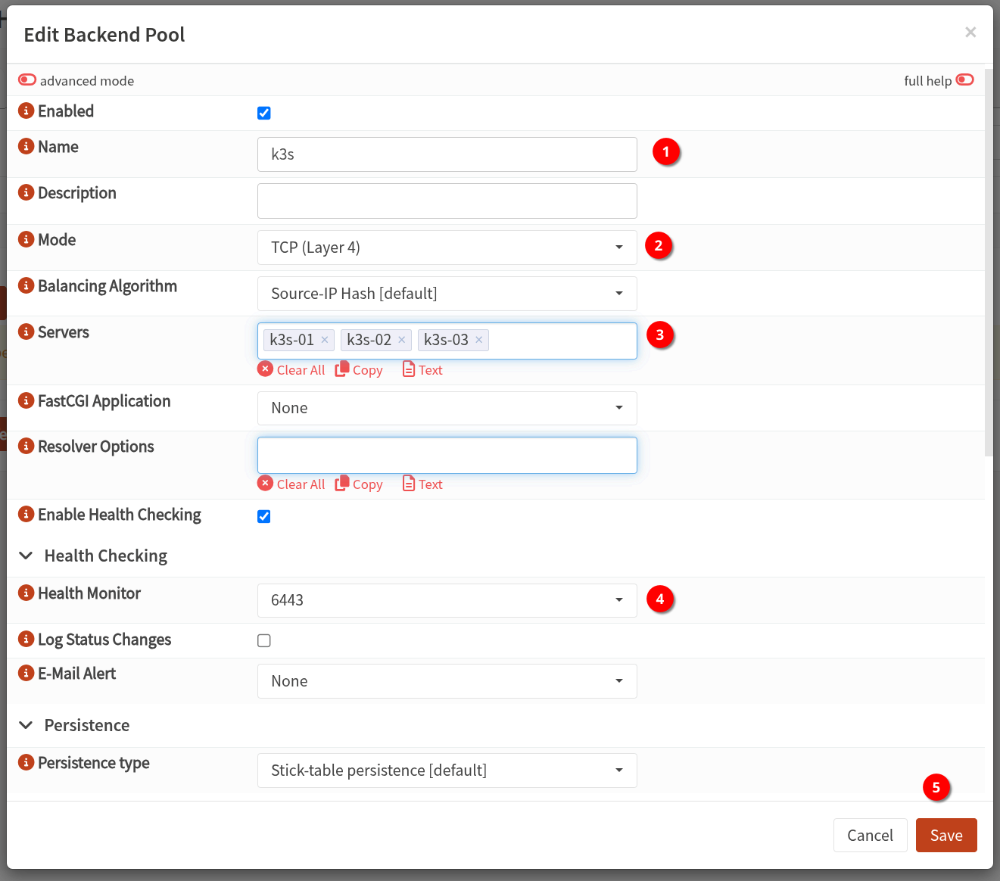
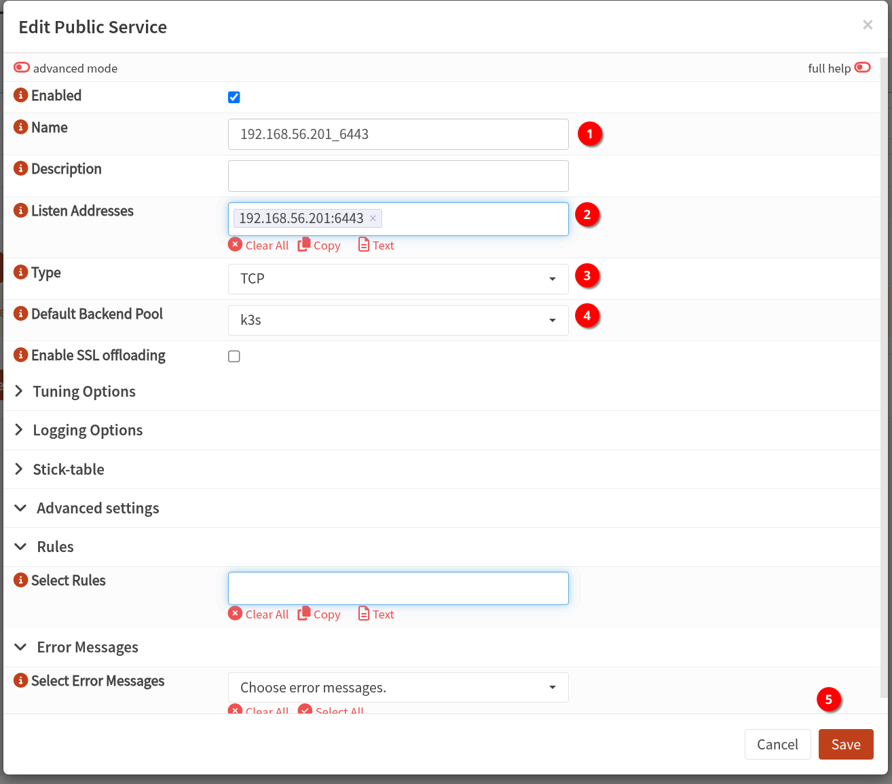
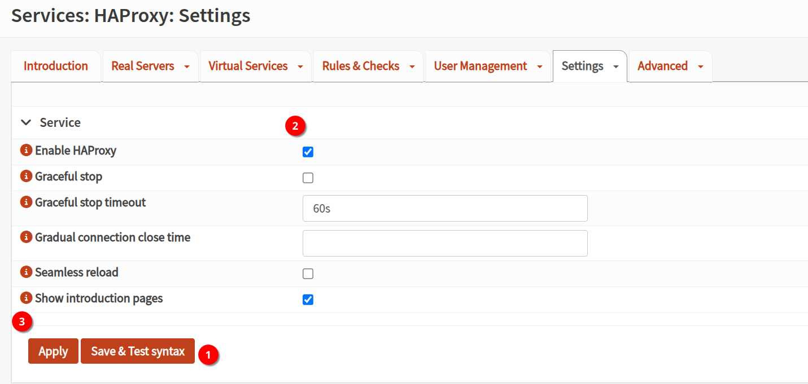

---
tags:
- k3s
---
# k3s with opensense  

這篇文章教學以 opensense 作為 cluster loadbalancer 安裝 k3s  

在 opensense 
1. 安裝 haproxy

 
2. Interfaces: Virtual IPs: Settings
新增 VIP 並 apply config

3. 進入 Services: HAProxy: Settings - Rules & Checks - health Monitors
記得要點到三角形  
另外選項有可能是 health Checks(根據版本)  

新增 monitor 6443 port  

4. 進入 Services: HAProxy: Settings - Real Servers - Real Servers
新增三台 k3s 主機 (圖片範例新增一台)  
 

5. 進入 Services: HAProxy: Settings - Virtual Services - Backend Pools

6. 進入 Services: HAProxy: Settings - Virtual Services - Public Services

7. 進入 Services: HAProxy: Settings - Settings - Service
套用前先 test syntax 後  
勾選 `Enable HAProxy` apply 設定

後續在安裝 k3s 時  
額外設定 `tls-san` 讓憑證支援 loadbalance IP 就可以正常使用  
