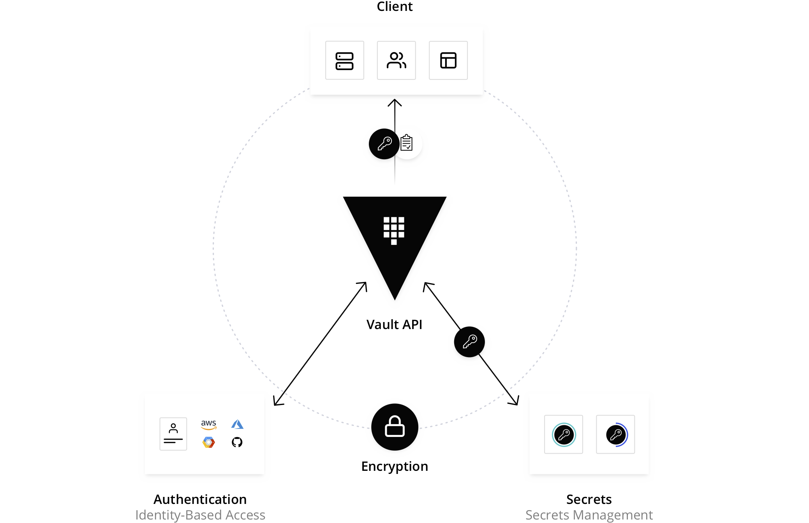

# introduction hashicorp-vault
vault 是一個管理敏感訊息的系統  
功能如下  
* Manage static secrets
* Manage certificates
* Manage identities and authentication
* Manage 3rd-party secrets
* Manage sensitive data
* Support regulatory compliance

另外支援 [plugin](https://developer.hashicorp.com/vault/docs/plugins) 達成以下功能

* authentication plugins that handle authentication flows and control client access to Vault.
* general secret plugins that generate, store, manage, or transform sensitive information.
* database secret plugins that manage dynamic credentials that clients use to access database data.


atchitecture

- Clients authenticate with manually generated tokens, protocols like LDAP, or third-party providers like Azure and AWS.
- Vault generates an access token that links the client request to an internal entity and applicable security policies.
- Clients interact with secrets and encryption operations based on resource paths mounted in Vault.
- Vault authorizes the client request against policies set on the resource path and grants or denies access accordingly.


**缺點**

Vault is robust, powerful, and flexible. But it can also be overwhelming if you have limited or simple secret management needs.


## how to vault store data 

Storage type                                                         | HA support | Description
-------------------------------------------------------------------- | ---------- | -----------
[Integrated](https://developer.hashicorp.com/vault/docs/configuration/storage/raft)                 | YES        | The "built-in" storage option that encrypts and replicates data across an operating Vault cluster.
[File system](https://developer.hashicorp.com/vault/docs/configuration/storage/filesystem)          | NO         | Persists data to the local file system on the machine running Vault.
[External](https://developer.hashicorp.com/vault/docs/configuration/storage#integrated-vs-external) | MAYBE      | A durable third-party storage system like Azure, AWS, Google Cloud, or MySQL.
[In-memory](https://developer.hashicorp.com/vault/docs/configuration/storage/in-memory)             | NO         | Persists data entirely in-memory on the machine running Vault for development and experimentation.


## getting start vault 

### Install Vault to Kubernetes with Integrated Storage 
https://developer.hashicorp.com/vault/tutorials/kubernetes-introduction/kubernetes-minikube-raft#kubernetes-minikube-raft

```bash
helm repo add hashicorp https://helm.releases.hashicorp.com
helm repo update
```

create file
```bash {filename="helm-vault-raft-values.yml"}
cat > helm-vault-raft-values.yml <<EOF
server:
   affinity: ""
   ha:
      enabled: true
      raft: 
         enabled: true
         setNodeId: true
         config: |
            cluster_name = "vault-integrated-storage"
            storage "raft" {
               path    = "/vault/data/"
            }

            listener "tcp" {
               address = "[::]:8200"
               cluster_address = "[::]:8201"
               tls_disable = "true"
            }
            service_registration "kubernetes" {}
EOF
```

install  
```bash
helm install vault hashicorp/vault --values helm-vault-raft-values.yml
```

Initialize
```bash
kubectl exec vault-0 -- vault operator init \
    -key-shares=1 \
    -key-threshold=1 \
    -format=json > cluster-keys.json
```


核心概念：金鑰份額與門檻 (Shares and Threshold)
這是 Vault 安全模型的核心。想像一個需要多把鑰匙才能打開的實體銀行保險箱。
key-shares: 相當於你總共複製了幾把鑰匙。
key-threshold: 相當於你需要同時插入幾把鑰匙才能打開保險箱。
教學中的設定 (-key-shares=1, -key-threshold=1)
意義: 產生一把「解封金鑰」，而解封 Vault 也只需要這一把鑰匙。
優點: 在教學、開發或測試環境中非常方便。你只需要管理一個金鑰，操作簡單快速。
缺點: 安全性較低。這構成了一個單點故障。任何能拿到這個金鑰的人或系統，都可以獨立解封 Vault。
生產環境中的典型設定 (例如: -key-shares=5, -key-threshold=3)
意義: Vault 會產生 5 把不同的「解封金鑰」。你必須湊齊其中任意 3 把，才能解封 Vault。
優點: 安全性極高。你必須洩漏 3 把金鑰才會導致 Vault 被解封。你可以將這 5 把金鑰分給 5 位不同的高階主管或系統，任何單一的人或系統都無法獨自解封 Vault，大大降低了風險。


Unseal and create cluster
```bash
VAULT_UNSEAL_KEY=$(jq -r ".unseal_keys_b64[]" cluster-keys.json)
kubectl exec vault-0 -- vault operator unseal $VAULT_UNSEAL_KEY
kubectl exec -ti vault-1 -- vault operator raft join http://vault-0.vault-internal:8200
kubectl exec -ti vault-2 -- vault operator raft join http://vault-0.vault-internal:8200


kubectl exec -ti vault-1 -- vault operator unseal $VAULT_UNSEAL_KEY
kubectl exec -ti vault-2 -- vault operator unseal $VAULT_UNSEAL_KEY
```

### Set a secret in Vault

```bash
# get root token 
jq -r ".root_token" cluster-keys.json

# start interative shell
kubectl exec --stdin=true --tty=true vault-0 -- /bin/sh

# login 
vault login

# Enable an instance of the kv-v2 secrets engine at the path secret
# 在 Vault 中啟用一個秘密儲存引擎，這個引擎的類型是「鍵值(Key-Value)儲存的第 2 版」，並且將這個引擎掛載 (mount) 到路徑 secret/ 上。

vault secrets enable -path=secret kv-v2

# Create a secret 
vault kv put secret/webapp/config username="static-user" password="static-password"

# verify 
vault kv get secret/webapp/config
```

工具/操作	您輸入的路徑	Vault 內部實際操作的路徑	為什麼？
CLI (vault kv ...)	secret/webapp/config	secret/data/webapp/config	為了方便。CLI 做了抽象化，隱藏了細節。
Policy (path)	secret/data/webapp/config	secret/data/webapp/config	為了精確。Policy 必須明確指定 API 路徑。
metadata (path)	secret/metadata/webapp/config	secret/metadata/webapp/config	為了精確。Policy 必須明確指定 API 路徑。


### Configure Kubernetes authentication
https://developer.hashicorp.com/vault/tutorials/kubernetes-introduction/kubernetes-minikube-raft#launch-a-web-application

```bash
kubectl exec --stdin=true --tty=true vault-0 -- /bin/sh
vault auth enable kubernetes
vault write auth/kubernetes/config \
    kubernetes_host="https://$KUBERNETES_PORT_443_TCP_ADDR:443"
```

add policy
```bash
vault policy write webapp - <<EOF
path "secret/data/webapp/config" {
  capabilities = ["read"]
}
EOF
```

create auth role
```bash
vault write auth/kubernetes/role/webapp \
        bound_service_account_names=vault \
        bound_service_account_namespaces=default \
        policies=webapp \
        ttl=24h
```


### Mount Vault secrets through Container Storage Interface (CSI) volume


## alternative
https://infisical.com/blog/hashicorp-vault-alternatives


