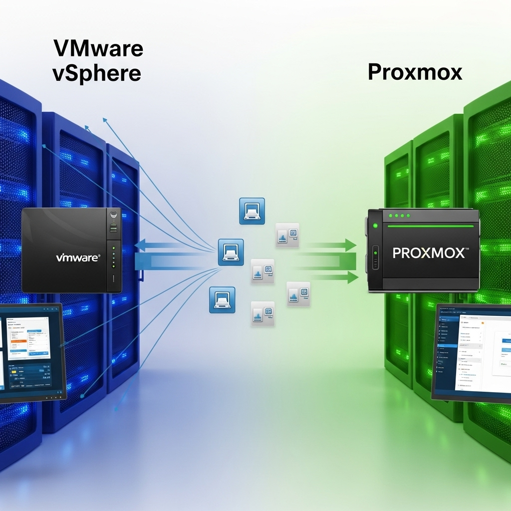

---
tags:
- projects
---
# hypervisor maintenance

* Key Responsibilities / 主要職責：
  * Upgraded production VMware ESXi hosts from version 5.0 to 8.0 to patch critical security vulnerabilities and enhance system stability.
  * 將生產環境的 VMware ESXi 主機從 5.0 版本升級至 8.0，以修復關鍵安全漏洞並增強系統穩定性。
  * Implemented and configured the Proxmox VE platform as a viable alternative to VMware.
  * 實施並配置 Proxmox VE 平台，作為 VMware 的可行替代方案。
  * Planned and executed the migration of Virtual Machines (VMs) from VMware to Proxmox, ensuring seamless service transition.
  * 規劃並執行從 VMware 到 Proxmox 的虛擬機器 (VM) 遷移，確保服務無縫轉換。
* Key Achievements / 主要成就：
  * Enhanced Security: Eliminated critical security risks associated with the outdated ESXi platform, achieving a compliant and secure infrastructure.
  * 增強安全性：消除了與舊版 ESXi 平台相關的關鍵安全風險，實現了合規且安全的基礎設施。
  * Cost Reduction: Significantly reduced software licensing costs by introducing the open-source Proxmox VE solution.
  * 降低成本：透過引入開源的 Proxmox VE 解決方案，顯著降低了軟體授權成本。
  * Increased Flexibility: Established a dual-hypervisor environment, reducing vendor lock-in and providing greater flexibility for future deployments.
  * 提高靈活性：建立了雙虛擬化管理平台環境，減少了對特定廠商的依賴（Vendor Lock-in），並為未來的部署提供更大的靈活性。