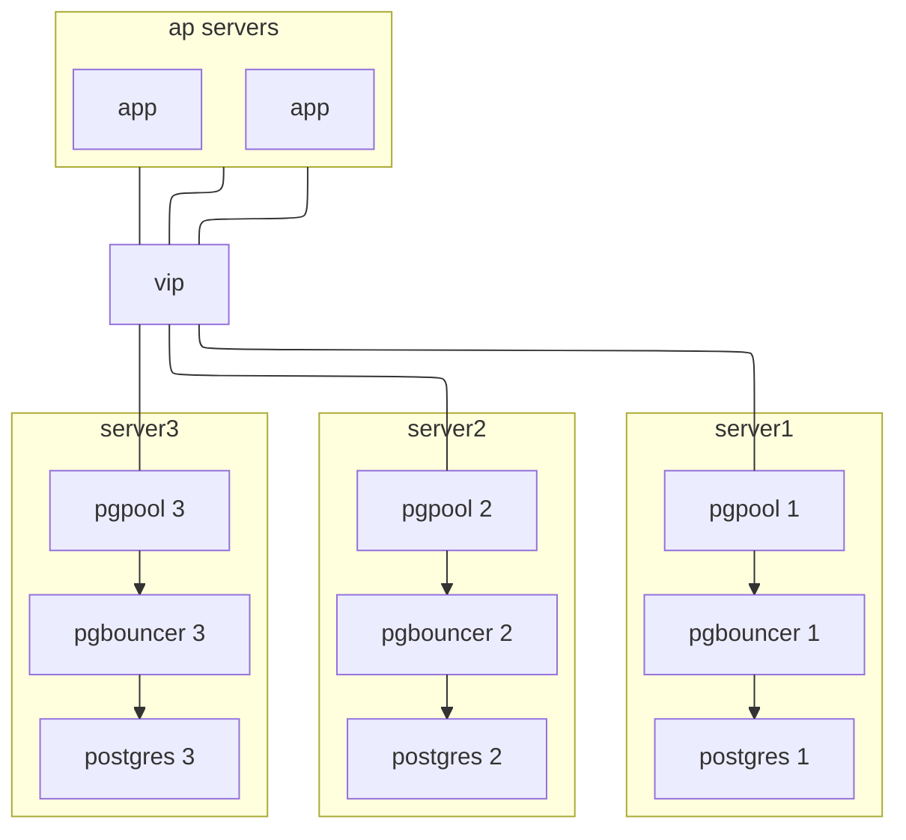

---
tags:
- projects
---
# postgresHA


## Objective / 目標：  
建立 postgres 高可用性 cluster  
使用 pgpool-II 與 pgbouncer 提昇 HA 保護與性能  

> pgbouncer 與 pgpool-II 功能其實有重疊  
> 在大部分場景 只需要用到 pgpool-II 即可  
> 會把 pgbouncer 一起使用  
> 主因在 [CloudNativePG](https://cloudnative-pg.io) 是搭配 pgbouncer, 順便作為學習  


## 簡介
### postgres 
PostgreSQL（常簡稱為 Postgres）被譽為「世界上最先進的開源關聯式資料庫」。它不僅僅是一個存放資料的倉庫，更是一個強大、穩定且擴充性極高的資料處理平台。  
PostgreSQL 之所以受開發者喜愛，主要源於其對資料完整性與複雜查詢的強大支持：  
完全符合 ACID 規範： 確保所有的資料交易（Transaction）都是可靠的，即便在電力中斷或系統崩潰的情況下也能保證資料不遺失或損壞  
強大的資料類型支持： 除了傳統的數值與字串，它原生支持 JSONB（存儲非結構化資料）、地理空間資料 (PostGIS)、陣列、甚至是自定義類型  
高度擴充性： 你可以編寫自己的函式、索引類型，甚至插入新的程式語言（如 Python 或 V8 引擎）到資料庫中執行  

| 特性 | PostgreSQL | MySQL |
| :--- | :--- | :--- |
| **定位** | 功能導向、複雜查詢、開發者友善 | 速度導向、簡單易用、讀寫分離成熟 |
| **資料完整性** | 非常嚴格，強制檢查約束 (Constraints) | 相對寬鬆（取決於 SQL Mode 設定） |
| **並發處理** | MVCC 表現優異，讀寫互不阻塞 | 在高併發寫入時，特定引擎可能面臨鎖定問題 |
| **擴充性** | 極強，支持多種插件（如 PostGIS, TimescaleDB） | 較為有限，通常依賴外部組件 |
| **資料類型** | 支持 JSONB、陣列、地理空間、自定義類型 | 基本類型為主，JSON 支持相對較晚 |


### Pgpool-II
Pgpool-II 是一個位於 PostgreSQL 伺服器與應用程式之間的 中間件 (Middleware)，也就是所謂的資料庫代理伺服器（Proxy）。  
它主要的任務是讓多個 PostgreSQL 伺服器看起來像是一個單一的資料庫系統，藉此提升效能、可用性與擴展性。  

**核心功能 (Core Features)**  
1. 連線池 (Connection Pooling)
PostgreSQL 為每個連線都會建立一個新的 Process，這非常消耗資源。  
Pgpool-II 會維持一組已建立的連線，供應用程式重複使用，減少連線建立與銷毀的開銷。  

2. 負載平衡 (Load Balancing)  
如果你的架構有「主從複製 (Master-Slave)」，Pgpool-II 可以自動辨別 SQL 指令：  
寫入 (INSERT/UPDATE/DELETE)：送到 Master 節點。  
讀取 (SELECT)：根據權重分發到各個 Slave 節點。  
這能有效分散主庫的負載，提升系統整體的讀取吞吐量。  

3. 高可用性 (High Availability / Watchdog)  
Pgpool-II 具備 Watchdog 機制，可以監控資料庫節點的健康狀態：  
如果 Master 故障，它可以觸發 Failover 指令。  
多台 Pgpool-II 之間可以互相監控，避免代理伺服器本身成為單點故障 (SPOF)。  

4. 複製 (Replication)  
雖然 PostgreSQL 原生就有串流複製 (Streaming Replication)，但 Pgpool-II 也提供自己的「原生複製模式」，可以讓多台資料庫同步寫入  
但現在主流做法多半是結合 PostgreSQL 原生複製加上 Pgpool-II 的負載平衡。  

5. 限制連線數 (Limiting Exceeding Connections)  
當連線數超過設定上限時，Pgpool-II 會讓請求排隊等待，而不是直接讓資料庫崩潰，起到緩衝保護的作用。  

### pgbouncer
如果說 Pgpool-II 像是資料庫的「全能管家」，那麼 Pgbouncer 就是一個「極致專業的門衛」。  
Pgbouncer 是一款輕量級、高效能的 PostgreSQL 連線池代理伺服器 (Connection Pooler)。它的功能非常專一：管理連線，且把這件事做得比誰都好。  

為什麼需要 Pgbouncer？  
PostgreSQL 的連線模型是「一個連線、一個進程 (Process)」。  
每個進程約消耗 2MB - 10MB 的記憶體。  
當連線數達到數百或上千時，記憶體會被吃光，且 CPU 會花大量時間在處理進程間切換（Context Switching），導致效能大幅下降。  

Pgbouncer 的解決方案：  
它在前端維持成千上萬個來自客戶端的「虛擬連線」，但在後端只維持極少數（例如幾十個）與資料庫的「實體連線」。  

**三種池化模式 (Pooling Modes)  **
這是 Pgbouncer 最核心的設定，決定了它如何分配連線：  

Session Pooling (會話池化)：  
最保險。當客戶端連進來，Pgbouncer 會分配一個實體連線給它，直到該用戶斷開連線為止。  

Transaction Pooling (交易池化)：  
最常用、效能最高。實體連線只在一個 BEGIN 與 COMMIT 之間分配。交易結束後，連線立刻歸還給池子，讓給下一個人的交易使用。  

Statement Pooling (語句池化)：  
最激進。每執行完一個 SQL 語句就歸還連線。不支援多語句的交易，使用場景較少。  

## LAB environment 
VM * 3
各自安裝 Pgpool-II, Pgbouncer, PostgreSQL  
OS: ubuntu 24.04
postgresql: 18.3
pgpool-II: 4.7.1
Pgbouncer: 1.25.1

| hostname | IP             |
|----------|----------------|
| server1  | 192.168.56.101 |
| server2  | 192.168.56.102 |
| server3  | 192.168.56.103 |


architecture  
此 LAB 中只包含 server1~3  



> 在正式環境下, 可以搭配 keepalived & HAproxy 來做 Pgpool-II 的 VIP & LB  
> 在 pgpool 範例 則是用 pgpool 自己做 VIP  
> 這邊我假設使用 keepalived & HAproxy  
> pgpool 不負責 VIP  

由於步驟相當繁瑣  
尤其是 pgpool 的部份  
其中大部份都是參考 [pgpool example](https://www.pgpool.net/docs/latest/en/html/example-cluster.html)  
以下教學盡可能簡化在 HOST 控制三台 VM  
請先設定好 ssh key authentication 方便後續操作  
可參考 [ubuntu doc](https://help.ubuntu.com/community/SSH/OpenSSH/Keys)  

如果以下沒特別說明在哪台執行  
那就是 host  

## install postgresql, pgpool-II, pgbouncer
安裝過程很簡單  
postgres repository 都包含了這些套件  
只要使用官方提供的 Automated Repository Configuration 就可以一次享有  
ref. https://www.postgresql.org/download/linux/ubuntu/  

以下 command 重複執行 server1 ~ server3
```bash
ssh server1 <<EOF
sudo apt install -y postgresql-common
sudo /usr/share/postgresql-common/pgdg/apt.postgresql.org.sh -y

sudo apt update

# postgresql-18 資料庫本體
# postgresql-18-pgpool2 資料庫端的擴充套件
# pgpool2 本體
sudo apt install -y pgpool2 libpgpool2 postgresql-18 postgresql-18-pgpool2 pgbouncer
EOF
```

## config
### config posgresql
在 ubuntu 環境下  
當安裝好 postgres 便會自動啟動  
我們要先還原到初始狀態  

以下 command 重複執行 server1 ~ server3
```bash
ssh server1 <<EOF
sudo pg_dropcluster 18 main --stop
sudo systemctl stop postgresql
sudo systemctl stop pgpool2
EOF
```

setup ssh key authentication  
To use the automated failover and online recovery of Pgpool-II, it is required to configure SSH public key authentication  
請先自己準備好 ssh key 以下範例已經先產生 key "lab_vm"  

以下 command 重複執行 server1 ~ server3
```bash
SERVER=server1

scp ~/.ssh/lab_vm ${SERVER}:/tmp/id_rsa
scp ~/.ssh/lab_vm.pub ${SERVER}:/tmp/id_rsa.pub

ssh ${SERVER} <<EOF
chmod 777 /tmp/id_rsa /tmp/id_rsa.pub
sudo su postgres
mkdir ~/.ssh
chmod 700 ~/.ssh
cp /tmp/id_rsa ~/.ssh/id_rsa
cp /tmp/id_rsa.pub ~/.ssh/id_rsa.pub
cat ~/.ssh/id_rsa.pub >> ~/.ssh/authorized_keys
chmod 400 ~/.ssh/id_rsa ~/.ssh/id_rsa.pub

exit
rm -f /tmp/id_rsa /tmp/id_rsa.pub

sudo tee -a /etc/hosts <<EEOF
192.168.56.101 server1
192.168.56.102 server2
192.168.56.103 server3
EEOF
EOF
```


設定 postgres  
以下 command 只須執行於 server1  

```bash
ssh server1 <<EOF
sudo pg_createcluster 18 main --start

sudo sed -i "/#listen_addresses = 'localhost'/a listen_addresses = '*'" \
/etc/postgresql/18/main/postgresql.conf
sudo sed -i "/#wal_log_hints = off/a wal_log_hints = on" \
/etc/postgresql/18/main/postgresql.conf

sudo tee -a /etc/postgresql/18/main/pg_hba.conf <<EEOF
host    all             pgpool             samenet                 scram-sha-256
host    all             postgres           samenet                 scram-sha-256
host    replication     repl               samenet                 scram-sha-256
EEOF
EOF
```


**goto to server1** 

Setting up PostgreSQL users

| User Name | Password | Detail |
|-----------|----------|--------|
| repl      | repl     | PostgreSQL replication user |
| pgpool    | pgpool   | Pgpool-II health check ([health_check_user](https://www.pgpool.net/docs/latest/en/html/runtime-config-health-check.html#GUC-HEALTH-CHECK-USER)) and replication delay check ([sr_check_user](https://www.pgpool.net/docs/latest/en/html/runtime-streaming-replication-check.html#GUC-SR-CHECK-USER)) user |
| postgres  | postgres | User running online recovery |


```bash
sudo -u postgres psql

postgres=# SET password_encryption = 'scram-sha-256';
postgres=# CREATE ROLE pgpool WITH LOGIN;
postgres=# CREATE ROLE repl WITH REPLICATION LOGIN;
postgres=# \password pgpool
postgres=# \password repl
postgres=# \password postgres
postgres=# GRANT pg_monitor TO pgpool;
postgres=# \q
```


create .**pgpass**
以下 command 只須執行於 server1  

```bash
ssh server1 <<EOF
sudo su postgres

tee ~/.pgpass <<EEOF
# hostname:port:database:username:password
server1:5432:replication:repl:repl
server2:5432:replication:repl:repl
server3:5432:replication:repl:repl
server1:5432:postgres:postgres:postgres
server2:5432:postgres:postgres:postgres
server3:5432:postgres:postgres:postgres
EEOF
chmod 600 ~/.pgpass
EOF
```


PCP connection authentication (Pgpool Control Protocol)
To use PCP commands PCP user names and md5 encrypted passwords must be declared in pcp.conf
後續
以下 command 只須執行於 server1  

```bash
ssh server1 <<EOF
sudo su
echo 'pgpool:'\`pg_md5 pgpool\` >> /etc/pgpool2/pcp.conf

sudo su postgres
tee ~/.pcppass <<EEOF
# hostname:port:database:username:password
localhost:9898:pgpool:pgpool
EEOF
chmod 600 ~/.pcppass
EOF
```


**Create pgpool_node_id**

If watchdog feature is enabled, to distinguish which host is which, a pgpool_node_id file is required
務必照順序,由 0 開始 不可跳號
```bash
ssh server1 "echo 0 | sudo tee /etc/pgpool2/pgpool_node_id"
ssh server2 "echo 1 | sudo tee /etc/pgpool2/pgpool_node_id"
ssh server3 "echo 2 | sudo tee /etc/pgpool2/pgpool_node_id"
```

Pgpool-II Configuration
以下 command 只須執行於 server1  

```bash
ssh server1 <<EOF
sudo tee -a /etc/pgpool2/pgpool.conf <<EEOF
listen_addresses = '*'
pcp_listen_addresses = '*'
port = 9999

# Streaming Replication Check
sr_check_user = 'pgpool'
sr_check_password = ''

# Health Check
health_check_period = 5
health_check_timeout = 30
health_check_user = 'pgpool'
health_check_password = ''
health_check_max_retries = 3

# Backend Settings
backend_hostname0 = 'server1'
backend_port0 = 5432
backend_weight0 = 1
backend_data_directory0 = '/var/lib/postgresql/18/main'
backend_flag0 = 'ALLOW_TO_FAILOVER'

backend_hostname1 = 'server2'
backend_port1 = 5432
backend_weight1 = 1
backend_data_directory1 = '/var/lib/postgresql/18/main'
backend_flag1 = 'ALLOW_TO_FAILOVER'

backend_hostname2 = 'server3'
backend_port2 = 5432
backend_weight2 = 1
backend_data_directory2 = '/var/lib/postgresql/18/main'
backend_flag2 = 'ALLOW_TO_FAILOVER'

backend_application_name0 = 'server1'
backend_application_name1 = 'server2'
backend_application_name2 = 'server3'

# Failover configuration
failover_command = '/etc/pgpool2/failover.sh %d %h %p %D %m %H %M %P %r %R %N %S'
follow_primary_command = '/etc/pgpool2/follow_primary.sh %d %h %p %D %m %H %M %P %r %R'

# Online Recovery Configurations
recovery_user = 'postgres'
recovery_password = ''
recovery_1st_stage_command = 'recovery_1st_stage'

# Client Authentication Configuration
enable_pool_hba = on
EEOF

# Failover script
sudo cp /usr/share/doc/pgpool2/examples/failover.sh.sample /etc/pgpool2/failover.sh
sudo cp /usr/share/doc/pgpool2/examples/follow_primary.sh.sample /etc/pgpool2/follow_primary.sh
sudo chmod +x /etc/pgpool2/failover.sh /etc/pgpool2/follow_primary.sh

sudo sed -i 's|PGHOME=/usr/pgsql-18|PGHOME=/usr/lib/postgresql/18|g' /etc/pgpool2/failover.sh
sudo sed -i 's|PGHOME=/usr/pgsql-18|PGHOME=/usr/lib/postgresql/18|g' /etc/pgpool2/follow_primary.sh
sudo sed -i 's|SSH_KEY_FILE=id_rsa_pgpool|SSH_KEY_FILE=id_rsa|g' /etc/pgpool2/failover.sh
sudo sed -i 's|SSH_KEY_FILE=id_rsa_pgpool|SSH_KEY_FILE=id_rsa|g' /etc/pgpool2/follow_primary.sh

# Online Recovery script
sudo su postgres 

# recovery_1st_stage 用 sample + sed 修補
cp /usr/share/doc/pgpool2/examples/recovery_1st_stage.sample /var/lib/postgresql/18/main/recovery_1st_stage
chmod +x /var/lib/postgresql/18/main/recovery_1st_stage
sed -i 's|PGHOME=/usr/pgsql-18|PGHOME=/usr/lib/postgresql/18|g'                                            /var/lib/postgresql/18/main/recovery_1st_stage
sed -i 's|SSH_KEY_FILE=id_rsa_pgpool|SSH_KEY_FILE=id_rsa|g'                                                /var/lib/postgresql/18/main/recovery_1st_stage
sed -i 's|/var/lib/pgsql/.pgpass|/var/lib/postgresql/.pgpass|g'                                            /var/lib/postgresql/18/main/recovery_1st_stage
# Debian/Ubuntu: postgresql.conf 在 /etc/postgresql/18/main/ 而非 PGDATA
sed -i 's|\${DEST_NODE_PGDATA}/postgresql.conf|/etc/postgresql/18/main/postgresql.conf|g'                  /var/lib/postgresql/18/main/recovery_1st_stage

# pgpool_remote_start 改寫 (不用 sample)
# sample 用 pg_ctl -D PGDATA, 在 Debian 下因 PGDATA 沒 postgresql.conf 而失敗
# 改用 pg_ctlcluster, 它會自動讀 /etc/postgresql/18/main/*.conf
tee /var/lib/postgresql/18/main/pgpool_remote_start <<'SCRIPT'
#!/bin/bash
set -o xtrace
DEST_NODE_HOST="\$1"
DEST_NODE_PGDATA="\$2"
SSH_OPTIONS="-o StrictHostKeyChecking=no -o UserKnownHostsFile=/dev/null -i ~/.ssh/id_rsa"

echo pgpool_remote_start: start: remote start Standby node \$DEST_NODE_HOST

ssh -T \${SSH_OPTIONS} postgres@\${DEST_NODE_HOST} ls /tmp > /dev/null
if [ \$? -ne 0 ]; then
    echo ERROR: passwordless SSH to postgres@\${DEST_NODE_HOST} failed.
    exit 1
fi

ssh -T \${SSH_OPTIONS} postgres@\${DEST_NODE_HOST} "
    if pg_lsclusters -h | awk '\\\$1==\"18\" && \\\$2==\"main\"{print \\\$4}' | grep -q online; then
        exit 0
    fi
    pg_ctlcluster 18 main start
"

if [ \$? -ne 0 ]; then
    echo ERROR: pgpool_remote_start: \${DEST_NODE_HOST} PostgreSQL start failed.
    exit 1
fi

echo pgpool_remote_start: end: PostgreSQL on \${DEST_NODE_HOST} is started successfully.
exit 0
SCRIPT
chmod +x /var/lib/postgresql/18/main/pgpool_remote_start


psql -U postgres postgres -c "CREATE EXTENSION pgpool_recovery"

exit

# Client Authentication Configuration
sudo tee -a /etc/pgpool2/pool_hba.conf <<EEOF
host    all         pgpool           samenet          scram-sha-256
host    all         postgres         samenet          scram-sha-256
EEOF

sudo su postgres 
# encrypt key
echo 'some string' > ~/.pgpoolkey  
chmod 600 ~/.pgpoolkey
EOF
```


goto server1, setup pool_passwd
```bash
sudo pg_enc -m -k /var/lib/postgresql/.pgpoolkey -u pgpool -p
sudo pg_enc -m -k /var/lib/postgresql/.pgpoolkey -u postgres -p

sudo cat /etc/pgpool2/pool_passwd 
```


Watchdog Configuration
以下 command 只須執行於 server1  
```bash
ssh server1 <<EOF
sudo tee -a /etc/pgpool2/pgpool.conf <<EEOF
# Watchdog Configuration
use_watchdog = on
wd_lifecheck_method = 'heartbeat'
## Specifies the interval between life checks of Pgpool-II in seconds.
wd_interval = 10
## interval time in seconds between sending the heartbeat signals.
wd_heartbeat_keepalive = 2
## time in seconds before marking the remote watchdog node as failed/dead node
wd_heartbeat_deadtime = 30

hostname0 = 'server1'
wd_port0 = 9000
pgpool_port0 = 9999

hostname1 = 'server2'
wd_port1 = 9000
pgpool_port1 = 9999

hostname2 = 'server3'
wd_port2 = 9000
pgpool_port2 = 9999

heartbeat_hostname0 = 'server1'
heartbeat_port0 = 9694
heartbeat_device0 = ''
heartbeat_hostname1 = 'server2'
heartbeat_port1 = 9694
heartbeat_device1 = ''
heartbeat_hostname2 = 'server3'
heartbeat_port2 = 9694
heartbeat_device2 = ''
EEOF
EOF
```

Logging
default pgpool 是 logging 到 stderr  
用 journalctl 就可以看到 log  

sync config from server1 to server2,server3
```bash
for h in server2 server3; do
  # /etc/pgpool2/ — owner root, default mode
  ssh server1 "sudo cat /etc/pgpool2/pgpool.conf"     | ssh $h "sudo tee /etc/pgpool2/pgpool.conf     > /dev/null"
  ssh server1 "sudo cat /etc/pgpool2/pool_hba.conf"   | ssh $h "sudo tee /etc/pgpool2/pool_hba.conf   > /dev/null"
  ssh server1 "sudo cat /etc/pgpool2/pool_passwd"     | ssh $h "sudo tee /etc/pgpool2/pool_passwd     > /dev/null"
  ssh server1 "sudo cat /etc/pgpool2/pcp.conf"        | ssh $h "sudo tee /etc/pgpool2/pcp.conf        > /dev/null"

  # failover scripts — owner root, mode 755 (執行權)
  ssh server1 "sudo cat /etc/pgpool2/failover.sh"       | ssh $h "sudo tee /etc/pgpool2/failover.sh       > /dev/null && sudo chmod 755 /etc/pgpool2/failover.sh"
  ssh server1 "sudo cat /etc/pgpool2/follow_primary.sh" | ssh $h "sudo tee /etc/pgpool2/follow_primary.sh > /dev/null && sudo chmod 755 /etc/pgpool2/follow_primary.sh"

  # postgres 家目錄下的 key/password 檔 — owner postgres, mode 600
  for f in .pgpoolkey .pgpass .pcppass; do
    ssh server1 "sudo cat /var/lib/postgresql/$f" \
      | ssh $h "sudo -u postgres tee /var/lib/postgresql/$f > /dev/null && sudo chmod 600 /var/lib/postgresql/$f"
  done

  # /etc/postgresql/18/main/ — 整個 folder 同步 (tar 保留 owner / mode / 子目錄 conf.d)
  ssh server1 "sudo tar -C /etc/postgresql/18 -cf - main" \
    | ssh $h "sudo mkdir -p /etc/postgresql/18 && sudo tar -C /etc/postgresql/18 -xf -"
done
```


重起 pgpool
```
ssh server1 "sudo systemctl restart pgpool2"
ssh server2 "sudo systemctl restart pgpool2"
ssh server3 "sudo systemctl restart pgpool2"
```

嘗試確認 pgpool 狀態(可於 host or server1)  
```bash
psql -h 192.168.56.101 -p 9999 -U pgpool postgres -c "show pool_nodes"
```

```
ubuntu@server1:/etc/pgpool2$ psql -h 192.168.56.101 -p 9999 -U pgpool postgres -c "show pool_nodes"
Password for user pgpool: 
 node_id | hostname | port | status | pg_status | lb_weight |  role   | pg_role | select_cnt | load_balance_node | replication_delay | replication_state | replication_sync_state | last_status_change  
---------+----------+------+--------+-----------+-----------+---------+---------+------------+-------------------+-------------------+-------------------+------------------------+---------------------
 0       | server1  | 5432 | up     | up        | 0.333333  | primary | primary | 0          | true              | 0                 |                   |                        | 2026-05-03 06:34:40
 1       | server2  | 5432 | down   | down      | 0.333333  | standby | unknown | 0          | false             | 0                 |                   |                        | 2026-05-03 06:33:14
 2       | server3  | 5432 | down   | down      | 0.333333  | standby | unknown | 0          | false             | 0                 |                   |                        | 2026-05-03 06:33:14
(3 rows)

```

由於此於我們只完成 server1 的 postgres 設定  
因此看到 server2,server3 是 down 的狀態是正常  
於任一 server 使用 pcp_recovery_node 修復節點
```bash
pcp_recovery_node -h 192.168.56.101 -p 9898 -U pgpool -n 1
```
---


參考資料： https://www.pgpool.net/docs/latest/en/html/example-cluster.html